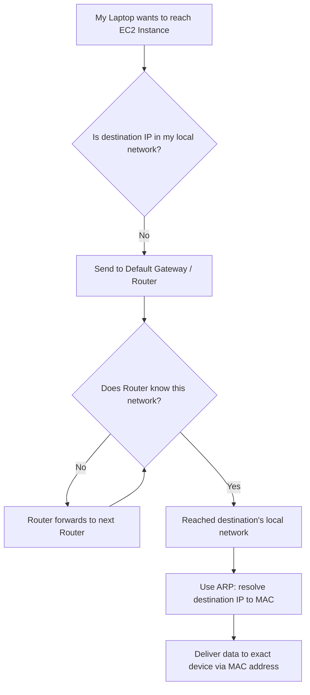

# IP Address vs MAC Address

> Networking Fundamentals Series — Session Notes
> Topic: Difference between IP Address and MAC Address, and why both are required

---

## 1. Overview

Both IP and MAC addresses are used to identify devices on a network, but they operate at different layers and solve different problems. Understanding *why* both are needed — not just how they differ — is the core takeaway of this session.

---

## 2. Quick Comparison Table

| Aspect | IP Address | MAC Address |
|---|---|---|
| **Size** | 32-bit integer (IPv4) | 48-bit |
| **Format** | Dotted decimal, separated by `.` (e.g. `192.168.1.4`) | Hexadecimal, separated by `:` or `-` |
| **Assigned by** | Network / router (DHCP) | Manufacturer (hardcoded on NIC) |
| **Can it change?** | Yes — can change on reconnect | No — constant (spoofing possible at OS level, but rare) |
| **Uniqueness** | Can be duplicated across *different* networks | Universally unique — no two devices share a MAC, even across networks |
| **Structure** | First N octets = network portion (via subnet mask), remaining = host portion | First 3 bytes = manufacturer (OUI), last 3 bytes = host/device identifier |
| **Scope of use** | Works globally over the Internet | Works only within a local network (LAN) |
| **Significance** | Logical — used for routing decisions, subnet calculations | No logical significance — effectively random from a network-logic standpoint |
| **Layer (OSI)** | Network Layer (Layer 3) | Data Link Layer (Layer 2) |

---

## 3. Key Differences Explained

### 3.1 Appearance
- **IP**: 32-bit integer, split into 4 octets, separated by dots. Example: `192.168.1.4`
- **MAC**: 48-bit value, separated by colons or hyphens (hyphens common on Windows). Example: `00:1A:2B:3C:4D:5E`

### 3.2 Mutability
- **IP can change.** If a laptop disconnects from a router and reconnects, there's no guarantee it gets the same IP again (especially with DHCP).
- **MAC does not change.** It's burned into the Network Interface Card (NIC) by the manufacturer at the time of manufacturing. It's hardware-level, not something that changes on reconnect.
  - *Exception*: MAC spoofing is possible at the OS level, but this is not the norm.

### 3.3 Uniqueness Scope
- **IP can be duplicated** across different networks. Two completely separate home networks can both assign `192.168.1.4` to a device — because they exist in different network scopes, there's no conflict.
- **MAC is universally unique.** Even if a single laptop has two NICs, both will have globally unique MAC addresses. No two devices anywhere in the world share the same MAC.

### 3.4 Structural Reservation
- **IP**: Part of the address is reserved for the **network**, and part for the **host** — determined by subnet mask / CIDR. (See prior notes on subnetting & CIDR.)
- **MAC**: First 3 bytes are reserved for the **manufacturer** (called the OUI — Organizationally Unique Identifier). E.g., if Intel manufactures a device, the first 3 bytes identify Intel as the maker. The last 3 bytes identify the specific host/device.

---

## 4. Why Two Addressing Schemes? (The Core "Why")

### 4.1 Role of IP — Reaching the Right Network
- If you know a device's **public IP**, you know its logical location on the Internet.
- To communicate over the Internet, IP is used at **every hop**:
  1. Source checks (via subnet mask) whether destination IP is in its own network.
  2. If not, packet is sent to the **default gateway** (router).
  3. The router performs its own calculation — is the destination in one of *its* known networks?
  4. If not, it forwards to another router (which becomes *that* router's own default gateway).
  5. This hop-by-hop forwarding continues until the destination network is reached.
- At each hop, IP is used to make **routing decisions** — this is why IP is said to have **logical significance**.

### 4.2 Role of MAC — Reaching the Exact Device
- IP gets you *to* the right network — but delivering the data to the **exact physical device/NIC** within that local network requires the **MAC address**.
- MAC has **no logical significance** — it can't be used for calculations or routing decisions; it's essentially random from a networking-logic point of view.
- MAC is only usable **once you're inside the local network** where the target device resides.

### 4.3 ARP — The Link Between IP and MAC
- **ARP (Address Resolution Protocol)** bridges the two: given an IP address, it returns the corresponding MAC address.
- Every device maintains an **ARP table** — a mapping of IP → MAC.
- This is a networking requirement: to send data over a network, you must know the physical (MAC) address of the destination device, even if you started out only knowing its IP.
- *(Covered in more depth in a dedicated ARP video/session.)*

---

## 5. Mental Model / Flow Diagram

**Summary of the flow:**
- IP is used at every hop to decide *where* to send the packet next (logical routing).
- MAC is used only in the final local network to deliver data to the *exact physical device*.

---

## 6. Analogy

Think of IP like a **postal address (city, state, pin code)** — it tells you which locality/network to route mail toward, and postal sorting facilities use it to make routing decisions at each stage.

MAC is like the **specific person's name/apartment number** at that address — irrelevant for city-to-city routing, but essential once the mail truck has arrived at the correct street.

---

## 7. Interview Q&A

**Q1: What is the fundamental difference between IP and MAC addresses?**
A: IP is a logical, 32-bit address used for routing across networks (can change, can be duplicated across networks). MAC is a physical, 48-bit hardware address that's globally unique and constant, used only within a local network to deliver data to the exact device.

**Q2: Why can't we just use MAC addresses for all communication over the Internet?**
A: MAC addresses have no logical significance — they can't be used to calculate whether a destination is within a given network or to make routing decisions. They also only work within a local network/broadcast domain, not globally across the Internet.

**Q3: Why can IP addresses be duplicated but not MAC addresses?**
A: IP addresses are scoped to a network — the same IP can exist in two different, non-overlapping networks without conflict. MAC addresses are universally unique by design (assigned by manufacturers via OUI blocks), regardless of which network a device sits on.

**Q4: What determines the manufacturer of a device from its MAC address?**
A: The first 3 bytes (24 bits) of a MAC address form the OUI (Organizationally Unique Identifier), assigned to manufacturers (e.g., Intel). The last 3 bytes identify the specific host/device.

**Q5: What role does ARP play between IP and MAC?**
A: ARP (Address Resolution Protocol) resolves a known IP address to its corresponding MAC address, using an ARP table maintained on each device. It's the mechanism that links Layer 3 (IP) addressing to Layer 2 (MAC) delivery.

**Q6: Can a MAC address change?**
A: Under normal circumstances, no — it's hardcoded onto the NIC by the manufacturer. MAC spoofing is technically possible at the OS level but is an exception, not standard behavior.

**Q7: At what point in a multi-hop journey does a device need a MAC address vs an IP address?**
A: IP is needed at every hop to decide the next routing step across networks. MAC is needed only once you've reached the exact local network where the target device lives — to do the final physical delivery.

---

## 8. Quick Revision Checklist

- [ ] IP = 32-bit, dotted decimal, logical, can change, works globally
- [ ] MAC = 48-bit, hex with `:`/`-`, physical, constant, works only in local network
- [ ] IP address: network portion + host portion (via subnet mask)
- [ ] MAC address: manufacturer portion (first 3 bytes / OUI) + device portion (last 3 bytes)
- [ ] IP can repeat across different networks; MAC is globally unique
- [ ] IP used for routing decisions at every hop (logical significance)
- [ ] MAC used only for final delivery within the local network (no logical significance)
- [ ] ARP = protocol that maps IP → MAC via an ARP table
- [ ] Both are required to communicate over a network — neither can be skipped

---

## 9. What's Next
- Deep dive into **Address Resolution Protocol (ARP)** — how exactly IP-to-MAC resolution works
- Future topic: what changes in a packet at each hop during routing (header updates as packet moves from router to router)
