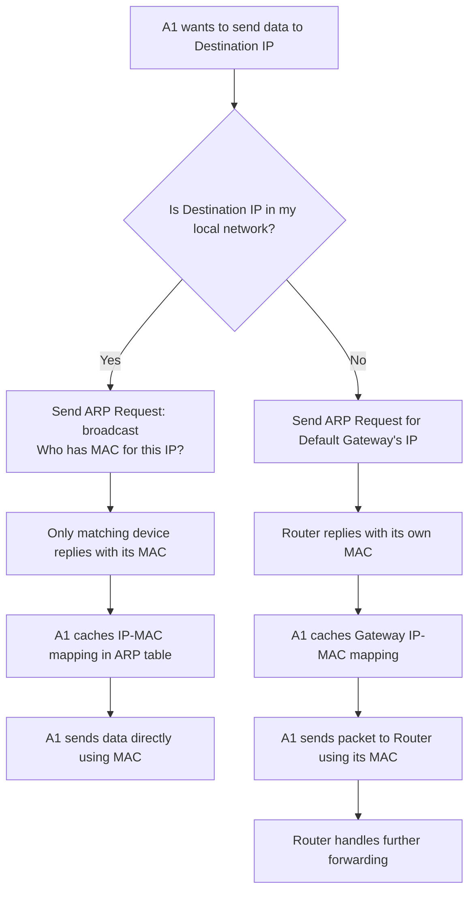

# Address Resolution Protocol (ARP)

> Networking Fundamentals Series — Session Notes
> Topic: What is ARP, how it links IP and MAC addresses, and how it works in practice (same-network and cross-network scenarios)

---

## 1. Overview

ARP is the protocol that bridges **IP addressing (Layer 3)** and **MAC addressing (Layer 2)**. Given an IP address, ARP resolves and returns the corresponding MAC address of the device holding that IP — enabling actual delivery of data within a local network.

**Prerequisite context** (covered in earlier sessions): IP basics, subnetting, subnet masks, default gateway, MAC address structure, and IP vs MAC differences.

---

## 2. What is ARP?

- **ARP = Address Resolution Protocol**
- Takes an **IP address as input** and **returns the MAC address** of the device holding that IP.
- Analogy: works just like **DNS** — DNS takes a domain name as input and returns the corresponding public IP. ARP takes an IP as input and returns the corresponding MAC.

| Protocol | Input | Output |
|---|---|---|
| DNS | Domain name (e.g. `api.example.com`) | Public IP address |
| ARP | IP address (e.g. `192.168.1.4`) | MAC address |

---

## 3. Setup Used in the Example

- One network (**Network A**) with a router acting as the **default gateway**.
- Three hosts on this network: **A1, A2, A3** — each with a known IP address.
- Goal/problem statement: **Send a data packet from A1 to A3** (within the same network).

---

## 4. ARP Within the Same Network (Step-by-Step)

### Step 1 — Confirm destination is in the same network
- A1 already knows A3's IP (you always know the destination IP before making a request — e.g., in HTTP requests, DNS already resolved the domain to an IP for you).
- A1 applies its **subnet mask** to its own IP and to A3's IP.
- If both results match → A3 is confirmed to be in the **same local network**.

### Step 2 — Realize MAC is needed
- Since A3 is in the same network, A1 knows it can deliver the packet **directly** — but for that, it needs A3's **MAC address**, not just its IP.

### Step 3 — ARP Request (Broadcast)
- A1 issues an **ARP request**: *"Who has the MAC address for IP `192.168.1.4`?"*
- This request is a **broadcast** — it is sent to **every device** in the local network (A1, A2, default gateway, A3, etc.), not just the intended target.
- Devices whose IP doesn't match (A2, default gateway) simply **ignore** the request.
- Only the device with the matching IP (**A3**) responds.

### Step 4 — ARP Reply
- A3 recognizes the IP as its own (every device is pre-configured with knowledge of its own IP and MAC).
- A3 responds directly to A1: *"MAC address for `192.168.1.4` is [A3's MAC]."*

### Step 5 — Data delivery + caching
- A1 receives A3's MAC and uses it to send the data packet directly to A3.
- A1 **caches** this IP → MAC mapping in its own **ARP table**, so future communication with A3 doesn't require broadcasting an ARP request again.

---

## 5. The ARP Table

- Every device maintains its own **ARP table** — a cache of IP → MAC mappings.
- Entries get added:
  - When a device responds to an ARP request the local device sent (cached from replies).
  - Some operating systems also pre-populate the table with the device's **own IP → own MAC** entry.
- Purpose: avoid repeated broadcasting — once a mapping is known, it's reused directly.

### Viewing the ARP table
- On macOS/Linux: `arp -a`
- Displays known IP–MAC pairs, including the default gateway's (router's) MAC — cached from prior requests sent to the router.
- (Windows command not covered in this session.)

---

## 6. ARP for Destinations Outside the Local Network

When the destination IP is **not** in the local subnet (e.g., `10.0.0.1` while A1 is on a different subnet):

1. A1 applies the subnet mask → determines the destination is **not** in its own network.
2. A1 cannot send the packet directly, so it must forward it to its **default gateway** (router).
3. A1 already knows its default gateway's IP (pre-configured on every machine).
4. A1 makes an **ARP request** — this time asking for the **MAC address of the default gateway**, not the ultimate destination.
5. This request is again broadcast to the network; A2 and A3 ignore it, and the **router responds** with its own MAC.
6. A1 uses the router's MAC to send the packet to the router — the router then handles forwarding onward (covered in future routing-focused sessions).

> **Key insight**: ARP is always used to resolve the MAC of the **next hop** — this could be the actual destination (if it's local) or the default gateway (if the destination is remote).

---

## 7. Mental Model / Flow Diagram

---

## 8. Analogy

ARP is like shouting a question into a room full of people: *"Who's [IP]? I need your physical address to hand you this package."* Everyone hears it, but only the person whose name matches responds. Once you know where they sit, you don't need to shout again — you just remember (cache) it for next time.

---

## 9. Interview Q&A

**Q1: What is ARP and what problem does it solve?**
A: ARP (Address Resolution Protocol) resolves an IP address to its corresponding MAC address. It solves the problem of knowing *where to send data logically* (via IP) but needing to know the *exact physical device* (via MAC) to actually deliver it within a local network.

**Q2: How is ARP similar to DNS?**
A: DNS takes a domain name and returns an IP address. ARP takes an IP address and returns a MAC address. Both are resolution protocols that map one type of identifier to another.

**Q3: Why is an ARP request broadcast instead of sent directly?**
A: Because the sender doesn't yet know which device holds the target IP's MAC address — it only knows the IP. Broadcasting the request lets every device in the local network check if the IP belongs to them; only the matching device replies.

**Q4: How does a device know its own MAC address when responding to an ARP request?**
A: Every device is pre-configured with knowledge of its own IP and MAC address at the OS/hardware level, so it can immediately recognize a matching request and reply with the correct MAC.

**Q5: What is an ARP table and why is it useful?**
A: It's a cached mapping of IP → MAC addresses maintained by each device. It avoids repeated ARP broadcasts for devices already contacted, improving efficiency for future communication.

**Q6: What happens when the destination IP is outside the local network?**
A: The device applies its subnet mask to detect the destination is remote, then sends an ARP request for its **default gateway's** MAC (not the final destination's), and forwards the packet to the gateway/router, which handles further routing.

**Q7: How can you view the ARP table on your machine?**
A: On macOS/Linux, run `arp -a` in the terminal to see cached IP–MAC mappings.

---

## 10. Quick Revision Checklist

- [ ] ARP = takes IP as input, returns MAC as output
- [ ] Conceptually similar to DNS (domain → IP), but for (IP → MAC)
- [ ] ARP request is a **broadcast** within the local network
- [ ] Only the device with the matching IP replies to an ARP request
- [ ] Devices are pre-configured with their own IP and MAC
- [ ] Every device keeps an **ARP table** (IP → MAC cache) to avoid repeated broadcasts
- [ ] For remote destinations, ARP resolves the **default gateway's** MAC, not the final destination's
- [ ] `arp -a` shows the ARP table on macOS/Linux
- [ ] ARP is the functional link between Layer 3 (IP) and Layer 2 (MAC)

---

## 11. What's Next
- Deeper dive into **routing**: what changes in a packet's headers at each hop as it moves from router to router across networks.
