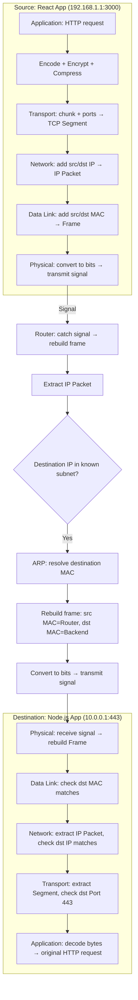

# OSI Model vs TCP/IP Model

> Networking Fundamentals Series — Session Notes
> Topic: OSI 7-layer model, its layer-by-layer breakdown, why layering exists, the TCP/IP model, and a full request/response walkthrough (encapsulation → transmission → decapsulation) through both models

---

## 1. Overview

- **OSI Model** = **O**pen **S**ystems **I**nterconnection — a **conceptual** model (introduced 1983) that splits networking into **7 independent layers**.
- **TCP/IP Model** = the **practical**, real-world model actually used today. It **merges** OSI's top 3 layers (and sometimes bottom 2) into fewer layers.
- "Open systems" = systems open to communicate — e.g., a backend may reject a request (401/403), but it's still open to receiving and processing it.
- "Interconnection" = how systems connect and communicate over a network, broken into 7 distinct responsibilities (layers).

---

## 2. The 7 OSI Layers (Top to Bottom)

| Layer # | Name | Data Unit | Core Concept | Example Protocols |
|---|---|---|---|---|
| 7 | Application | — | End-user facing apps | HTTP, SMTP, IMAP, POP3, FTP, SSH |
| 6 | Presentation | — | Encoding, encryption, serialization, compression | TLS/SSL, UTF-8 |
| 5 | Session | — | Session creation, maintenance, termination | RPC, NetBIOS |
| 4 | Transport | Segment (TCP) / Datagram (UDP) | Ports, reliable/unreliable delivery | TCP, UDP, QUIC |
| 3 | Network | IP Packet | IP addressing, routing decisions | IP, ICMP |
| 2 | Data Link | Frame | MAC addressing, physical delivery within LAN | Ethernet, Wi-Fi (802.11) |
| 1 | Physical | Bits | Electrical/radio/light signal transmission | Wi-Fi radio waves, fiber optics, Ethernet cabling |

**Mnemonic reference (Application → Physical):** *A*ll *P*eople *S*eem *T*o *N*eed *D*ata *P*rocessing

---

## 3. Layer-by-Layer Breakdown

### 3.1 Layer 7 — Application Layer
- Where your **actual software** lives — browsers (Chrome, Edge), desktop apps, mobile apps, web servers.
- Protocols: HTTP, SMTP, IMAP, POP3, FTP, SSH.
- Simple mental model: whatever software you build that runs on browser/mobile/desktop = application layer.

### 3.2 Layer 6 — Presentation Layer
- Handles: **encoding, encryption, serialization, compression**.
- Example: when you send an HTTPS request, the plaintext request (`GET /profile`) is **encrypted via TLS** before transmission — so an attacker intercepting it sees gibberish, not the raw request.
- Encoding: converting plaintext → bytes (e.g., using UTF-8) before transmission.
- Compression: large payloads compressed (e.g., using zlib) before sending.
- **Key insight**: these operations transform your plain data from the application layer — that transformation work is what defines the presentation layer.

### 3.3 Layer 5 — Session Layer
- Manages **sessions** between two applications: creating, maintaining, and terminating a session for a task.
- Example — **user sessions**: after authenticating (username/password), the server creates a session and returns a session ID, stored as an HTTP cookie or in browser storage, sent with every subsequent request so the server knows the user is authorized.
- Example — **file transfer checkpointing**: if transferring a 10GB file and the connection fails at 8GB, the session layer acts like a **checkpoint** — on reconnect, it knows to resume from 8GB rather than restarting from zero.
- **Commonly misunderstood layer** — people often assume HTTP session/cookie logic is purely "application layer," but conceptually, session management is a distinct OSI responsibility (layer 5).
- Protocols: RPC (Remote Procedure Call — execute code on another machine), NetBIOS (used in older systems).

### 3.4 Layer 4 — Transport Layer
- As a software developer, you mostly deal with **Application + Transport** layers (DevOps/Cloud roles also deal with Network layer — IP, sometimes MAC).
- **Most important layer** — nearly every higher-layer protocol (HTTP, SMTP, RPC, SSH, even QUIC under the hood) rides on top of **TCP or UDP**.
- Introduces the concept of **ports** — e.g., a React app running on port `3000` is exposed via the transport layer.
- **Data units**:
  - TCP → **Segment**
  - UDP → **Datagram**

### 3.5 Layer 3 — Network Layer
- Introduces **IP addressing** — while transport layer tells you *which port* on a machine, network layer tells you *how to route to that machine* over the internet.
- Protocols: **IP** (Internet Protocol), **ICMP** (Internet Control Message Protocol — used by tools like `ping` and `traceroute` to diagnose networks).
- **Data unit**: **IP Packet**

### 3.6 Layer 2 — Data Link Layer
- Introduces **MAC addressing** (see prior IP vs MAC notes).
- IP is virtual/logical; MAC delivery is the **physical medium** concept — "this is the MAC address, send a frame to that device."
- No knowledge of IP addresses exists at this layer — that's a Network Layer (above) concern.
- **Data unit**: **Frame**

### 3.7 Layer 1 — Physical Layer
- Frames are converted into **0s and 1s (bits)**.
- Bits are transmitted as **electrical signals, radio waves (Wi-Fi), or light (fiber optics)** over the physical medium to the destination.
- This is the actual endpoint of the transmission process — everything above this layer is abstraction; this layer is where data physically leaves the machine.

---

## 4. Data Units — Quick Reference

| Layer | Data Unit |
|---|---|
| Transport (TCP) | Segment |
| Transport (UDP) | Datagram |
| Network | IP Packet |
| Data Link | Frame |
| Physical | Bits (signals) |

*(These terms matter — they recur when discussing routing, ICMP, and packet analysis.)*

---

## 5. Why Layering? (The "Separation of Concerns" Rationale)

- Each layer is **independent** of the others. If a new protocol is introduced at the application layer, lower layers continue working correctly without needing to change.
- Analogy: you don't write a different Node.js application depending on whether the network uses Wi-Fi, Ethernet, or fiber optics — you write your app once in JavaScript, and it works regardless of the physical medium.
- This independence is the core benefit of the OSI model's layered design — it allows each layer to be built, maintained, and reasoned about **separately**.

---

## 6. OSI vs TCP/IP Model — Why the Merge?

- In practice, **Application (7), Presentation (6), and Session (5)** layers are all typically implemented **within the same application code**:
  - Encryption (e.g., using an OpenSSL library) → still part of your app's code.
  - Compression (e.g., using zlib) → still part of your app's code.
  - Authentication/authorization (login/logout/signup routes, middleware) → still part of your app's code, and session verification also happens there.
- Since all three responsibilities are handled at essentially the same level (your application), the **TCP/IP model merges Layers 5, 6, and 7 into a single "Application Layer."**
- Result: TCP/IP model has **5 layers** instead of OSI's 7 (some versions merge Data Link + Physical too, into just **4 layers** — this session keeps those two separate).

### Comparison Table

| OSI Model (7 layers) | TCP/IP Model (5 layers) |
|---|---|
| Application | Application |
| Presentation | *(merged into Application)* |
| Session | *(merged into Application)* |
| Transport | Transport |
| Network | Network (Internet) |
| Data Link | Data Link |
| Physical | Physical |

> **Practical takeaway**: OSI is a **conceptual/teaching model** (1983); TCP/IP is the model **actually used in modern real-world systems**. When discussing networking in practice, refer to TCP/IP.

---

## 7. Mapping a Real HTTP Request to TCP/IP Layers

Using a `fetch()` HTTPS request as the running example:

| Step | Operation | TCP/IP Layer |
|---|---|---|
| 1 | Write the actual request code (`fetch`, headers, etc.) | Application |
| 2 | Encrypt (TLS), compress, encode into bytes | Application *(absorbs Presentation)* |
| 3 | Manage user session / cookies | Application *(absorbs Session)* |
| 4 | Break byte blob into chunks; attach source & destination **ports** → forms a **TCP segment** | Transport |
| 5 | Encapsulate segment with source & destination **IP** → forms an **IP packet** | Network |
| 6 | Encapsulate IP packet with source & destination **MAC** → forms a **Frame** | Data Link |
| 7 | Convert frame into bits; transmit as signal (Wi-Fi/Ethernet/fiber) | Physical |

---

## 8. Full Encapsulation Walkthrough (Source → Router → Destination)

**Setup:**
- **Source**: React.js frontend at `192.168.1.1`, port `3000`
- **Destination**: Node.js backend at `https://api.example.com` → `10.0.0.1`, port `443`
- **Request**: `GET /profile`

### 8.1 At the Source (Frontend)
1. **Application layer**: HTTP request built, encrypted (TLS), compressed, encoded into bytes.
2. **Transport layer**: Byte blob broken into chunks → each chunk gets source port `3000` and destination port `443` → forms a **TCP segment**.
3. **Network layer**: Segment encapsulated with source IP `192.168.1.1` and destination IP `10.0.0.1` → forms an **IP packet**.
4. **Data Link layer**: Packet encapsulated with source MAC (own NIC) and destination MAC = **default gateway's MAC** (since the backend is on a different network, not directly known) → forms a **Frame**.
   - *(Recall: this MAC is obtained via ARP — see ARP notes.)*
5. **Physical layer**: Frame converted to bits → transmitted as a signal (e.g., radio waves over Wi-Fi).

### 8.2 At the Router (Layer 3 Device)
1. Router intercepts the **signal** → reconstructs it into a **frame**.
2. Breaks the frame → extracts the **IP packet**.
3. Checks destination IP (`10.0.0.1`) against its known subnets (using subnet mask) → determines it knows this network.
4. Uses **ARP** to resolve the destination IP to the backend's MAC address.
5. Rebuilds the frame: **source MAC = router's MAC**, **destination MAC = backend's MAC** (IP packet inside stays the same).
6. Converts frame → bits → transmits toward the backend.

> **Key insight**: The router only inspects up to **Layer 3 (IP)** — it never touches the TCP segment. This is exactly why **routers are classified as Layer 3 devices**.

### 8.3 At the Destination (Backend)
1. Backend receives the signal → reconstructs the **frame**.
2. Checks destination MAC — confirms the frame is meant for it.
3. Breaks frame → gets the **IP packet** → checks destination IP (`10.0.0.1`) — confirms match.
4. Breaks IP packet → gets the **TCP segment** → checks destination port (`443`) → knows this belongs to its Node.js app.
5. This process repeats for **all chunks** (e.g., all 10 chunks of the request) — typically via the same route (same source → router → destination path), though this isn't guaranteed in general.
6. Once all chunks arrive, backend **decodes** them (reverses the encoding done at the source) to reconstruct the original plaintext HTTP request.
7. Backend interprets the request (`GET /profile`), performs the necessary logic (e.g., a database call), and prepares a response.

### 8.4 Response Flow (Backend → Frontend)
- The exact same top-to-bottom flow repeats in reverse:
  - Application layer: response chunked, compressed, encrypted.
  - Transport layer: source port becomes `443`, destination port becomes `3000` → TCP segment.
  - Network layer: source IP becomes `10.0.0.1`, destination IP becomes `192.168.1.1` → IP packet.
  - Data Link layer: source MAC = backend's MAC, destination MAC = **default gateway's MAC** (router) → frame.
  - Physical layer: frame → bits → transmitted as signal.
- **Router** again intercepts, checks destination IP (`192.168.1.1`), determines it belongs to the frontend's network, and forwards the frame to the frontend machine.
- Frontend decodes the signal → frame → IP packet → segment → and ultimately reconstructs the original **HTTP response**.

---

## 9. Mental Model / Flow Diagram

---

## 10. Analogy

Think of the layers like **packing a parcel for international shipping**:
- **Application**: You write the letter (your actual content/code).
- **Presentation**: You translate it into a language the recipient understands and seal it in a tamper-proof envelope (encoding/encryption/compression).
- **Session**: You attach a tracking/reference number so the courier knows which ongoing exchange this belongs to.
- **Transport**: You split it into labeled boxes with sender/recipient **suite numbers** (ports).
- **Network**: You write the sender/recipient **street addresses** (IP) on each box.
- **Data Link**: The local courier van driver only needs to know the exact **house/door** to deliver to (MAC) — relevant only for the local leg.
- **Physical**: The actual truck/plane/ship physically carrying the boxes (bits over wire/radio/light).

---

## 11. Interview Q&A

**Q1: What are the 7 layers of the OSI model, top to bottom?**
A: Application, Presentation, Session, Transport, Network, Data Link, Physical.

**Q2: Why does layering exist in the OSI model?**
A: To achieve separation of concerns — each layer operates independently, so a change in one layer (e.g., a new application protocol) doesn't require changes in other layers (e.g., the physical medium). This makes each layer easier to build, maintain, and reason about.

**Q3: What is the key difference between the OSI model and the TCP/IP model?**
A: OSI is a conceptual, 7-layer model (introduced in 1983) used mainly for teaching. TCP/IP is the model actually used in practice — it merges OSI's Application, Presentation, and Session layers into a single Application layer, resulting in 5 layers (or 4, if Data Link and Physical are also merged).

**Q4: Why are Presentation and Session layer responsibilities merged into the Application layer in TCP/IP?**
A: Because in real applications, encryption, compression, serialization (Presentation) and session/authentication management (Session) are all implemented within the same application codebase — there's no separate system handling them, so treating them as one layer better reflects real-world implementation.

**Q5: What is the data unit at each layer?**
A: Transport (TCP) → Segment; Transport (UDP) → Datagram; Network → IP Packet; Data Link → Frame; Physical → Bits.

**Q6: Why is a router considered a Layer 3 device?**
A: Because a router only inspects and acts on information up to the Network layer (IP packet / destination IP) to make routing decisions. It never opens or processes the TCP segment (Transport layer) — that's the endpoint devices' job.

**Q7: What happens to source/destination IP and MAC addresses as a packet passes through a router?**
A: The IP addresses (source and destination) stay the same throughout the journey (they represent the true origin and final destination). The MAC addresses change at every hop — e.g., from Frontend→Router, source MAC = frontend's MAC, destination MAC = router's MAC; from Router→Backend, source MAC = router's MAC, destination MAC = backend's MAC.

**Q8: What's the difference between how TCP and UDP structure their data units?**
A: TCP's data unit is called a **Segment**; UDP's data unit is called a **Datagram**. Both operate at the Transport layer and involve ports, but TCP segments are part of an ordered, connection-oriented delivery, while UDP datagrams are connectionless.

**Q9: Where does session management with HTTP cookies fit in the OSI/TCP-IP model?**
A: In OSI, session management is conceptually part of the Session layer. In practice (and in TCP/IP model terms), it's implemented within the Application layer, since cookies and session logic are handled directly in application code (e.g., server-side auth middleware).

**Q10: As a software developer, which layers do you typically deal with directly?**
A: Mostly Application and Transport layers. DevOps/Cloud engineers often also deal with the Network layer (IP addresses) and occasionally MAC addresses at the Data Link layer.

---

## 12. Quick Revision Checklist

- [ ] OSI = 7 layers (conceptual, 1983): Application, Presentation, Session, Transport, Network, Data Link, Physical
- [ ] TCP/IP = practical model; merges Presentation + Session into Application → 5 layers (sometimes 4)
- [ ] Application (L7): actual app/code — HTTP, SMTP, IMAP, FTP, SSH
- [ ] Presentation (L6): encoding, encryption (TLS), serialization, compression
- [ ] Session (L5): session creation/maintenance/termination — RPC, NetBIOS, checkpointing
- [ ] Transport (L4): ports; TCP → Segment, UDP → Datagram; most protocols ride on TCP/UDP
- [ ] Network (L3): IP addressing, routing decisions; data unit = IP Packet; protocols = IP, ICMP
- [ ] Data Link (L2): MAC addressing, physical-medium delivery; data unit = Frame
- [ ] Physical (L1): raw bits transmitted as electrical/radio/light signals
- [ ] Layering exists for separation of concerns — each layer is independent
- [ ] Router = Layer 3 device — only reads up to IP packet, never opens TCP segment
- [ ] IP addresses stay constant end-to-end; MAC addresses change at every hop
- [ ] Encapsulation direction: Application → Transport → Network → Data Link → Physical (adding headers at each step)
- [ ] Decapsulation direction (at receiver): Physical → Data Link → Network → Transport → Application (stripping headers at each step)

---

## 13. What's Next
- Deeper dive into **ICMP** and tools like `ping` and `traceroute` for network diagnostics.
- Further exploration of **routing** — how packets hop across multiple routers to reach their destination.
