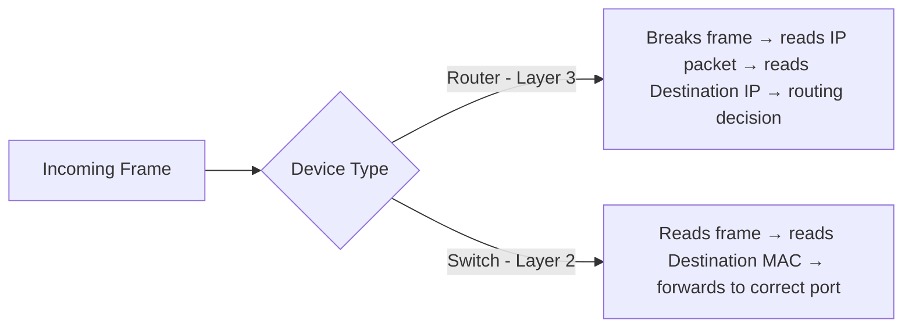
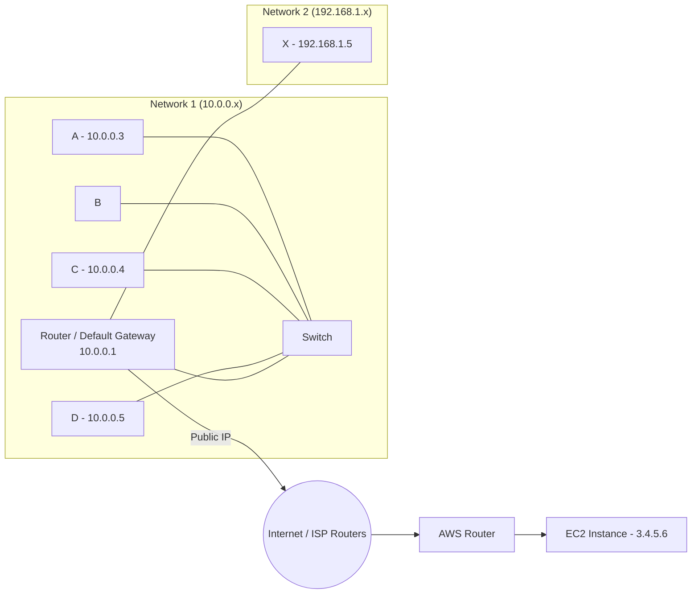

# Routing in Networks — Detailed Notes

> Series: Computer Networking Fundamentals
> Prerequisite videos: IP addressing, MAC addressing, Subnet Mask, Default Gateway, ARP (Address Resolution Protocol)
> Topic: How a packet actually travels — hop by hop — from source device to destination device, and what changes at each hop

---

## 1. What is Routing?

**Routing** is the process of taking a data packet from a source device to a destination device via a series of **hops** (routers/switches), when the source doesn't directly know where the destination is located.

- When you make an API request from frontend → backend, the source machine and destination machine are usually on **different networks** and neither knows the other's exact physical location.
- The packet is handed off device-to-device (laptop → router → ISP router → ISP router → destination router → destination device) until it reaches the destination.
- This chain of hops taken to reach the destination = **Routing**.

### Routing can happen at 3 levels:
| Scope | Description |
|---|---|
| Same network | Source and destination are on the same LAN |
| Two different networks | A single router bridges both networks |
| Multiple networks (Internet) | Packet hops across many routers/ISPs to reach a distant network (e.g., AWS data center) |

---

## 2. Core Building Block: The Ethernet Frame

- The **Ethernet Frame** is the Data Link Layer unit — the second-last unit before data is transmitted as raw bits.
- Whenever bits are received, the **first thing parsed** after the bits is the Ethernet Frame.
- Every routing scenario below is really about: **"What changes inside this frame as it moves hop to hop?"**

Frame contains (at minimum, for our purposes):
- Source IP
- Destination IP
- Source MAC
- Destination MAC

---

## 3. Router vs Switch

| Aspect | Router | Switch |
|---|---|---|
| OSI Layer | Layer 3 (Network Layer) | Layer 2 (Data Link Layer) |
| Decision basis | **Destination IP address** | **Destination MAC address** |
| What it does | Breaks the frame, reads IP packet, decides next hop | Reads frame, reads destination MAC, forwards to correct port |
| Scope | Connects different networks | Switches traffic within the same network |
| Standalone device? | Can act as both router + switch (home routers) | Dedicated devices used by ISPs are pure switches (Layer 2 only, never inspect IP) |

**Key insight:** A switch knows which MAC address is connected to which physical port (it learns this automatically as devices connect). This lets it **unicast** — forward a frame/ARP directly to the correct port instead of broadcasting to everyone.

---

## 4. Setup Used in the Examples

- **Network 1**: Laptops A, B, C, D + a Router (also acting as a Switch) with IP `10.0.0.1`
- **Network 2**: Laptop X with IP `192.168.1.5`, reachable via the same router
- Router also has a **Public IP** (assigned by ISP)
- **Internet**: modeled as 2 intermediate ISP routers (R_P, R_Q)
- **AWS Data Center**: has its own router + an EC2 instance

---

## 5. Scenario 1 — A → D (Same Network)

**Goal:** A (10.0.0.3) sends a packet to D (10.0.0.5). Both are in Network 1.

### Step-by-step:
1. A knows its own IP/MAC and D's IP, but **not D's MAC**.
2. A applies its **subnet mask** on D's IP → confirms D is in the *same* network.
3. Since MAC is unknown, A triggers **ARP (Address Resolution Protocol)**:
   - ARP Request: *"What is the MAC of IP 10.0.0.5?"*
   - This request is **broadcast** to the switch.
4. Switch forwards the broadcast to **every port** (since it doesn't know who owns that IP).
5. B, C, R ignore it (wrong IP match). **D** recognizes the IP as its own.
6. D caches A's MAC (learned from the ARP request itself) into its own **ARP table** — avoids future ARP requests.
7. D sends back an **ARP Reply**: *"MAC of 10.0.0.5 is D's MAC."* — this reply is **unicast** directly to A's port (switch already knows A's port-MAC mapping).
8. A receives D's MAC, updates its own ARP table, fills in the frame's destination MAC.
9. Frame is forwarded to switch → switch forwards it directly to D's port (switch already knows D's MAC-port mapping).

### Key Point
✅ Entirely resolved using **ARP + Switch MAC table** — no Layer 3 routing decision needed since it's same-network.

---

## 6. Scenario 2 — C → X (Different Network, Same Router)

**Goal:** C (10.0.0.4) sends a packet to X (192.168.1.5) — a **different** network.

### Step-by-step:
1. C applies subnet mask on X's IP → determines X is **NOT** in its own network.
2. C **falls back to its Default Gateway** (the router) — this is pre-configured.
3. C sends an ARP Request: *"What is MAC of Default Gateway (10.0.0.1)?"*
4. A, B, D ignore it (wrong IP). Default Gateway replies with its own MAC.
5. Switch forwards the reply to C's port (known mapping) → C attaches Default Gateway's MAC as destination MAC.
6. C forwards frame → switch → forwards to Router's port (known mapping).
7. **Router receives frame**, breaks it open:
   - Checks destination MAC → matches itself → frame is meant for it.
   - Reads destination IP → applies subnet mask → determines destination belongs to **Network 2**.
8. Router now needs X's MAC (unknown). It sends an **ARP request into Network 2**.
9. X replies with its own MAC.
10. Router updates the frame: destination MAC = X's MAC, **destination IP unchanged**.
11. Router forwards the frame → X receives it.

### Key Point
✅ **Destination IP never changes.** Only the **destination MAC** changes at each hop — it always points to the *next hop's* MAC, not the final destination's MAC (until the last hop within that destination's own network).

---

## 7. Scenario 3 — C → AWS EC2 (Over the Internet, via NAT)

**Goal:** C (10.0.0.4, private IP) sends a packet to an AWS EC2 instance (3.4.5.6).

### Step-by-step:

1. C applies subnet mask → destination is not in its own network → falls back to Default Gateway.
2. Since Default Gateway's MAC was already cached in a previous scenario, **no new ARP request is needed** — C fetches it straight from its ARP table.
3. Frame → Switch → forwarded to Router (via known Default Gateway MAC/port mapping).
4. **Router** breaks the frame:
   - Applies subnet mask on destination IP → **not in Network 1, not in Network 2** → must go out to the **Internet**.

### 🔑 NAT (Network Address Translation) Kicks In
   - C's IP (`10.0.0.4`) is a **private IP** — meaningless on the public internet; no internet router knows how to route to it.
   - Before sending to the internet, the router:
     - Replaces **source IP** → its own **public IP**
     - Replaces **source MAC** → its own MAC
     - Also assigns a **random source port** (deferred to a future NAT-focused video)
   - Router **maintains a NAT mapping table**, e.g.:
     | Private IP:Port | Mapped Public IP:Port |
     |---|---|
     | 10.0.0.1 : 3000 | 2.3.4.5 : 54326 |
   - This mapping lets the router later route the **response** back to the correct internal device/port.

5. **Destination IP still never changes** (stays 3.4.5.6 throughout).
6. Destination MAC is now updated hop-by-hop across the internet:
   - Router → ISP Router **R_P** (MAC resolved via ARP since same network)
   - R_P → ISP Router **R_Q** (breaks frame, sees destination MAC = itself, but destination IP ≠ itself → forwards further; MAC updated to R_Q via ARP since same ISP network)
   - R_Q → **AWS Router** (same logic; MAC resolved via ARP)
7. **AWS Router** receives the frame, sees destination IP belongs to its own network (AWS data center) → resolves EC2's MAC via ARP → forwards to EC2.
8. **EC2 receives the packet.**

### Return Path (Response from EC2)
- EC2 sends response → destination IP/port = router's public IP:port (e.g., `2.3.4.5 : 54326`)
- Router checks its **NAT table**, finds this maps to `10.0.0.1 : 3000` (i.e., device C's private IP:port)
- Router rewrites destination IP/port back to C's private values and forwards it inward to C via the switch.

---

## 8. The Golden Rule of Routing

> ✅ **Destination IP never changes** across the entire journey (except when NAT rewrites *source* IP, not destination).
> 🔁 **Source IP** changes only once — when the router performs NAT to swap a private IP for a public IP before hitting the internet.
> 🔁 **Both Source MAC and Destination MAC change at every single hop.**

### Why do MAC addresses always change per hop?
- MAC addresses are only meaningful **within a local network** (Layer 2 scope).
- To physically deliver a frame to the *next* hop, you need that next hop's MAC — not the final destination's MAC.
- So at every hop: source MAC = current device's MAC, destination MAC = next hop's MAC (resolved via ARP or ARP table cache).

---

## 9. Comparison Table: All 3 Scenarios

| | Scenario 1 (A→D) | Scenario 2 (C→X) | Scenario 3 (C→AWS) |
|---|---|---|---|
| Networks involved | 1 (same) | 2 (via 1 router) | Multiple (via Internet) |
| ARP needed for | Destination directly | Default Gateway + Router resolves X's MAC | Default Gateway (cached) + hop-by-hop ISP router MACs + AWS resolves EC2 MAC |
| Destination IP change? | ❌ Never | ❌ Never | ❌ Never |
| Source IP change? | ❌ No | ❌ No | ✅ Yes (NAT: private → public IP) |
| NAT involved? | ❌ No | ❌ No | ✅ Yes |
| Switch role | Broadcasts unknown ARP, unicasts known MACs | Same | Same, plus forwarding to router uplink |
| Router role | Not involved | Breaks frame, cross-network forward | Breaks frame at every hop, performs NAT, multi-hop forwarding |

---

## 10. Interview Q&A

**Q1. What is routing?**
> The process of forwarding a packet across one or more intermediate devices (routers/switches) using hop-by-hop decisions, until it reaches its destination network/device.

**Q2. What's the fundamental difference between a router and a switch?**
> A router operates at Layer 3 and makes forwarding decisions based on the destination IP address; a switch operates at Layer 2 and forwards based on the destination MAC address. A switch has no visibility into IP at all.

**Q3. Why does the destination IP address never change during routing, but the destination MAC does?**
> IP addressing is used for **end-to-end logical addressing** across the whole journey, while MAC addressing is only valid **within a local network segment**. At each hop, the frame needs to be physically delivered to the next device in line, which requires that next device's MAC — hence MAC keeps changing, while IP (the ultimate identity of the destination) stays the same throughout.

**Q4. What role does ARP play in routing?**
> ARP resolves an IP address to its corresponding MAC address within a local network. It's used whenever a device (or router) needs to physically forward a frame to another device/router in the same network segment, but doesn't yet know its MAC.

**Q5. What is a Default Gateway and when is it used?**
> The default gateway is the pre-configured router IP that a device falls back to whenever it determines (via subnet mask) that the destination IP is *not* part of its own local network.

**Q6. Why is NAT necessary?**
> Devices behind a home/office router typically have **private IP addresses**, which are not routable on the public internet. NAT allows the router to swap a device's private IP:port for its own public IP:port (and maintain a mapping table) so that internet responses can be routed back correctly.

**Q7. How does a switch decide where to forward an ARP broadcast vs a regular frame?**
> If the switch doesn't know which port owns the target MAC (e.g., during an ARP broadcast for an unknown IP-to-MAC mapping), it floods the request to **all ports**. If it already knows the MAC-to-port mapping (learned by observing traffic), it **unicasts** directly to that one port — this is far more efficient.

**Q8. Trace what happens to source IP, destination IP, source MAC, and destination MAC as a packet goes from a private LAN device to a public cloud server.**
> - Destination IP: stays constant throughout (the cloud server's public IP).
> - Source IP: stays as the private IP until it hits the router doing NAT, after which it becomes the router's public IP for the rest of the journey.
> - Source MAC & Destination MAC: change at **every hop** — always reflecting current-device-MAC → next-hop-device-MAC.

**Q9. Why does an ARP reply not need to be broadcast, unlike an ARP request?**
> An ARP request doesn't know which device owns the target IP, so it must be broadcast to all devices/ports. Once the owning device responds, it already knows the requester's MAC (learned from the request itself), so the reply can be **unicast** directly.

**Q10. What information does a router use to decide whether to hand off a frame to the internet vs deliver it locally?**
> It applies the **subnet mask** to the destination IP. If the IP doesn't match any network the router has direct access to, it forwards the frame outward toward its ISP/internet uplink (its own default gateway, essentially).

---

## 11. Quick Revision Checklist

- [ ] Ethernet Frame = Data Link Layer unit; first thing parsed after raw bits
- [ ] Router = Layer 3 → decides using **destination IP**
- [ ] Switch = Layer 2 → decides using **destination MAC**
- [ ] Switch learns MAC↔port mapping automatically; enables unicast forwarding
- [ ] ARP resolves IP → MAC within a local network
- [ ] ARP Request = broadcast (unknown owner) | ARP Reply = unicast (owner known)
- [ ] Devices cache resolved MACs in their own **ARP table** to avoid repeat ARP requests
- [ ] Subnet mask is used to check: "is destination IP in my own network?"
- [ ] If not in own network → fall back to **Default Gateway**
- [ ] **Destination IP never changes** across the entire path
- [ ] **Source IP changes only once** — at the router doing NAT (private → public IP)
- [ ] **Source MAC & Destination MAC change at every hop**
- [ ] NAT maintains a mapping table (private IP:port ↔ public IP:port) to route responses back correctly
- [ ] Three routing scenarios: same network (ARP only) → cross-network via one router → cross-network via internet (multi-hop + NAT)

---

## 12. Related Prerequisite Topics (Watch Before/Alongside This)
- IP Addressing & Subnet Masks (CIDR)
- MAC Addressing
- Default Gateway
- ARP (Address Resolution Protocol)
- NAT (Network Address Translation) — covered in a future/dedicated video, referenced here but not fully detailed
