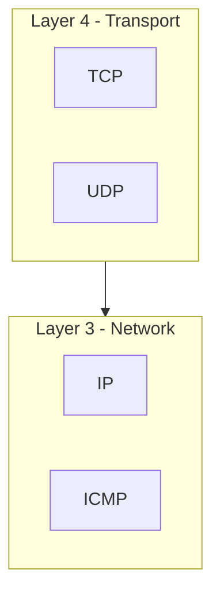
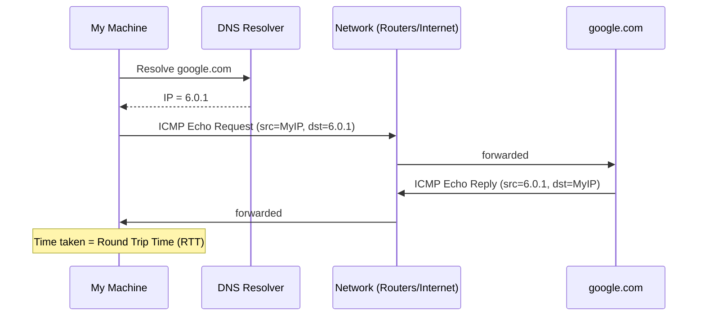
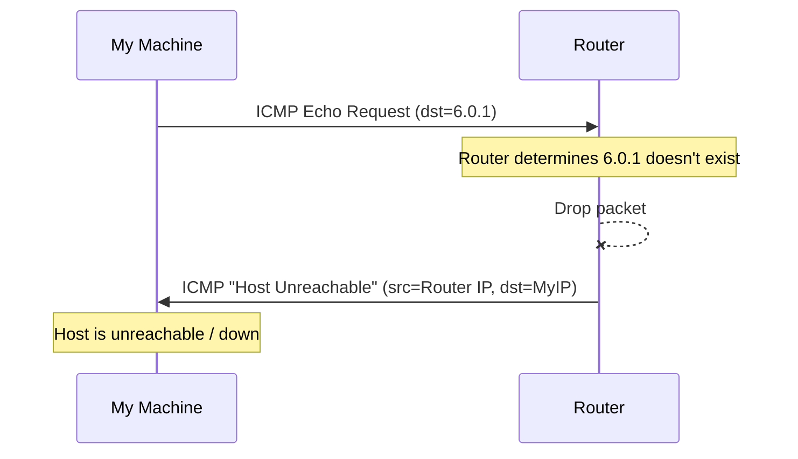
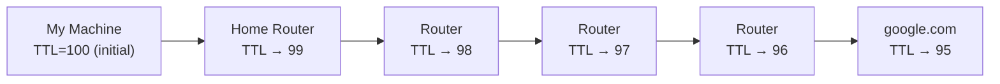
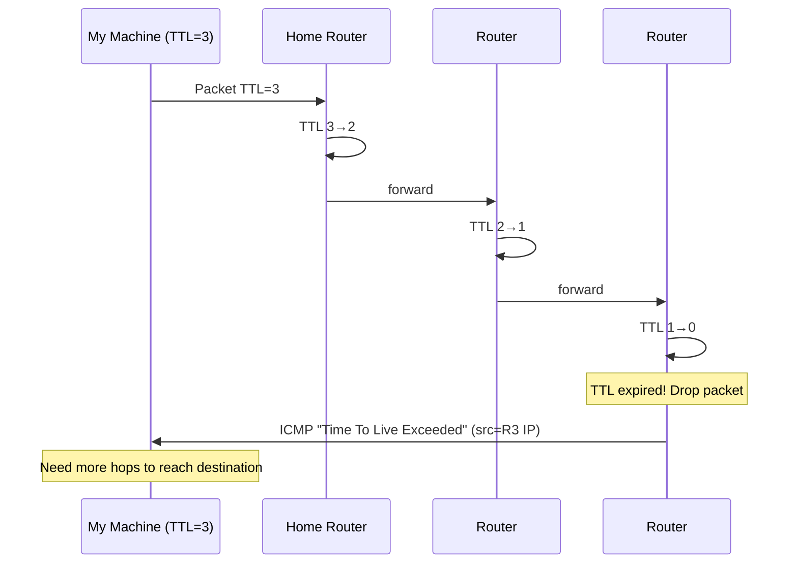
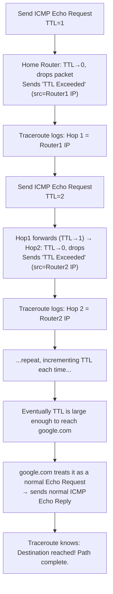
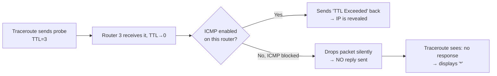

# ICMP, Ping & Traceroute — Detailed Notes

> Series: Computer Networking Fundamentals
> Prerequisite: Routing in Networks (IP, MAC, Routers, Switches)
> Topic: What is ICMP, how `ping` and `traceroute` use ICMP under the hood, and what TTL really does

---

## 1. What is ICMP?

**ICMP = Internet Control Message Protocol**

- A protocol that helps **notify errors and events** happening on the network.
- It is **NOT an application-layer concept** — it operates at the **Network Layer (Layer 3)**, the same layer where IP operates.
- Because it's a Layer 3 protocol, **ICMP has no concept of ports** (ports are a Layer 4 concept — TCP/UDP). ICMP only uses **IP addresses** to deliver its error messages/events.

### Common ICMP Use Cases
| Scenario | ICMP Response |
|---|---|
| Destination host doesn't exist | **Host Unreachable** |
| Host exists, but requested port has no process listening | **Port Unreachable** |
| Packet stuck in a routing loop (TTL hits 0) | **Time To Live (TTL) Exceeded** |
| Successful reachability check | **Echo Reply** (response to Echo Request) |

---

## 2. ICMP in Action: How `ping` Works

**Ping** = a network utility used to check:
1. Whether a server is **up or down**
2. If up, what is the **Round Trip Time (RTT) / latency**

### Step-by-step flow of `ping google.com`

1. `ping google.com` first performs a **DNS lookup** → resolves `google.com` to an IP (e.g., `6.0.1`).
2. Ping internally creates an **ICMP Echo Request** packet:
   - Source IP = my machine's IP
   - Destination IP = `6.0.1` (google.com)
3. This IP packet is sent over the network to `google.com`.
4. `google.com` detects the Echo Request and generates an **ICMP Echo Reply**:
   - Source IP = `6.0.1`
   - Destination IP = my machine's IP
5. Reply comes back to my machine → the time taken for this full round trip = **RTT** (e.g., `8 ms`).
6. Ping repeats this every second (or configured interval) — each line of output = **one ICMP Echo Request/Reply pair**, identified by a **sequence number**.

### How Ping Detects an Unreachable Host

- If the destination host doesn't exist, the router that detects this **drops the packet** and generates an ICMP **Host Unreachable** error.
- Source IP of this error = the **router's own IP** (the one that dropped it), Destination IP = my machine.
- This is how `ping` tells you a host is dead/unreachable.

---

## 3. TTL (Time To Live) — The Core Mechanism

**TTL** = a counter field in the ICMP/IP packet that tracks **how many hops** a packet has taken.

### Why TTL exists
- Prevents packets from looping **infinitely** across the internet (e.g., Router1 → Router2 → Router3 → Router2 → Router3 → ... forever).
- Every time a packet passes through a router (one hop), the router **decrements TTL by 1**.
- When **TTL reaches 0**, the router **drops the packet** and sends back an ICMP **"Time To Live Exceeded"** error to the source.

### Example: TTL decrementing across hops

### What happens when TTL hits 0

- The router where TTL becomes 0 → **drops the packet** and returns a **"TTL Exceeded"** ICMP error, with:
  - Source IP = that router's own IP
  - Destination IP = my machine
- This tells the sender: *"You needed more hops to reach the destination, but your packet expired midway."*

> 💡 **This TTL-exceeded mechanism is exactly what `traceroute` exploits to map out the entire path to a destination.**

---

## 4. Practical: Simulating TTL Exceeded with Ping

Command used: `ping -m 1 google.com` (sets TTL flag to 1 → allows only 1 hop)

- Result: immediately get **"Time To Live Exceeded"** — because with TTL=1:
  1. Packet reaches home router.
  2. Home router decrements TTL: `1 → 0`.
  3. Home router **drops the packet** and sends back "TTL Exceeded" with source IP = home router's IP.
- This confirms in practice: whichever device makes TTL hit 0 is the one that returns the TTL Exceeded error — giving you visibility into exactly *which hop* you reached.

---

## 5. How Traceroute Works Internally

**Traceroute** = a network utility that **traces the path (route)** a packet takes to reach a destination, hop by hop.

### The Clever Trick
Traceroute **cleverly manipulates TTL**, starting from `1` and incrementing by `1` with every subsequent probe, to force **each router along the path** to reveal itself via a "TTL Exceeded" error.

### Step-by-step (matches the video's example)
| Probe # | TTL Sent | Where it Expires | Source IP in "TTL Exceeded" reply | Hop Logged |
|---|---|---|---|---|
| 1 | 1 | Home Router | `10.0.0.1` (Home router) | Hop 1 = `10.0.0.1` |
| 2 | 2 | Router 2 | `20.0.0.1` | Hop 2 = `20.0.0.1` |
| 3 | 3 | Router 3 | `30.0.0.1` | Hop 3 = `30.0.0.1` |
| 4 | 4 | Router 4 | `40.0.0.1` | Hop 4 = `40.0.0.1` |
| 5 | 5 | Router 5 | `50.0.0.1` | Hop 5 = `50.0.0.1` |
| 6 | 6 | **Reaches google.com** | — (Normal Echo Reply, not TTL Exceeded) | Destination reached ✅ |

- At each step, traceroute **notes down the source IP** of the "TTL Exceeded" reply as that hop's router IP.
- When TTL is finally large enough for the packet to reach the actual destination (`google.com`), the destination treats it as a **normal ICMP Echo Request** (not expired) → replies with a normal **ICMP Echo Reply** → traceroute knows it has reached the end and stops.

---

## 6. Understanding `* * *` (Stars) in Traceroute Output

- Traceroute sends **3 probe requests per hop** (hence you typically see 3 columns of timing/output per hop).
- `* * *` appears when **no reply was received** for one or more of those 3 probes at a given hop.

### Why does this happen?

- The router **still drops the expired packet** (TTL logic always applies), but if **ICMP is disabled/blocked** on that router (common security practice), it does **not** send back the "TTL Exceeded" message.
- Since traceroute got no response for that probe, it can't learn that hop's IP → displays a `*` for that probe.
- Since 3 probes are sent per hop, seeing `* * *` means **all 3 probes** to that hop got no ICMP response — meaning that hop's router is functional (forwarding packets fine) but is **not replying with ICMP** (likely blocked for security).

> ⚠️ **Important clarification:** `* * *` does **not** mean the router is down. It means the router is silently dropping/forwarding without sending ICMP replies — very commonly due to ICMP being disabled for security reasons.

---

## 7. Ping vs Traceroute — Comparison

| Aspect | Ping | Traceroute |
|---|---|---|
| Purpose | Check if host is up/down + measure latency (RTT) | Map the entire hop-by-hop path to a destination |
| TTL behavior | Uses a fixed/default TTL (large value) | Starts TTL at 1 and increments by 1 per probe |
| Number of requests | One per interval (e.g., every 1 sec), same destination each time | Multiple requests (3 probes) per TTL value, targeting each intermediate router along the way |
| Underlying protocol | ICMP (Echo Request/Reply) | ICMP (Echo Request + deliberately triggered TTL Exceeded errors) |
| Output | RTT per request, packet loss % | List of hop IPs + latency per hop |
| Detects unreachable host? | Yes — via ICMP "Host Unreachable" | Yes — implicitly, by showing where the path breaks |

---

## 8. Interview Q&A

**Q1. What layer does ICMP operate at, and why does that matter?**
> ICMP is a **Layer 3 (Network Layer)** protocol — the same layer as IP. Since ports are a Layer 4 (Transport) concept, **ICMP has no concept of ports**; it only uses IP addresses to route its error/event messages.

**Q2. What are the main types of ICMP messages discussed, and when is each triggered?**
> - **Host Unreachable** — when the destination host doesn't exist on the network.
> - **Port Unreachable** — host exists, but no process is listening on the requested port.
> - **Time To Live (TTL) Exceeded** — when a packet's TTL counter hits 0, usually because it's stuck in a routing loop or hasn't reached its destination within the allotted hop count.
> - **Echo Request / Echo Reply** — used by `ping` to check reachability and measure latency.

**Q3. What exactly is TTL and why does it decrease at every hop?**
> TTL (Time To Live) is a counter set on a packet that represents the **maximum number of hops** it's allowed to take. Every router that forwards the packet **decrements TTL by 1**. This prevents packets from circulating forever in routing loops — once TTL hits 0, the packet is dropped and an ICMP "TTL Exceeded" message is returned to the sender.

**Q4. How does `ping` measure Round Trip Time (RTT)?**
> Ping records the time it sends an ICMP Echo Request and the time it receives the corresponding ICMP Echo Reply from the destination. The difference between these two timestamps is the RTT/latency.

**Q5. Explain, step by step, how `traceroute` discovers each hop along a path.**
> Traceroute sends a series of ICMP Echo Requests, starting with TTL=1 and incrementing by 1 for each subsequent probe. Each time TTL reaches 0 at some router along the path, that router drops the packet and sends back a "TTL Exceeded" ICMP message with its own IP as the source. Traceroute logs that IP as the current hop, then repeats with a higher TTL to discover the next hop — continuing until the packet finally reaches the actual destination, which replies with a normal Echo Reply instead of a TTL Exceeded error.

**Q6. Why do we sometimes see `* * *` in traceroute output instead of an IP address?**
> Traceroute sends 3 probes per hop. If a router **drops the expired packet but has ICMP disabled/blocked** (common for security), it will not send back a "TTL Exceeded" reply. Since no response is received for one or more of the 3 probes, traceroute displays `*` for each missing reply — this does **not** mean the router is down, just that it isn't responding with ICMP.

**Q7. If a `ping` fails with "Request Timed Out" vs "Host Unreachable" — what's the difference?**
> "Host Unreachable" is an explicit **ICMP error message** actively sent back by a router that determined the destination doesn't exist/isn't reachable. A generic timeout (no response at all) usually means the packet (or its reply) was silently dropped somewhere — possibly due to ICMP being blocked — and no explicit error was ever received.

**Q8. Does the destination IP change as an ICMP packet travels through multiple routers (similar to routing)?**
> No — just like in regular IP routing, the **destination IP remains constant** throughout the journey. What changes at each hop (as covered in Layer 2 routing) is the MAC addressing used for physical delivery — ICMP itself just rides on top of IP packets and follows the same underlying routing behavior.

**Q9. Why can't traceroute find the IP of every single hop sometimes?**
> Because some intermediate routers have **ICMP disabled or blocked** for security/administrative reasons. They still forward/drop packets correctly per normal TTL logic, but they choose not to send back "TTL Exceeded" replies — so traceroute has no way to learn that hop's identity, resulting in `* * *`.

**Q10. What's the fundamental relationship between Ping, Traceroute, ICMP, and TTL?**
> ICMP is the underlying **protocol** used to carry error/event messages across the network. Both `ping` and `traceroute` are **utilities built on top of ICMP**: `ping` uses ICMP Echo Request/Reply to check reachability and latency, while `traceroute` cleverly manipulates the **TTL** field within ICMP packets to force each router along a path to reveal itself via "TTL Exceeded" errors, thereby mapping the complete route to a destination.

---

## 9. Quick Revision Checklist

- [ ] ICMP = Internet Control Message Protocol, operates at **Layer 3** (no ports)
- [ ] ICMP delivers **errors/events**: Host Unreachable, Port Unreachable, TTL Exceeded, Echo Request/Reply
- [ ] `ping` = network utility to check if a host is up/down + measure **RTT (latency)**
- [ ] `ping` internally: DNS lookup → ICMP Echo Request → ICMP Echo Reply → RTT calculated
- [ ] If host doesn't exist → router sends back ICMP **Host Unreachable**
- [ ] **TTL (Time To Live)** = hop counter; decremented by 1 at every router hop
- [ ] TTL hits 0 → packet dropped → **"TTL Exceeded"** ICMP error sent back (source IP = the router that dropped it)
- [ ] TTL exists to prevent **infinite routing loops**
- [ ] `traceroute` = traces the full hop-by-hop path to a destination
- [ ] Traceroute trick: starts TTL=1, increments by 1 each probe → forces each router to reveal itself via "TTL Exceeded"
- [ ] When packet finally reaches the real destination → normal Echo Reply (not TTL Exceeded) → traceroute stops
- [ ] Traceroute sends **3 probes per hop**
- [ ] `* * *` = no ICMP reply received for that probe (commonly because ICMP is disabled/blocked on that router) — **not** an indication the router is down
- [ ] Destination IP never changes throughout ICMP's journey either (same principle as regular routing)

---

## 10. Related Prerequisite / Follow-up Topics
- Routing in Networks (Router vs Switch, ARP, hop-by-hop MAC changes)
- IP Addressing & Subnet Masks
- NAT (Network Address Translation)
- TCP/UDP & Ports (Layer 4) — for contrast with ICMP's port-less nature
