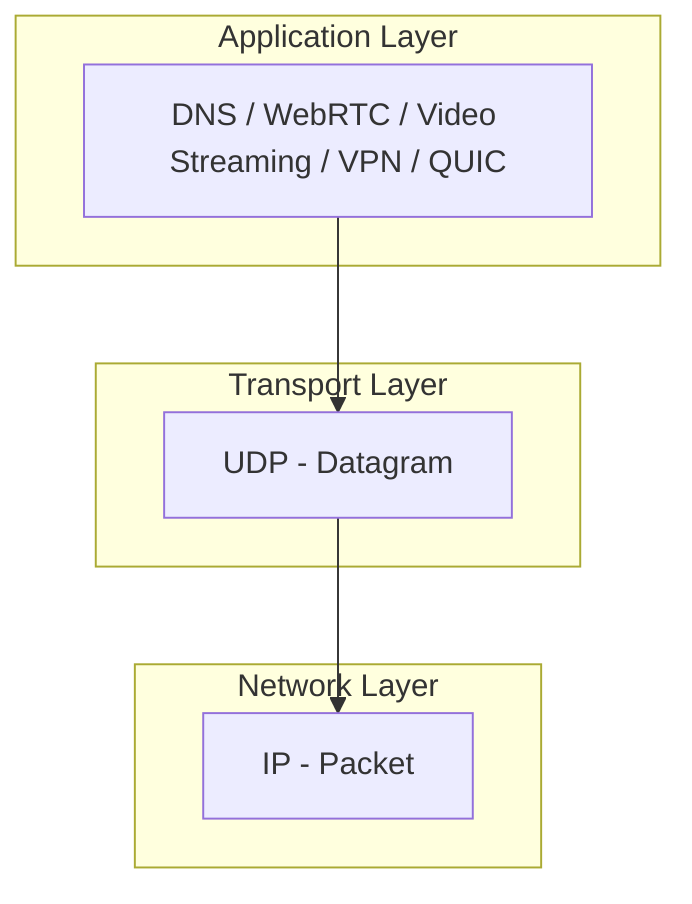
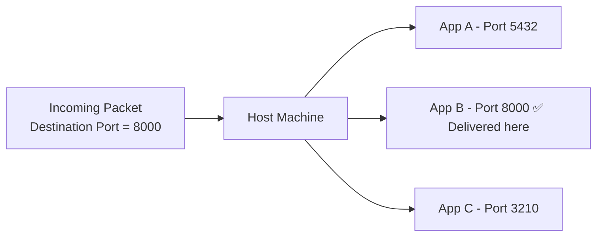
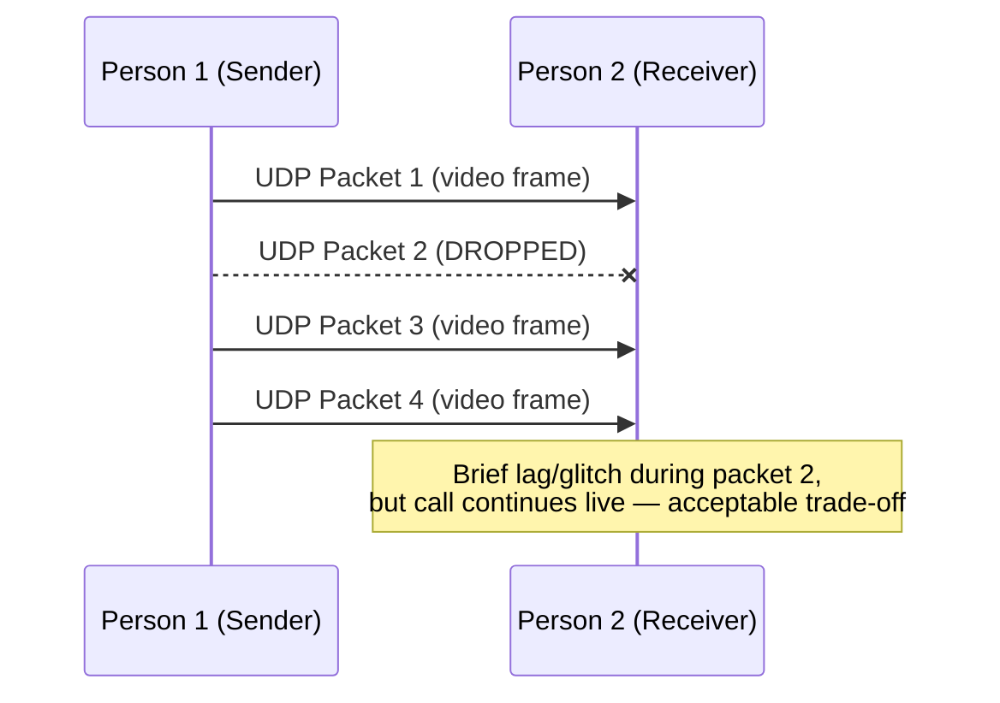
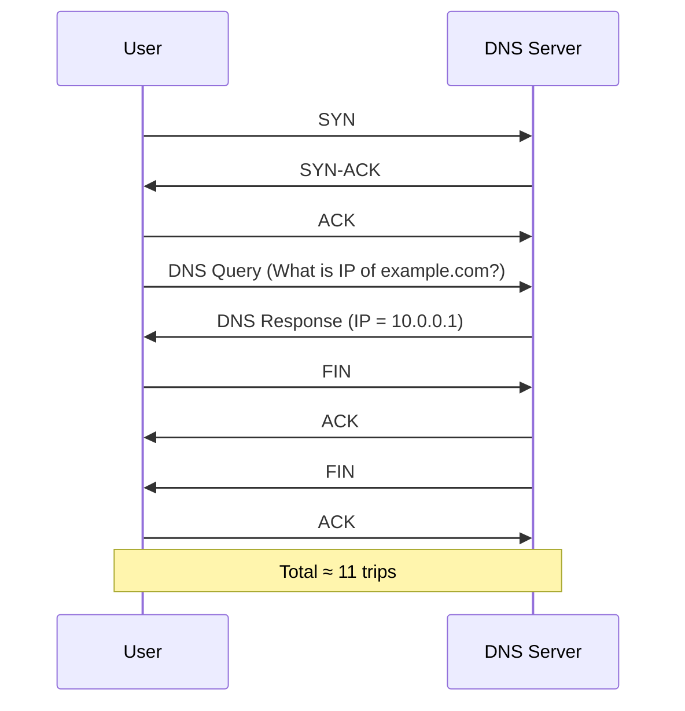
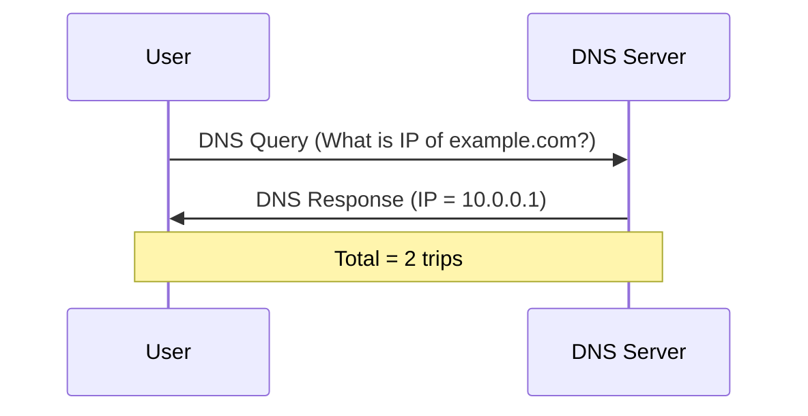
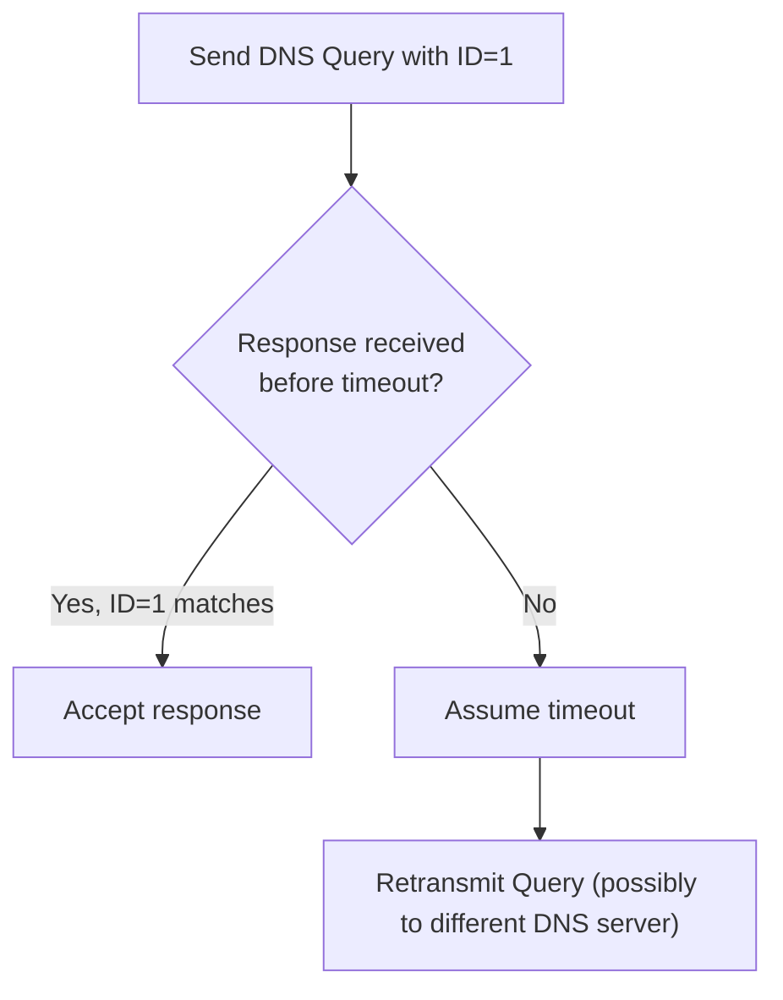
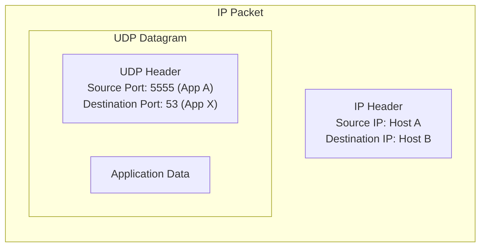
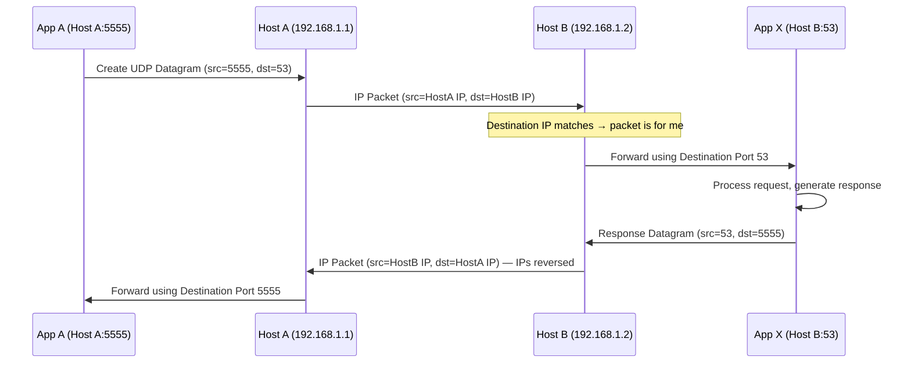

# UDP (User Datagram Protocol) — Detailed Notes

> Series: Computer Networking Fundamentals
> Prerequisite: IP & MAC addressing, Routing, TCP/IP model basics
> Topic: What UDP is, why it's fast but unreliable, its major real-world use cases, and how it uses ports to address processes on a host

---

## 1. What is UDP?

**UDP = User Datagram Protocol**

- A **Layer 4 (Transport Layer)** protocol — sits directly on top of **IP**.
- Its data unit is called a **Datagram** (just like TCP's data unit is called a **Segment**).
- Higher-level protocols that use UDP "under the hood" use this datagram as a **vehicle** to carry their data across the network to the destination.

---

## 2. Why Do We Need Ports? (Introduced First at Transport Layer)

- IP + MAC addressing gets a packet **to the correct machine** — but a single machine can have **hundreds of processes** running simultaneously (e.g., a React app on port `3000`, a FastAPI app on port `8000`).
- **Ports** are the mechanism that tells the receiving machine: *"which specific application/process should this data be delivered to?"*
- This is the **first time** the concept of ports is introduced in the protocol stack — it appears at **Layer 4** (both UDP and TCP), not at Layer 3 or below.

---

## 3. UDP vs TCP — Core Philosophy

| Aspect | UDP | TCP |
|---|---|---|
| Connection | **Connectionless** — no handshake needed | **Connection-oriented** — requires 3-way handshake before sending data |
| State | **Stateless** — doesn't track window size, sequence numbers, or delivery status | **Stateful** — maintains window size, sequence numbers, acknowledgments |
| Reliability | **Unreliable** — sends and forgets; no retransmission | **Reliable** — guarantees delivery via ACKs and retransmission |
| Speed | **Fast** (no handshake/tracking overhead) | **Slower** (handshake + tracking overhead) |
| Header size | **8 bytes** | Larger (20+ bytes) |
| Use case fit | Speed-critical, loss-tolerant apps | Reliability-critical apps |

### Why is UDP called "fire and forget"?
- UDP just creates a datagram, hands it off to IP, and **sends it over the network** — then completely forgets about it.
- It does **not** track:
  - Whether the packet was dropped
  - Whether the destination received it
  - Any state about the destination (window size, whether it's even reachable)
- Because it skips all this bookkeeping, it's **inherently unreliable** but **very fast and lightweight**.

### Why is TCP relatively slower?
- Before sending any actual data, TCP must first **establish a connection** via a **3-way handshake** (SYN → SYN-ACK → ACK), during which both sides exchange info like window size and sequence numbers.
- Both source and destination then **maintain this state** throughout the connection — this bookkeeping is what makes TCP reliable, but also adds overhead → slower than UDP.

---

## 4. UDP Header Size

- The UDP datagram header is only **8 bytes**.
- It stores: **Source Port**, **Destination Port**, **Length**, and **Checksum** (anatomy covered in a dedicated future video).
- Small header = minimal overhead = contributes to UDP's speed.

---

## 5. Major Real-World Use Cases of UDP

| Protocol / Use Case | Why UDP? |
|---|---|
| **WebRTC** (Web Real-Time Communication) | Peer-to-peer real-time audio/video calling in the browser — needs speed over reliability |
| **Gameplay traffic** (multiplayer games) | Player positions, shoots, jumps need to reach other players in real time; occasional packet loss is acceptable, but lag is not |
| **Video/Audio streaming** (e.g., Zoom calls) | Live streaming needs speed; a dropped frame causes a brief glitch but recovery happens via subsequent packets — acceptable trade-off |
| **VPN** (e.g., OpenVPN) | Avoids "TCP Meltdown" — wrapping a TCP packet inside another TCP packet (VPN tunnel) causes performance issues; UDP avoids this |
| **DNS** | Needs to be extremely fast and lightweight; uses far fewer round trips than TCP would require |
| **QUIC** | A transport layer protocol built **on top of UDP** — takes UDP's speed but reimplements its own custom reliability/retransmission mechanism (instead of using raw TCP) |

### Example: Video Call Packet Loss Tolerance

### Why VPNs Avoid TCP-over-TCP ("TCP Meltdown")
- A VPN encapsulates (hides) your original packet and sends it over the internet to keep it private.
- If your original traffic is already TCP, and the VPN tunnel *also* uses TCP, you get **TCP-inside-TCP**, which causes a well-known performance problem called **TCP Meltdown**.
- This is one major reason VPNs (e.g., OpenVPN) prefer **UDP** for the tunnel itself.

---

## 6. Case Study: Why DNS Uses UDP (Round-Trip Comparison)

### If DNS were built on TCP:
DNS resolution over TCP would require a full connection lifecycle:

### If DNS uses UDP (actual behavior):

| | Over TCP | Over UDP |
|---|---|---|
| Round trips required | ~11 (handshake + query/response + 4-way close) | 2 (query + response) |
| Speed | Slow | Fast |
| Reliability | Guaranteed by TCP | Not guaranteed by transport layer |

✅ **This massive difference in round trips (11 vs 2) is the primary reason DNS uses UDP.**

---

## 7. But UDP is Unreliable — So How Does DNS Handle Packet Loss?

Even though the **transport layer (UDP)** provides no reliability guarantees, the **application layer protocol (DNS itself)** implements its **own lightweight reliability mechanism**:

- Every DNS query is tagged with a unique **identifier/ID** (e.g., "Query ID 1").
- When the DNS server responds, it includes that same ID, so the client knows exactly which query the response belongs to.
- If no response arrives within a timeout window, the client considers the query **timed out** and **retransmits** the same query — possibly to a different DNS server, or the same one again.

> 💡 **Key takeaway:** UDP itself doesn't guarantee reliability, but the **application built on top of it can implement its own reliability layer** if needed — this is exactly what DNS does, and what **QUIC** does more elaborately.

---

## 8. How UDP Uses Ports to Address Processes (Full Example)

### Setup
| Host | IP | Apps Running (Ports) |
|---|---|---|
| Host A | `192.168.1.1` | App A (5555), App B (8000), App C (3210) |
| Host B | `192.168.1.2` (`.1.01` in transcript) | App X (53), App Y (8000), App Z (9000) |

**Goal:** Send a datagram from **App A (Host A)** to **App X (Host B)**.

### Structure: UDP Datagram Encapsulated Inside IP Packet

- Just like a TCP segment is encapsulated inside an IP packet, a **UDP datagram is encapsulated inside an IP packet**.
- **Source IP** = Host A, **Destination IP** = Host B (standard IP routing — already covered in the Routing series).
- **Source Port** = 5555 (App A's port) — **Destination Port** = 53 (App X's port, incidentally the well-known **DNS port**).

### Step-by-step Flow

1. App A creates data to send to App X.
2. UDP datagram is built: Source Port = `5555`, Destination Port = `53`.
3. This gets wrapped in an IP packet: Source IP = Host A, Destination IP = Host B.
4. Packet travels over the network (standard IP/MAC routing) to Host B.
5. Host B checks: *"Is this destination IP mine?"* → Yes → now it needs to know **which app** to forward to.
6. Host B reads the **Destination Port (53)** → forwards the data to **App X**.
7. App X processes the request and generates a response.
8. For the response: **IPs and Ports both reverse** —
   - Source IP = Host B, Destination IP = Host A
   - Source Port = `53` (App X), Destination Port = `5555` (App A)
9. Packet travels back to Host A → Host A reads Destination Port `5555` → forwards to App A.

### Key Point
✅ Exactly like IP addresses uniquely identify a *machine* on a network, **ports uniquely identify a *process/application* on that machine** — and UDP (along with TCP) is what introduces this addressing concept at Layer 4.

---

## 9. Comparison Table: UDP Use Cases Summary

| Use Case | Reliability Need | Speed Need | Why UDP Fits |
|---|---|---|---|
| DNS | Low (self-implements retry via query ID) | Very High | Fewer round trips than TCP |
| WebRTC (video/audio calls) | Low (occasional glitch OK) | Very High | Real-time peer-to-peer needs |
| Multiplayer gaming | Low (missed frame OK) | Very High | Real-time positional updates |
| Video Streaming | Low (buffering/glitch OK) | Very High | Live delivery over guaranteed delivery |
| VPN tunneling | Medium (handled at a different layer) | High | Avoids TCP-over-TCP meltdown |
| QUIC | High (but self-implemented) | Very High | Speed of UDP + custom-built reliability layer |

---

## 10. Interview Q&A

**Q1. What layer does UDP operate at, and what is its data unit called?**
> UDP is a **Layer 4 (Transport Layer)** protocol. Its data unit is called a **Datagram**.

**Q2. Why is UDP called "connectionless" and "stateless"?**
> UDP doesn't require any handshake before sending data (connectionless) and doesn't maintain any tracking information — like window size, sequence numbers, or delivery confirmation — about the packets it sends (stateless). It just sends a datagram and forgets about it.

**Q3. Why is UDP faster than TCP?**
> TCP requires a 3-way handshake to establish a connection and maintains ongoing state (sequence numbers, ACKs, retransmission logic) throughout the connection — all of which add overhead. UDP skips all of this: no handshake, no state tracking, no retransmission — making it significantly faster, at the cost of reliability.

**Q4. Give three real-world protocols/applications that use UDP, and explain why each chooses UDP over TCP.**
> - **DNS** — needs to be extremely fast and lightweight; uses far fewer round trips (2 vs ~11 over TCP).
> - **WebRTC / video calls** — real-time communication where occasional dropped packets are acceptable, but lag/delay is not.
> - **Multiplayer gaming** — real-time position/action updates where speed matters more than guaranteed delivery.

**Q5. If UDP is unreliable, how does DNS ensure queries aren't silently lost forever?**
> DNS implements its **own application-level reliability mechanism** on top of UDP: each query is tagged with a unique ID, and if no matching response arrives within a timeout, the client retransmits the query (possibly to a different DNS server).

**Q6. What is "TCP Meltdown" and how does it relate to why VPNs often use UDP?**
> TCP Meltdown is a performance problem that occurs when a TCP packet is encapsulated inside another TCP connection (TCP-over-TCP) — such as when both the underlying application traffic and the VPN tunnel itself use TCP. This causes conflicting retransmission/congestion-control behavior and degrades performance. VPNs like OpenVPN often use UDP for the tunnel to avoid this issue.

**Q7. What is QUIC, and how does it relate to UDP?**
> QUIC is a modern **transport layer protocol built on top of UDP**. It takes advantage of UDP's speed (no built-in handshake/state overhead) but implements its **own custom reliability and retransmission mechanisms** — effectively getting the best of both worlds: UDP's speed with TCP-like reliability, engineered specifically for the protocol's needs.

**Q8. How does UDP determine which application on a host machine should receive an incoming datagram?**
> Using the **Destination Port** field stored in the UDP datagram header. Once the packet reaches the correct machine (verified via destination IP), the host reads the destination port number and forwards the data to whichever process is bound to that port.

**Q9. What is the size of a UDP header, and what does it typically contain?**
> The UDP header is only **8 bytes**, and it stores the **Source Port**, **Destination Port**, **Length** of the datagram, and a **Checksum** (full anatomy covered in follow-up content).

**Q10. In the App A → App X example, what fields get reversed when App X sends its response back to App A?**
> Both the **Source/Destination IPs** and the **Source/Destination Ports** get reversed. The original request had Source IP = Host A, Destination IP = Host B, Source Port = 5555, Destination Port = 53. On the response: Source IP = Host B, Destination IP = Host A, Source Port = 53, Destination Port = 5555.

---

## 11. Quick Revision Checklist

- [ ] UDP = User Datagram Protocol, operates at **Layer 4 (Transport)**, sits on top of IP
- [ ] Data unit = **Datagram**
- [ ] Ports are introduced for the **first time** at Transport Layer (UDP/TCP) — used to address specific processes on a host
- [ ] UDP is **connectionless** — no handshake required (unlike TCP's 3-way handshake)
- [ ] UDP is **stateless** — doesn't track window size, sequence numbers, or delivery confirmation
- [ ] UDP is **unreliable** — "fire and forget", no retransmission on packet loss
- [ ] Because it skips handshake + state tracking, UDP is **fast** — but trades off reliability
- [ ] UDP header size = **8 bytes** (very lightweight)
- [ ] Major UDP-based protocols: **WebRTC, gameplay traffic, video/audio streaming, VPNs, DNS, QUIC**
- [ ] DNS uses UDP because it needs only **2 round trips** vs **~11 round trips** if built on TCP
- [ ] DNS compensates for UDP's unreliability by implementing its **own** query-ID-based retry/timeout mechanism at the application layer
- [ ] VPNs prefer UDP to avoid **TCP Meltdown** (TCP-over-TCP performance issue)
- [ ] QUIC = built on UDP, but reimplements TCP-like reliability itself
- [ ] UDP datagram is **encapsulated inside an IP packet** (same pattern as TCP segments)
- [ ] Destination Port tells the host **which app/process** to forward the datagram to
- [ ] On a response, **both IPs and Ports reverse** (source ↔ destination)

---

## 12. Related Prerequisite / Follow-up Topics
- IP Addressing, MAC Addressing & Routing (how packets physically travel)
- TCP/IP Model & OSI Model (Layer 4 - Transport Layer context)
- TCP (planned deep-dive: 3-way handshake, sequence numbers, window size, 4-way connection close)
- UDP Datagram Anatomy (header field breakdown — planned follow-up video)
- DNS (dedicated deep-dive planned)
- QUIC Protocol
