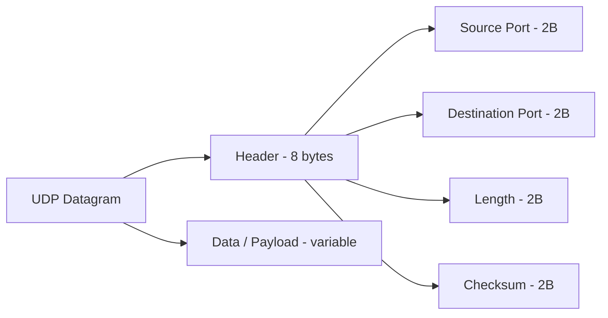

# Anatomy of a UDP Datagram

> Networking Fundamentals Series — Session Notes
> Topic: Structure/format of the UDP Datagram (header + payload)

---

## 1. Why This Topic Matters

Any protocol that runs on top of UDP (DNS, QUIC, gaming traffic, RTP/VoIP, DHCP, etc.) uses the **UDP datagram as a vehicle** to transport its data across the network. To really understand how data travels, you need to know exactly what a UDP datagram looks like at the byte level — what fields exist, how big they are, and what each one is for.

**Source of truth:** UDP is officially defined in **RFC 768**. It's famously short — only about **3 pages**, compared to IP's RFC which spans ~45 pages. This reflects how lightweight and simple UDP is as a protocol.

---

## 2. High-Level Structure

A UDP datagram sits **inside the payload of an IP packet**, and consists of two parts:

1. **UDP Header** — fixed size, always **8 bytes**
2. **Data (Payload)** — the actual application-layer data (DNS query, game data, etc.)

```
┌─────────────────────────────────────────────┐
│                 IP Packet                    │
│  ┌─────────────────────────────────────────┐│
│  │           UDP Datagram                   ││
│  │  ┌───────────────────┐  ┌──────────────┐ ││
│  │  │   UDP Header (8B)  │  │  Data/Payload│ ││
│  │  └───────────────────┘  └──────────────┘ ││
│  └─────────────────────────────────────────┘│
└─────────────────────────────────────────────┘
```

> ⚠️ **Important nuance:** Diagrams (including RFC diagrams) show the header as neat "rows and columns" (Source Port | Dest Port on one row, Length | Checksum on the next). This is purely for **visual/educational representation**. In reality, there is **no concept of rows** — it's all one **continuous stream of bits/bytes**. The fields just follow each other sequentially in the bitstream.

---

## 3. UDP Header Fields (8 Bytes Total)

The UDP header is made up of exactly **4 fields**, each **16 bits (2 bytes)**:

| Field | Size (bits) | Size (bytes) | Bit Range (example) | Purpose |
|---|---|---|---|---|
| **Source Port** | 16 | 2 | 0–15 | Identifies the sending application/process |
| **Destination Port** | 16 | 2 | 16–31 | Identifies the receiving application/process |
| **Length** | 16 | 2 | 32–47 | Total size of UDP datagram (header + data) |
| **Checksum** | 16 | 2 | 48–63 | Used to verify data integrity/corruption |

**Total header size = 2 + 2 + 2 + 2 = 8 bytes** → matches the "UDP header is only 8 bytes" fact from the UDP overview.



### 3.1 Source Port & Destination Port
- Each occupies **16 bits (2 bytes)**.
- Exactly the same concept referenced in earlier videos when talking about "source port" and "destination port" — this is *where* that data physically lives inside the datagram.
- TCP segments also have source/destination port fields (will be covered when studying TCP segment anatomy) — the concept is identical, just the surrounding header fields differ.
- Conceptually identical fields — just represent the "sender" and "receiver" ends of the communication.

### 3.2 Length
- Denotes the **total size of the UDP datagram** = size of header (the 4 fields) **+** size of the data/payload.
- Basically tells the receiver "how big is this entire datagram."

### 3.3 Checksum
- Used to **validate/verify** that the datagram was not corrupted in transit.
- **Analogy — password hashing:**
  - When a password is stored, it's hashed and saved in the DB.
  - On login, the entered password is hashed again and **compared** with the stored hash.
  - If hashes match → password correct. If not → password incorrect.
- **How it applies to UDP:**
  1. Sender takes the entire UDP datagram and generates a **hash → this is the checksum**, stored in the checksum field.
  2. When the datagram reaches the destination, the receiver **recomputes the hash** of the datagram it received.
  3. It **compares** this new hash with the checksum value carried in the datagram.
  4. If an attacker (or network corruption) modifies any field in transit — e.g., changing the source port from `555` to `4000` — the recomputed hash at the destination will **differ** from the original checksum.
  5. Mismatch → datagram is considered **corrupted/invalid** → it is **dropped**.
- Checksum occupies **16 bits (2 bytes)**, spanning bits 16–31 in that segment's byte-count reasoning (bit positions vary by convention, but size is fixed at 2 bytes).

---

## 4. Data Field (Payload)

- Everything **after the 8-byte header** is the **Data field** — a.k.a. the **application payload**.
- This is where higher-level protocols that ride on top of UDP place their actual content:
  - **DNS** → e.g., a query like "What is the IP of example.com?"
  - **RTP** (real-time media)
  - **Gaming traffic**
  - **QUIC** (uses UDP under the hood)
- The Data field size is **variable** — it depends on what the higher-level application needs to send.

---

## 5. Full Field Summary Table

| # | Field | Size | Part of Header? |
|---|---|---|---|
| 1 | Source Port | 2 bytes (16 bits) | ✅ Yes |
| 2 | Destination Port | 2 bytes (16 bits) | ✅ Yes |
| 3 | Length | 2 bytes (16 bits) | ✅ Yes |
| 4 | Checksum | 2 bytes (16 bits) | ✅ Yes |
| 5 | Data (Payload) | Variable | ❌ No (this is the body, not header) |

**Header total = 8 bytes** (matches UDP's reputation as an extremely lightweight, minimal-overhead protocol).

---

## 6. Key Takeaways

- UDP datagram = **Header (8 bytes, fixed)** + **Data (variable, application payload)**.
- The 4 header fields — Source Port, Destination Port, Length, Checksum — are each exactly **16 bits / 2 bytes**.
- **Length** = total size of the datagram (header + data).
- **Checksum** = integrity check via hash comparison, conceptually like password-hash verification.
- The "rows and columns" diagram is only for teaching purposes — actual data is a **continuous bitstream**.
- UDP's simplicity is reflected in its RFC size: **RFC 768 is only ~3 pages**, vs. IP's RFC which is ~45 pages.
- UDP datagrams sit inside IP packets — UDP is the transport-layer vehicle; IP is the network-layer vehicle carrying it further.

---

## 7. Interview Q&A

**Q1. What is the size of the UDP header, and why?**
> A: Always exactly 8 bytes, because it consists of 4 fields (Source Port, Destination Port, Length, Checksum), each 2 bytes (16 bits) in size.

**Q2. What does the "Length" field in a UDP datagram represent?**
> A: The total size of the entire UDP datagram — i.e., the 8-byte header plus the size of the data/payload it carries.

**Q3. How does the UDP checksum work, and what happens if it fails?**
> A: The sender computes a hash (checksum) over the datagram and includes it in the header. The receiver recomputes the hash on arrival and compares it to the received checksum. If they don't match (e.g., due to corruption or tampering in transit), the datagram is considered invalid and is dropped.

**Q4. Is the UDP header physically laid out in rows and columns like RFC diagrams show?**
> A: No — that's just a visual convention for documentation/teaching. In reality, it's a continuous stream of bits/bytes; there's no literal "row" boundary between fields like Length and Checksum.

**Q5. Where does DNS data (or other higher-level protocol data) live inside a UDP datagram?**
> A: In the **Data (payload)** field, which comes right after the 8-byte header. E.g., a DNS query like "what is the IP of example.com" sits entirely in this data section.

**Q6. Why is UDP considered such a lightweight protocol?**
> A: Its header is minimal (only 4 fields, 8 bytes total) and its defining RFC (RFC 768) is only about 3 pages — a stark contrast to more complex protocols like IP (~45-page RFC) or TCP.

**Q7. Do TCP segments also have Source Port and Destination Port fields?**
> A: Yes — the same conceptual fields exist in TCP segments too. The core idea (identifying sender/receiver applications) is identical; only the surrounding header fields differ between TCP and UDP.

---

## 8. Quick Revision Checklist

- [ ] UDP header = **8 bytes fixed**, made of 4 fields
- [ ] Source Port = 2 bytes (16 bits)
- [ ] Destination Port = 2 bytes (16 bits)
- [ ] Length = 2 bytes → total datagram size (header + data)
- [ ] Checksum = 2 bytes → integrity check via hash comparison
- [ ] Data/Payload = variable size → carries higher-level protocol data (DNS, RTP, gaming, QUIC, etc.)
- [ ] Actual layout = continuous bitstream, NOT literal rows/columns
- [ ] RFC 768 = official UDP spec, only ~3 pages (vs IP's ~45 pages) → reflects UDP's simplicity
- [ ] UDP datagram sits inside an IP packet's payload

---

## 9. What's Next
- TCP Segment Anatomy (header fields, how Source/Destination Port fit in, comparison with UDP)
- IP Packet Anatomy (in a future session)
