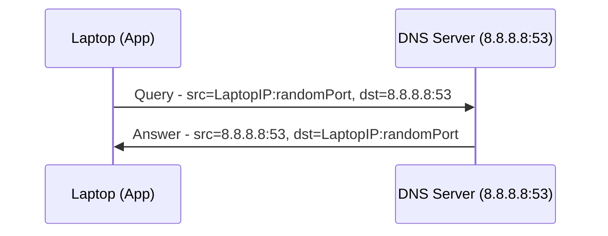
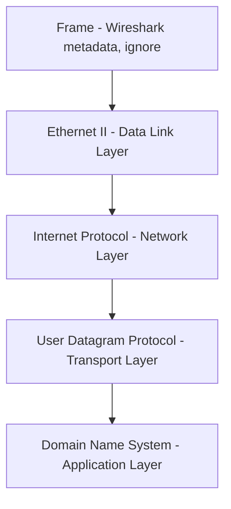

# Inspecting UDP Datagrams with Wireshark

> Networking Fundamentals Series — Session Notes
> Topic: Practically capturing & inspecting a real UDP datagram (DNS query) using Wireshark

---

## 1. Goal of This Session

Take everything learned so far — routing, IP addresses, MAC addresses, TCP/IP model layers, UDP ports, UDP datagram anatomy — and **validate it practically** by capturing a real DNS query in **Wireshark** and inspecting it byte-by-byte.

**Why DNS?** DNS uses UDP under the hood. So triggering a DNS query lets us capture and inspect real UDP packets on the wire.

**Tool used:** [Wireshark](https://www.wireshark.org) — a network protocol analyzer that captures packets/frames traveling through a network interface and lets you inspect them in detail.

---

## 2. The Setup

| Role | Value |
|---|---|
| Client (laptop) | Sends the DNS query |
| DNS Server used | **Google Public DNS** → `8.8.8.8` |
| DNS Server Port | `53` (DNS servers conventionally run on port 53) |
| Query tool | `nslookup` (built into Windows/Mac/Linux) |

**Why Google Public DNS instead of the ISP's DNS?**
Your ISP's (e.g., Jio, Airtel) DNS server IP is usually unknown to you, which makes it hard to build a precise Wireshark filter. Google Public DNS has a well-documented, fixed IP (`8.8.8.8`), making it easy to filter for.

---

## 3. Conceptual Packet Walkthrough (Before Touching Wireshark)

### Request packet (Client → DNS Server)
| Field | Value |
|---|---|
| Source IP | Laptop's IP |
| Source Port | App's port (sending the query) |
| Destination IP | `8.8.8.8` |
| Destination Port | `53` |

### Response packet (DNS Server → Client)
| Field | Value |
|---|---|
| Source IP | `8.8.8.8` |
| Source Port | `53` |
| Destination IP | Laptop's IP |
| Destination Port | Same port the original query came from |

This request/response IP pair (`8.8.8.8` ↔ laptop IP) is exactly what's used to build the Wireshark filter.



---

## 4. Setting Up Wireshark

1. Open Wireshark → you'll see a list of **interfaces** (Wi-Fi, Ethernet, etc.) — these are the "doorways" through which your laptop communicates with the outside network.
2. Since the DNS query travels over the internet, select the **interface currently connected to the internet** (e.g., Wi-Fi).
3. Because thousands of packets flow every second, the raw capture view is extremely noisy — a **display filter** is needed to isolate just the DNS traffic.

### 4.1 The Filter

```
ip.dst == 8.8.8.8 && ip.src == 8.8.8.8
```

- `ip.dst == 8.8.8.8` → catches the **outgoing query** packet (destination = Google DNS)
- `ip.src == 8.8.8.8` → catches the **incoming answer** packet (source = Google DNS)

**Steps:**
1. Type the filter in the "Apply a display filter" bar.
2. Press **Enter** to apply it.
3. Double-click the active interface (e.g., Wi-Fi) to start capturing.
4. No packets appear yet — because no DNS query has been made.

### 4.2 Triggering the DNS Query

Use `nslookup` from the terminal:

```
nslookup github.com 8.8.8.8
```

- `github.com` → the domain being resolved.
- `8.8.8.8` → explicitly tells `nslookup` which DNS server to query.
- No need to specify port `53` — `nslookup` (and DNS tooling in general) **assumes** DNS servers run on port 53 by default.

Once executed, `nslookup` returns the resolved IP, and **two packets** now appear in Wireshark:
1. The **query** packet (the question — "what is the IP of github.com?")
2. The **answer** packet (the response)

---

## 5. Dissecting the Query Packet in Wireshark

Wireshark neatly displays each **TCP/IP model layer** as an expandable section:



### 5.1 Data Link Layer — Ethernet II
| Field | Meaning |
|---|---|
| Source MAC | MAC address of the laptop/NIC |
| Destination MAC | MAC address of the next hop (e.g., router) |

This is the **Layer 2** property, carrying the Ethernet frame.

### 5.2 Network Layer — Internet Protocol (IP)
| Field | Value (example) |
|---|---|
| Source Address | `192.168.1.7` (laptop's local IP) |
| Destination Address | `8.8.8.8` (Google Public DNS) |

This is the **Layer 3** property. (A dedicated deep-dive on IP packet anatomy is planned for a future session.)

### 5.3 Transport Layer — User Datagram Protocol (UDP)
This is the **core focus** of the video — matching exactly what was learned in the previous "UDP Datagram Anatomy" session:

| Field | Value (example) |
|---|---|
| Source Port | `56470` (randomly assigned by the OS for this `nslookup` instance) |
| Destination Port | `53` (DNS server's well-known port) |
| Length | `36` bytes |
| Checksum | Present, used for validating the datagram |
| UDP Payload | The actual DNS data |

**Validating the Length field:**
- DNS payload size (shown via Wireshark's "Show Packet Bytes") = **28 bytes**
- UDP header size (fixed, from the previous session) = **8 bytes**
- Total = `28 + 8 = 36 bytes` → **matches** the Length field shown in Wireshark ✅

> This is a direct, real-world confirmation of the formula:
> **UDP Datagram Length = Header (8 bytes) + Payload (data) size**

### 5.4 Application Layer — Domain Name System (DNS)
| Field | Meaning |
|---|---|
| Transaction ID | Unique identifier for this specific query (e.g., `0x6078`) |
| Questions | `1` — the actual query, e.g., "github.com, Type A" |
| Answers | `0` in the query packet (no answer yet) |

---

## 6. Dissecting the Answer Packet

Same layers, but source/destination are **flipped**:

| Layer | Field | Value |
|---|---|---|
| Network (IP) | Source | `8.8.8.8` |
| Network (IP) | Destination | Laptop's IP |
| Transport (UDP) | Source Port | `53` |
| Transport (UDP) | Destination Port | `56470` (same port that sent the query) |
| Application (DNS) | Questions | `1` |
| Application (DNS) | Answers | `1` — now contains the resolved IP (e.g., `github.com Type A → 20.77.38.2` — matches what's printed in the terminal by `nslookup`) |

**Key logic:** The DNS server knows exactly which port to reply to because the original query's **source port becomes the response's destination port**. This is how the server "routes" the answer back to the exact machine/app instance that asked.

**Length field also changes** in the answer packet — because now the DNS payload includes **both** the question **and** the answer, increasing its byte size.

---

## 7. Transaction ID — DNS's Own Reliability Mechanism

- UDP itself is **unreliable** — it has no built-in confirmation or retransmission mechanism (just source port, destination port, length, checksum — nothing else).
- Since a machine can send **hundreds of DNS requests** to the same server, DNS needs a way to match each **answer** to its corresponding **question**.
- Solution: every DNS query includes a **Transaction ID**. The server echoes back the **same Transaction ID** in its response.
- Verified in Wireshark: both the query and the answer packets carry the identical Transaction ID (e.g., `0x6078`).
- This is how **DNS implements its own confirmation/matching system on top of UDP**, since UDP itself provides none.

---

## 8. TCP/IP Model — Fully Visualized in Wireshark

| Layer | Visible in Wireshark? | Example Protocol Seen |
|---|---|---|
| Application | ✅ Yes | DNS |
| Transport | ✅ Yes | UDP |
| Network | ✅ Yes | IP |
| Data Link | ✅ Yes | Ethernet II (frame, MAC addresses) |
| Physical | ❌ No (radio waves — not visible in software) |

Wireshark effectively let us **see all 4 inspectable TCP/IP layers** for a single real DNS query.

---

## 9. Key Takeaways

- DNS is chosen for this demo specifically because **DNS runs over UDP**.
- Wireshark filter to isolate DNS traffic to/from Google's public DNS:
  `ip.dst == 8.8.8.8 && ip.src == 8.8.8.8`
- `nslookup <domain> <dns-server-ip>` lets you manually query a specific DNS server; port 53 is assumed automatically.
- The UDP header fields observed in Wireshark (**Source Port, Destination Port, Length, Checksum**) exactly match the anatomy studied previously.
- **Length = UDP header (8 bytes) + payload size** — verified practically (28 + 8 = 36 bytes).
- Query and response packets have **swapped source/destination** IP and port values.
- DNS's **Transaction ID** compensates for UDP's lack of reliability/confirmation by matching each answer to its corresponding question.
- Wireshark visually confirms **Data Link, Network, Transport, and Application** layers of the TCP/IP model for a real packet (Physical layer is not inspectable in software).

---

## 10. Interview Q&A

**Q1. Why is DNS used to demonstrate UDP inspection in Wireshark?**
> A: Because DNS runs on top of UDP under the hood. Triggering a DNS query guarantees that the captured packets will be UDP datagrams.

**Q2. How do you build a Wireshark filter to isolate traffic to/from a specific DNS server?**
> A: Using `ip.dst == <server_ip> && ip.src == <server_ip>` — this captures both the outgoing query (destination = DNS server) and the incoming answer (source = DNS server).

**Q3. How is the UDP "Length" field validated practically?**
> A: By checking the DNS payload byte size (via Wireshark's "Show Packet Bytes") and adding the fixed 8-byte UDP header size. Example: 28-byte payload + 8-byte header = 36 bytes, which matches the Length field shown in Wireshark.

**Q4. How does the destination port of a query packet relate to the source port of its DNS response?**
> A: They're the same. The DNS server takes the source port from the original query and uses it as the destination port when sending the response back, ensuring the reply reaches the exact app instance that made the request.

**Q5. Since UDP has no reliability mechanism, how does DNS ensure a response matches its query?**
> A: DNS includes a Transaction ID with every query. The server echoes the same Transaction ID back in its response, allowing the client to match answers to the correct outstanding queries — a mechanism DNS implements on its own, since UDP provides no such guarantee.

**Q6. Which TCP/IP model layers can be inspected in Wireshark, and which cannot?**
> A: Data Link (Ethernet frame/MAC addresses), Network (IP), Transport (UDP/TCP), and Application (DNS) layers are all visible. The Physical layer (e.g., radio waves for Wi-Fi) cannot be inspected in software.

**Q7. Why does `nslookup` not require specifying port 53 explicitly?**
> A: Because DNS servers conventionally run on port 53 by default, and `nslookup` automatically assumes this — it only needs the target DNS server's IP address.

---

## 11. Quick Revision Checklist

- [ ] DNS chosen for demo because it runs over UDP
- [ ] Google Public DNS = `8.8.8.8`, port `53`
- [ ] Wireshark filter: `ip.dst == 8.8.8.8 && ip.src == 8.8.8.8`
- [ ] `nslookup <domain> <dns_ip>` → triggers a manual DNS query
- [ ] Query packet: src = laptop IP/random port → dst = `8.8.8.8:53`
- [ ] Answer packet: src = `8.8.8.8:53` → dst = laptop IP/same random port
- [ ] UDP fields seen in Wireshark: Source Port, Destination Port, Length, Checksum
- [ ] Length validated: payload (28B) + header (8B) = 36B ✅
- [ ] Transaction ID matches query ↔ answer (DNS's own reliability layer)
- [ ] TCP/IP layers visible in Wireshark: Data Link → Network → Transport → Application
- [ ] Physical layer NOT inspectable (radio waves)

---

## 12. What's Next
- Deep dive on **DNS** itself — Transaction ID, Questions, Answers, resource records, how resolution actually works end-to-end
- **IP Packet Anatomy** (dedicated session) + inspecting it in Wireshark
- Inspecting **TCP segments** in Wireshark once TCP anatomy is covered
