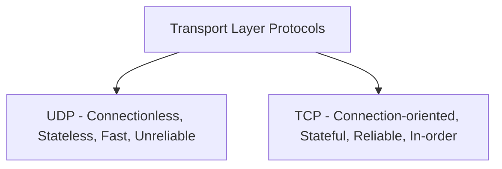
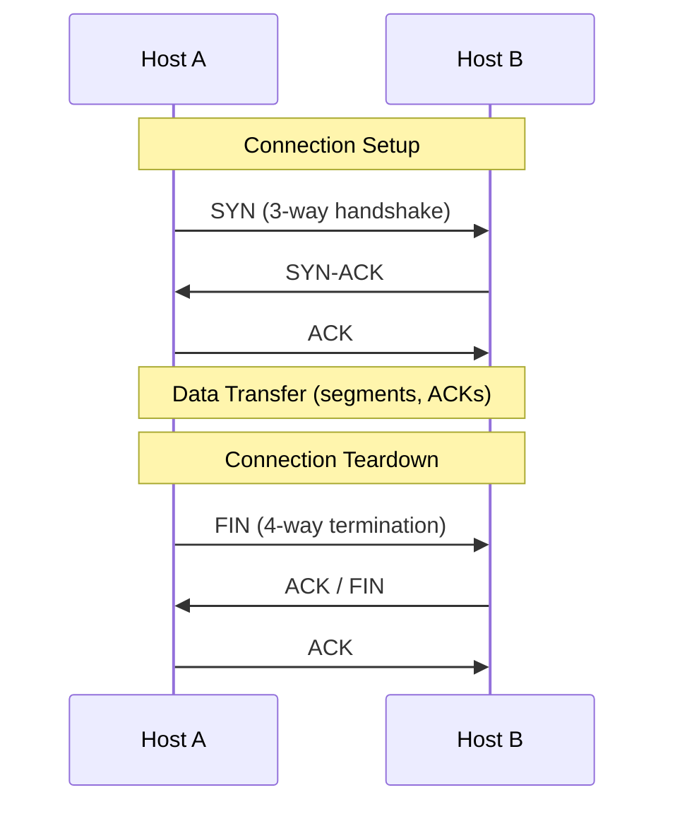
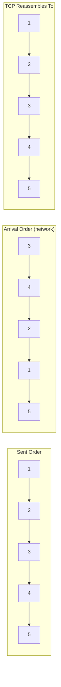
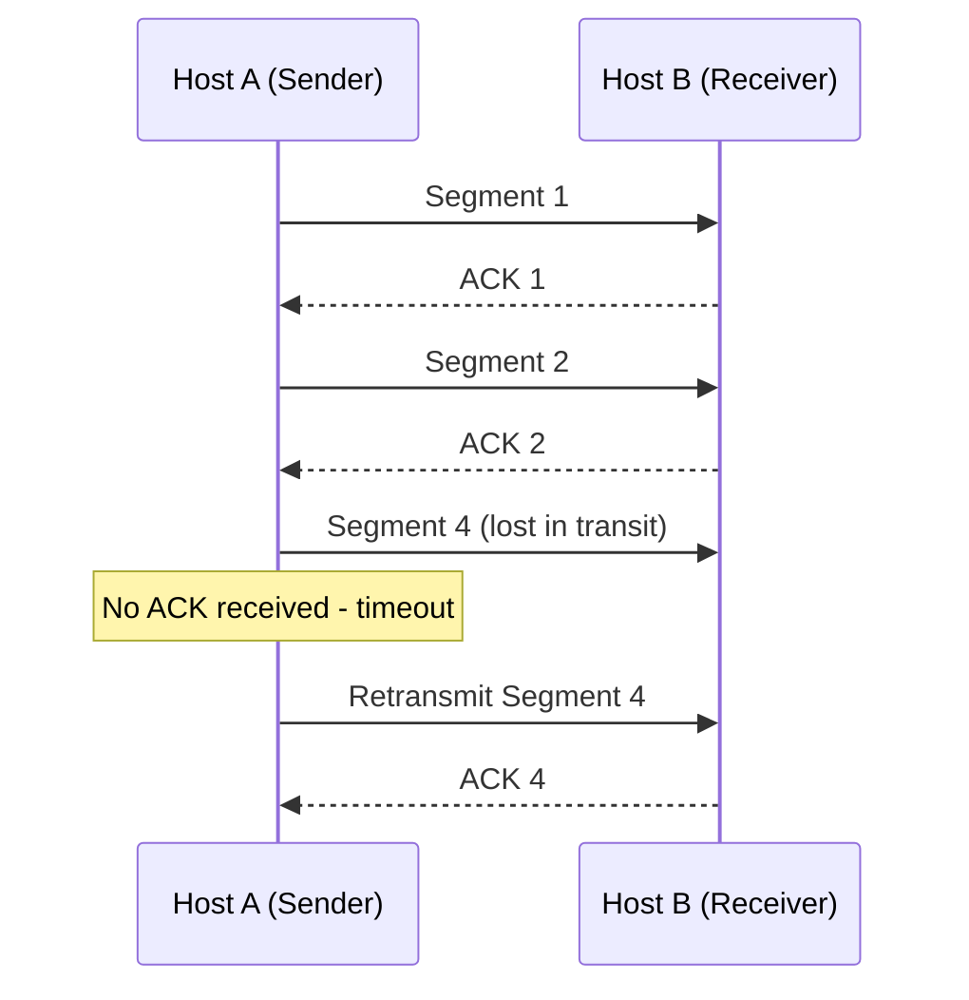
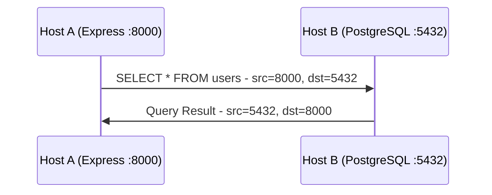

# Understanding TCP: Key Internet Protocol

> Networking Fundamentals Series — Session Notes
> Topic: Overview of TCP (Transmission Control Protocol) — properties, guarantees, and use cases (compared against UDP)

---

## 1. What is TCP?

**TCP = Transmission Control Protocol** — a protocol that controls how data is transmitted from source to destination in a **controlled, reliable manner**.

- It is a **Layer 4 (Transport Layer)** protocol — same layer as UDP.
- Like UDP, TCP uses **port numbers** to identify applications/processes on a host machine (e.g., React on `3000`, an API on `8000`).
- TCP's data unit is called a **segment** (equivalent to UDP's "datagram").

One of the **most important protocols on the internet** — nearly all critical services (databases, web servers, SSH, FTP, email) rely heavily on TCP.

---

## 2. TCP vs UDP — Core Comparison

| Property | UDP | TCP |
|---|---|---|
| Layer | Transport (L4) | Transport (L4) |
| Addressing | Uses port numbers | Uses port numbers |
| Connection | **Connectionless** — just sends data | **Connection-oriented** — requires a connection first |
| State | **Stateless** — stores nothing | **Stateful** — stores connection state on host |
| Reliability | Unreliable — drops are ignored | Reliable — detects & retransmits lost data |
| Order guarantee | None | **Guarantees in-order delivery** |
| Speed | Faster (less overhead) | Slower (more overhead due to reliability logic) |
| Data unit | Datagram | Segment |
| Setup / teardown | None | 3-way handshake (setup) + 4-way termination (teardown) |

---

## 3. TCP is Connection-Oriented

- Unlike UDP (which just sends a datagram with no setup), TCP requires establishing a **connection** before any data transfer.
- This connection is established via a **3-way handshake**. (A dedicated video will cover this in detail.)
- During the handshake, **Host A and Host B exchange information about each other**, such as:
  - **Window size**
  - **Sequence number** (starting point for data ordering)
- This exchanged info needs to be **remembered/stored** by both hosts for the lifetime of the connection.

### Why TCP is "Stateful"
Because TCP **stores data about the other party** on the host machine (e.g., sequence numbers, window size, connection status), it is called a **stateful protocol** — in direct contrast to UDP, which is **stateless** and stores nothing.

---

## 4. TCP Connection Termination

- A TCP connection, once opened via the 3-way handshake, must eventually be **closed gracefully** — otherwise it keeps consuming resources indefinitely.
- TCP uses a **4-way termination process** to close a connection (informally called **"FIN"** — will be covered in detail in a future video).

---

## 5. Segmentation — Breaking Data into TCP Segments

- Before transmission, large continuous data (e.g., an HTTP request, a big stream of bytes) is broken down by TCP into smaller **chunks**, called **segments**.
- **Why chunk it?** Sending one massive block of data at once isn't efficient/reliable over the network. Breaking it into segments lets each piece be routed independently and reassembled reliably at the destination.
- **TCP Segment** = TCP's data unit (equivalent to UDP's datagram).
- Each segment travels separately, wrapped inside its own **IP packet**.

---

## 6. Guarantee #1 — In-Order Delivery

- There is **no guarantee** that segments arrive at the destination in the order they were sent (each travels independently through the network, potentially via different routes).
- **Example:** Segments sent in order `1, 2, 3, 4, 5` might arrive in the order `3, 4, 2, 1, 5`.
- **TCP guarantees** it will **rearrange the segments** at the destination back into their original sending order before handing the data to the application — regardless of the order they physically arrived in.

---

## 7. Guarantee #2 — Reliable Delivery (Retransmission)

- Suppose segments `1, 2, 3` and `5` reach the destination, but **segment 4 is dropped** in transit.
- **TCP detects this loss** and **retransmits segment 4** until it successfully reaches the destination.
- Contrast with **UDP**: if a datagram drops, UDP simply **ignores it** — no detection, no retransmission.

### How TCP Detects Loss — Acknowledgments (ACKs)
- The receiver sends an **Acknowledgment (ACK)** back to the sender to confirm receipt of each segment.
- Example: Host A sends segment 1 → Host B replies "I got segment 1" (this reply is the ACK).
- This ACK mechanism is **built into TCP** from the moment the connection is established.
- If the sender doesn't receive an ACK for a segment within the expected time, it assumes the segment was lost and **retransmits** it.

---

## 8. The Cost of Reliability — Overhead

TCP does a lot more "work" under the hood than UDP:
- Segmenting/chunking data
- Sending and tracking acknowledgments
- Detecting drops and retransmitting
- Reordering segments at the destination

All of this requires **processing power and extra data handling**, which introduces **overhead**. This is why:

> **TCP is comparatively slower than UDP**, but in exchange it provides reliability, ordering, and guaranteed delivery — benefits UDP does not offer.

---

## 9. Use Cases of TCP

TCP is used wherever **data loss or out-of-order delivery is unacceptable**. Examples:

| Use Case | Underlying Application Protocol(s) | Why TCP? |
|---|---|---|
| **Database connections** | e.g., Node backend ↔ PostgreSQL over network | A query like `DELETE FROM users WHERE id = 10` must reach the DB **exactly as sent** — losing or corrupting even part of it (e.g., turning it into `WHERE id = 0`) could be catastrophic |
| **Web/REST APIs** | HTTP | HTTP relies on TCP under the hood for reliable request/response delivery |
| **File transfer** | FTP | A transferred file (movie, PDF, etc.) must arrive **without any corruption** |
| **Email** | SMTP, IMAP, POP3 | A message must arrive complete and unaltered — e.g., "Hi Shubham" shouldn't arrive as just "Hi" |
| **Remote shell access** | SSH | Commands run on a remote machine (e.g., `rm -rf`) must be delivered exactly as typed — no room for corruption or partial delivery |

### Hypothetical: What if a database used UDP instead?
- A query gets broken into datagrams; suppose one datagram is dropped in transit.
- UDP does not care about drops — it just "sends and forgets."
- The database might receive an **incomplete or malformed query**, potentially with catastrophic effects (e.g., an unintended mass delete).
- This illustrates exactly why **critical operations rely on TCP** — reliable, ordered delivery is a **basic networking requirement**, separate from any application-level business logic.

---

## 10. Why Only TCP or UDP?

At the transport layer, there are really only **two major protocols in common use**: **UDP** and **TCP**.
(Note: QUIC is technically built **on top of UDP**, so it's not a separate transport-layer choice in this comparison.)

| Requirement | Protocol Choice |
|---|---|
| Speed matters more than reliability, and some data loss is acceptable | **UDP** |
| Reliability, guaranteed and in-order delivery are required | **TCP** (in most cases, the only real option) |

---

## 11. Port Numbers in TCP — How Applications Are Addressed

Same underlying concept as UDP: **port numbers identify which application on a host the data is meant for.**

### Example walkthrough
**Setup:**
- Host A: `App A` on port `555`, Express backend on port `8000`, App B on port `3210`
- Host B: PostgreSQL server on port `5432` (PostgreSQL's default port)

**Request (Host A → Host B):**
| Field | Value |
|---|---|
| Source IP | Host A's (laptop's) IP |
| Destination IP | Host B's IP (where PostgreSQL runs) |
| Source Port | Express's port (the app that made the query) |
| Destination Port | `5432` (PostgreSQL) |

- When the packet reaches Host B, it's **unpacked**, and the destination port (`5432`) tells the OS/networking stack **exactly which application** to forward the data to — even if Host B is running multiple applications on different ports (e.g., another service on `8000`).

**Response (Host B → Host A):**
| Field | Value |
|---|---|
| Source IP | Host B's IP (PostgreSQL server) |
| Destination IP | Host A's IP |
| Source Port | `5432` (PostgreSQL) |
| Destination Port | The original querying app's port (Express) |

---

## 12. Key Takeaways

- TCP = Layer 4, **connection-oriented**, **stateful**, **reliable**, **ordered** transport protocol.
- Requires a **3-way handshake** to establish a connection, and a **4-way termination process** to close it.
- Breaks data into **segments** (TCP's data unit) before sending, each traveling inside its own IP packet.
- **Guarantees in-order delivery** — reorders segments at the destination even if they arrive out of sequence.
- **Guarantees reliable delivery** — detects dropped segments via missing **acknowledgments (ACKs)** and retransmits them.
- This reliability comes at the cost of **higher overhead** → TCP is **slower** than UDP.
- Used by virtually all critical, loss-intolerant protocols/services: **databases, HTTP/REST APIs, FTP, SMTP/IMAP/POP3 (email), SSH**.
- Like UDP, TCP uses **port numbers** to address specific applications on a host machine.
- At the transport layer, the real-world choice is essentially binary: **UDP (speed, no reliability) or TCP (reliability, ordering, guaranteed delivery)**.

---

## 13. Interview Q&A

**Q1. What are the fundamental differences between TCP and UDP?**
> A: TCP is connection-oriented, stateful, and guarantees reliable, in-order delivery via acknowledgments and retransmissions — at the cost of higher overhead and slower speed. UDP is connectionless, stateless, faster, and offers no reliability or ordering guarantees — datagrams are simply sent, and drops are ignored.

**Q2. Why is TCP called a "stateful" protocol?**
> A: Because during connection setup (3-way handshake) and throughout the connection, TCP stores information about the other party — such as sequence numbers and window size — on the host machine, maintaining an ongoing state of the connection.

**Q3. How does TCP guarantee in-order delivery when segments can arrive out of order over the network?**
> A: Each segment carries information (like sequence numbers) that lets the receiving TCP stack reassemble segments into their original sending order before passing the data up to the application, regardless of the order they physically arrived in.

**Q4. How does TCP detect and recover from a lost segment?**
> A: The receiver sends an acknowledgment (ACK) for each segment it receives. If the sender doesn't receive an ACK for a particular segment within the expected time, it assumes that segment was lost and retransmits it until it is successfully acknowledged.

**Q5. Why do critical services like databases, email, and SSH rely on TCP rather than UDP?**
> A: These operations cannot tolerate data loss, corruption, or out-of-order delivery — e.g., a partially delivered database query could have catastrophic effects (like an unintended mass delete), or a corrupted SSH command could execute unintended actions. TCP's built-in reliability and ordering guarantees make it the safe choice for such critical operations.

**Q6. Why is TCP generally slower than UDP?**
> A: TCP has to perform extra work — segmenting data, tracking acknowledgments, detecting and retransmitting lost segments, and reordering segments at the destination. This additional processing introduces overhead that UDP, being a much simpler protocol, doesn't have.

**Q7. How does TCP use port numbers?**
> A: Similar to UDP, TCP uses source and destination port numbers to identify which specific application or process on a host machine the data is intended for — since a single host can run multiple applications simultaneously, each on a different port.

---

## 14. Quick Revision Checklist

- [ ] TCP = Layer 4, connection-oriented, stateful, reliable transport protocol
- [ ] Uses port numbers to identify applications (same concept as UDP)
- [ ] Requires 3-way handshake before sending data
- [ ] Requires 4-way termination process to close a connection gracefully
- [ ] Data unit = **segment** (vs UDP's datagram)
- [ ] Large data is broken into segments before transmission; each travels in its own IP packet
- [ ] Guarantees **in-order delivery** — reorders out-of-sequence segments at destination
- [ ] Guarantees **reliable delivery** — detects drops via missing ACKs, retransmits lost segments
- [ ] Acknowledgments (ACKs) are how the receiver confirms receipt to the sender
- [ ] Reliability = higher overhead = TCP is slower than UDP
- [ ] Use cases: databases, HTTP/REST APIs, FTP, email (SMTP/IMAP/POP3), SSH
- [ ] At transport layer, real choice is UDP (speed, unreliable) vs TCP (reliable, ordered)

---

## 15. What's Next
- **3-way handshake** in detail — what's exchanged, sequence numbers, window size
- **4-way termination process** ("FIN") in detail
- **TCP Segment Anatomy** (header fields, in-depth structure — parallel to the UDP Datagram Anatomy session)
- Wireshark inspection of a real TCP segment
- Flow control, congestion control, sequence numbers, and acknowledgments in depth
