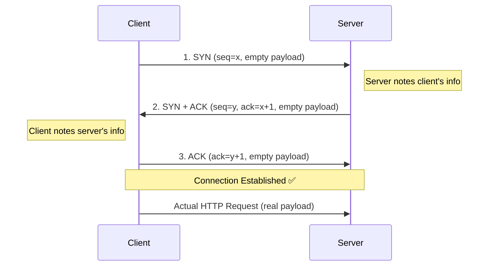

# TCP 3-Way Handshake

> Series: Computer Networking Fundamentals
> Prerequisite: TCP Overview (connection-oriented protocol basics), IP Addressing, TCP/IP Model

---

## 1. Why Do We Need a Connection First?

TCP is a **connection-oriented protocol** — before any actual application data (HTTP request, WebSocket frame, SMTP payload, etc.) can be sent, a connection **must** be established between client and server.

**Example setup:**
- Client: React app on `192.168.1.5:3000`
- Server: Express/Node.js app on `10.0.1.1:80` (e.g., on AWS)

Since HTTP runs on top of TCP, before the client can send an HTTP request, it must first establish a TCP connection with the server. This connection establishment happens via the **TCP 3-Way Handshake**.

---

## 2. Where Does This Fit in the Packet Structure?

- An **IP packet** carries higher-level protocol data (TCP, UDP, HTTP, WebSocket, etc.)
- The IP packet carries a **TCP segment**
- A TCP segment = **Headers + Payload** (same structure as a UDP datagram: headers + data)

**TCP segment headers include (relevant to handshake):**
- Source port / Destination port
- Sequence number
- Window size
- Flags (SYN, ACK, etc.)

During the handshake, these segments are **empty** — no application payload — because no actual data is being exchanged yet, only connection-setup information.

---

## 3. The Three Steps



### Step 1 — SYN (Client → Server)
- Client initiates the connection.
- Sends a TCP segment with `SYN` flag set.
- Header carries client info: sequence number, window size.
- **Payload is empty** — this is purely a connection-setup packet.
- Source IP/Port = Client, Destination IP/Port = Server.

### Step 2 — SYN-ACK (Server → Client)
- Server receives SYN, **notes** the client's info.
- Server **acknowledges** the client's SYN.
- Server also sends **its own SYN** (its sequence number, window size) so the client can sync with server's state.
- Instead of sending ACK and SYN as two separate packets, TCP **merges them into a single segment** — this is an optimization (fewer packets = more efficient).
- **Payload is empty** here too.
- Source IP/Port = Server, Destination IP/Port = Client.

### Step 3 — ACK (Client → Server)
- Client receives the merged SYN-ACK.
- Client acknowledges the server's SYN.
- Now both sides have exchanged and stored each other's connection info.
- **Connection is established.**
- After this, the client can finally send the actual HTTP request (this segment *does* carry real payload).

---

## 4. Why "3-Way" Handshake?

Because exactly **3 requests/segments** are exchanged to establish the connection:

| # | Direction | Segment | Payload |
|---|-----------|---------|---------|
| 1 | Client → Server | SYN | Empty |
| 2 | Server → Client | SYN + ACK (merged) | Empty |
| 3 | Client → Server | ACK | Empty |

---

## 5. Also Known As: SYN, SYN-ACK, ACK

The handshake is commonly referred to by its packet sequence:

```
SYN  →  SYN-ACK  →  ACK
```

- **SYN**: Client's synchronization request
- **SYN-ACK**: Server's synchronization request + acknowledgment of client's SYN (merged into one segment)
- **ACK**: Client's acknowledgment of server's SYN

This naming directly reflects the optimization in Step 2 (merging SYN + ACK into a single packet instead of sending them separately).

---

## 6. Why TCP Is a "Stateful" Protocol

- During the handshake, client and server exchange information about each other (sequence number, window size, etc.)
- Both sides **store this state** on the host machine.
- This state is **persisted for as long as the connection is alive**, and is needed to keep the connection functioning correctly for all further communication.
- This is precisely why TCP is called a **stateful protocol** — unlike stateless protocols, both endpoints must track ongoing connection state.

---

## 7. Comparison: TCP Segment vs UDP Datagram (Handshake Context)

| Aspect | UDP Datagram | TCP Segment (during handshake) |
|---|---|---|
| Structure | Headers + Payload | Headers + Payload |
| Connection needed? | No | Yes (3-way handshake required) |
| Handshake payload | N/A | Empty (no app data) |
| Statefulness | Stateless | Stateful (tracks seq #, window size, etc.) |
| Headers include | Source port, dest port, length, checksum | Source port, dest port, seq #, ack #, window size, flags |

---

## 8. Quick Revision Checklist

- [ ] TCP is connection-oriented → connection must exist before sending data
- [ ] HTTP runs over TCP → HTTP requests require a prior TCP handshake
- [ ] 3 segments exchanged: **SYN → SYN-ACK → ACK**
- [ ] All 3 handshake segments have **empty payloads** (no app data yet)
- [ ] Step 2 merges server's SYN + ACK into a **single optimized packet**
- [ ] Handshake exchanges: sequence number, window size (details covered in a future video/notes)
- [ ] Also called **SYN, SYN-ACK, ACK** based on packet sequence
- [ ] Connection persists until communication is done — explains why **TCP is stateful**
- [ ] Only after handshake completes does the client send the actual HTTP request (with real payload)

---

## 9. Interview Q&A

**Q1: Why does TCP need a 3-way handshake before sending data?**
A: TCP is connection-oriented, so both client and server must first synchronize connection parameters (sequence numbers, window size) and confirm they can communicate reliably before any application data is sent.

**Q2: What are the three steps of the handshake?**
A: SYN (client → server), SYN-ACK (server → client, merged), ACK (client → server).

**Q3: Why is the second step called SYN-ACK instead of two separate packets?**
A: TCP optimizes by merging the server's own SYN (to sync its info with the client) and its ACK (acknowledging the client's SYN) into a single segment, reducing the number of packets sent.

**Q4: Do handshake segments carry any application data?**
A: No — all three segments (SYN, SYN-ACK, ACK) are empty; they only carry header information used for connection setup, not payload data.

**Q5: Why is TCP called a stateful protocol?**
A: Because client and server exchange and store information about each other (sequence numbers, window size, etc.) during the handshake, and this state must be maintained on both host machines for the lifetime of the connection.

**Q6: What information is exchanged in the TCP segment headers during the handshake?**
A: Source port, destination port, sequence number, and window size (flags like SYN/ACK are also part of the header).

**Q7: What is another name for the TCP 3-way handshake?**
A: SYN, SYN-ACK, ACK — named after the sequence of packets exchanged.

**Q8: What happens immediately after the handshake completes?**
A: The connection is considered established, and the client can now send the actual application data (e.g., the real HTTP request) over that connection.

**Q9: How do source/destination IP and port change across the three steps?**
A: In Step 1, source = client, destination = server. In Step 2, source = server, destination = client. In Step 3, source = client, destination = server again.

---

## 10. What's Next

- Deep dive into TCP segment headers: sequence number, acknowledgment number, window size, flags (covered in future notes/videos)
- How TCP maintains reliability and ordering using sequence numbers after the handshake
