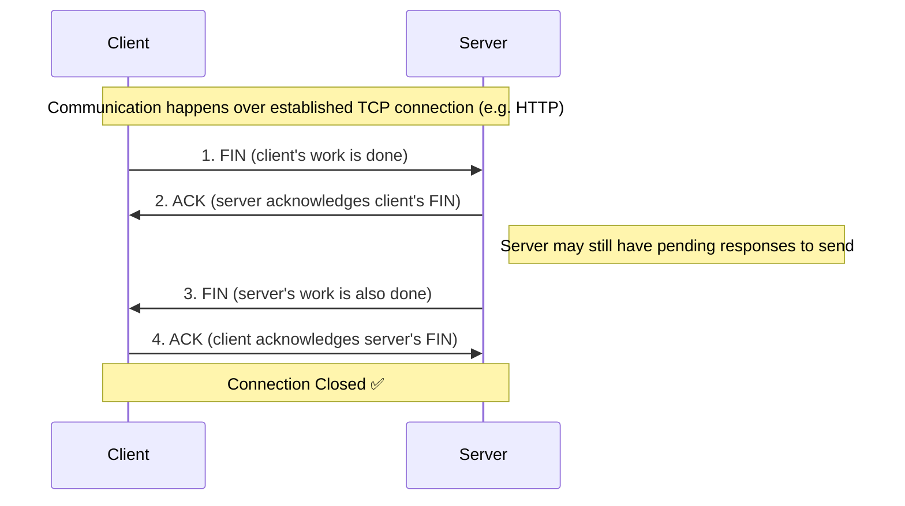

# TCP Connection Termination (4-Way Termination)

> Series: Computer Networking Fundamentals
> Prerequisite: [TCP 3-Way Handshake](./tcp-3-way-handshake.md)

---

## 1. Why Does a Connection Need to Be Terminated?

A TCP connection, once established via the 3-way handshake, doesn't last forever. Client and server communicate over it using whatever application protocol runs on top of TCP — HTTP, SMTP, WebSocket, etc. Once both sides are done exchanging data, the connection needs to be **closed cleanly**.

This closure process is called the **4-Way Termination**.

---

## 2. The Four Steps

### Step 1 — FIN (Client → Server)
- Client has finished all its requests (login, queries, etc. — whatever the app needed).
- Client sends a **FIN** segment: "My work is done, I want to close this connection."

### Step 2 — ACK (Server → Client)
- Server acknowledges the client's FIN: "OK, I noted that you want to close."
- **Important:** the server does *not* immediately close its side here — it may still have pending responses left to send to the client. Acknowledging the FIN just confirms it noted the client's intent, not that the server is also ready to close.

### Step 3 — FIN (Server → Client)
- Once the server has sent all its remaining responses and has nothing more to send, it sends its **own FIN**: "My work is done too, I also want to close this connection."

### Step 4 — ACK (Client → Server)
- Client acknowledges the server's FIN: "OK, I noted that you want to close."
- **Connection is now closed.**

---

## 3. Why 4 Steps Instead of Merging Like the Handshake?

In the 3-way handshake, the server merges **SYN + ACK** into a single packet (Step 2) because as soon as it receives the client's SYN, it's ready to respond with both its acknowledgment and its own SYN together.

Termination is different: when the server receives the client's FIN, it **cannot always immediately close its own side** — there's a chance the server still has pending responses left to send. So:
- Server first just **ACKs** the client's FIN (confirms it noted the request).
- Server sends its **own separate FIN** only later, once it has genuinely finished sending everything and is ready to close from its side too.

That's why termination needs **4 separate steps** instead of 3 — the ACK and the server's own FIN can't always be merged into one packet, unlike in the handshake.

---

## 4. Quick Reference: FIN-ACK-FIN-ACK

| # | Direction | Segment | Meaning |
|---|-----------|---------|---------|
| 1 | Client → Server | FIN | "My work is done, I want to close." |
| 2 | Server → Client | ACK | "Noted, but I may still have pending work." |
| 3 | Server → Client | FIN | "My work is done too, I want to close." |
| 4 | Client → Server | ACK | "Noted, closing now." |

Commonly remembered as: **FIN, ACK, FIN, ACK**

---

## 5. Comparison: Handshake vs Termination

| Aspect | 3-Way Handshake (Connection Setup) | 4-Way Termination (Connection Close) |
|---|---|---|
| Number of steps | 3 | 4 |
| Flags used | SYN, SYN-ACK, ACK | FIN, ACK, FIN, ACK |
| Can steps be merged? | Yes — server merges SYN + ACK | Not always — server's ACK and FIN are usually separate |
| Reason for separation | N/A (merge is the optimization) | Server may still have pending responses when it receives client's FIN, so it can't close immediately |
| Initiator | Client (wants to send data) | Either side (whoever finishes first) — in this example, client |
| Result | Connection established | Connection closed |

---

## 6. Quick Revision Checklist

- [ ] TCP connections are closed via a **4-way termination process**, not the 3-way handshake pattern
- [ ] Sequence: **FIN (client) → ACK (server) → FIN (server) → ACK (client)**
- [ ] Either side can initiate termination once its work is done
- [ ] Server's ACK to client's FIN is **not** a promise to close immediately — server may still have pending responses
- [ ] Server sends its **own separate FIN** only when it's truly done sending everything
- [ ] Unlike the handshake's SYN-ACK merge, termination's ACK and FIN from the server are typically **separate packets**
- [ ] Once all 4 steps complete, the connection is fully closed

---

## 7. Interview Q&A

**Q1: How is a TCP connection terminated?**
A: Through a 4-way termination process: FIN (client) → ACK (server) → FIN (server) → ACK (client).

**Q2: Why is termination called "4-way" while connection setup is "3-way"?**
A: In the handshake, the server can merge its ACK and its own SYN into a single packet. In termination, the server usually can't merge its ACK and its own FIN — it may still have pending data to send after acknowledging the client's FIN — so the process needs 4 separate steps.

**Q3: What does FIN mean?**
A: FIN stands for "finish" — a signal that the sender has completed its work and wants to close the connection.

**Q4: When the server receives a FIN and sends back an ACK, does that mean the connection is closed?**
A: No. The ACK only confirms the server noted the client's request to close. The server may still have pending responses to send before it sends its own FIN and is ready to close.

**Q5: Can either side initiate the termination process?**
A: Yes — whichever side finishes its work first sends the first FIN. In the example, the client initiates, but the server could just as well initiate first.

**Q6: What is the full sequence of flags exchanged during termination?**
A: FIN, ACK, FIN, ACK — first from client to server, then server to client, alternating.

**Q7: What information is exchanged in the FIN/ACK segments?**
A: Similar to the handshake, sequence numbers and acknowledgment numbers are used to confirm receipt — exact details of how sequence/ack numbers work are covered separately (see "What's Next" below).

---

## 8. What's Next

- Detailed breakdown of TCP segment headers: sequence numbers and acknowledgment numbers
- How exactly SYN, ACK, and FIN flags are identified within a TCP segment
