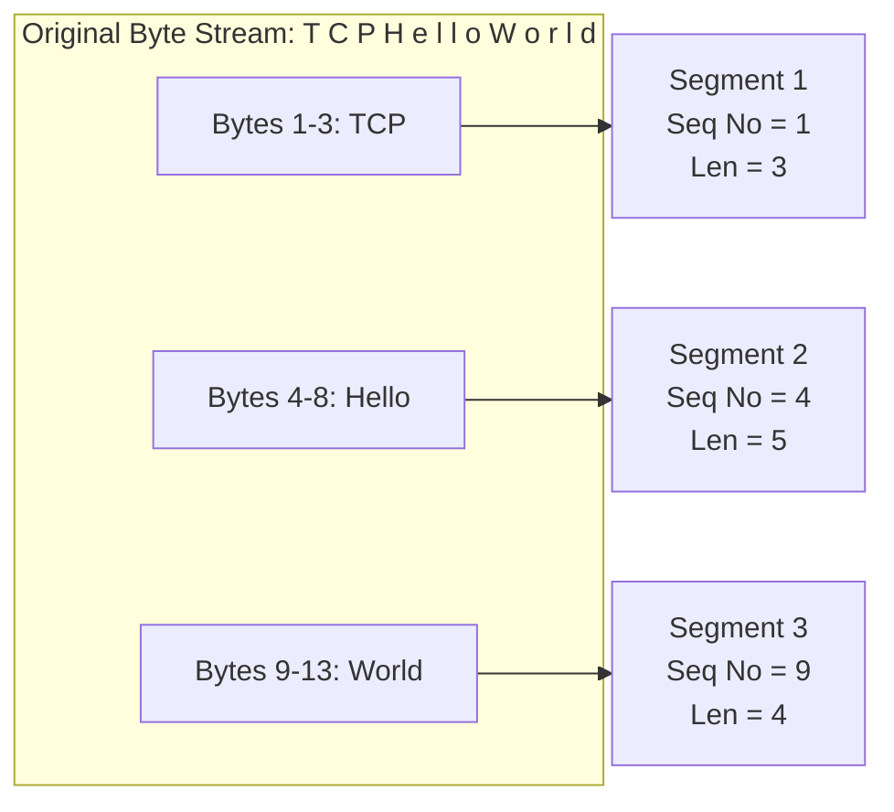
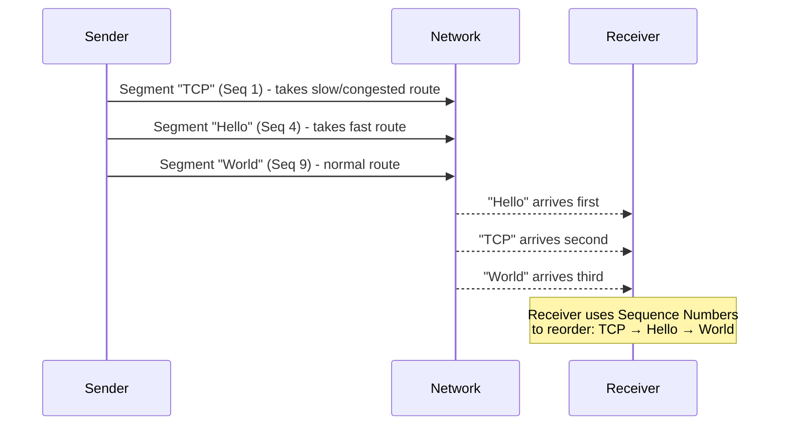
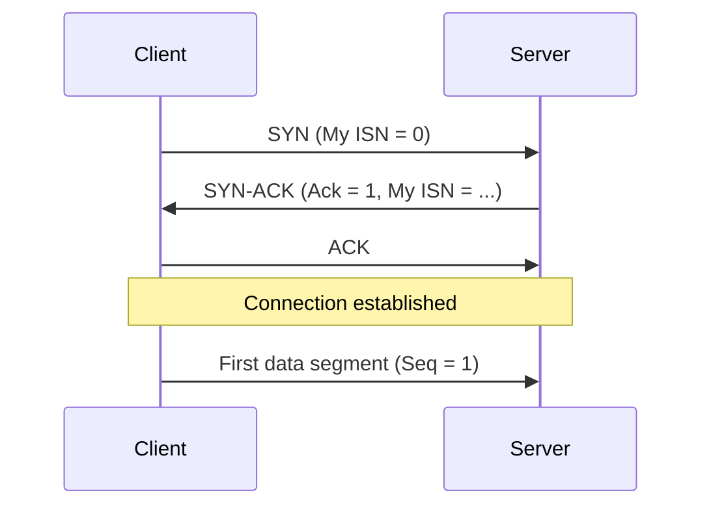
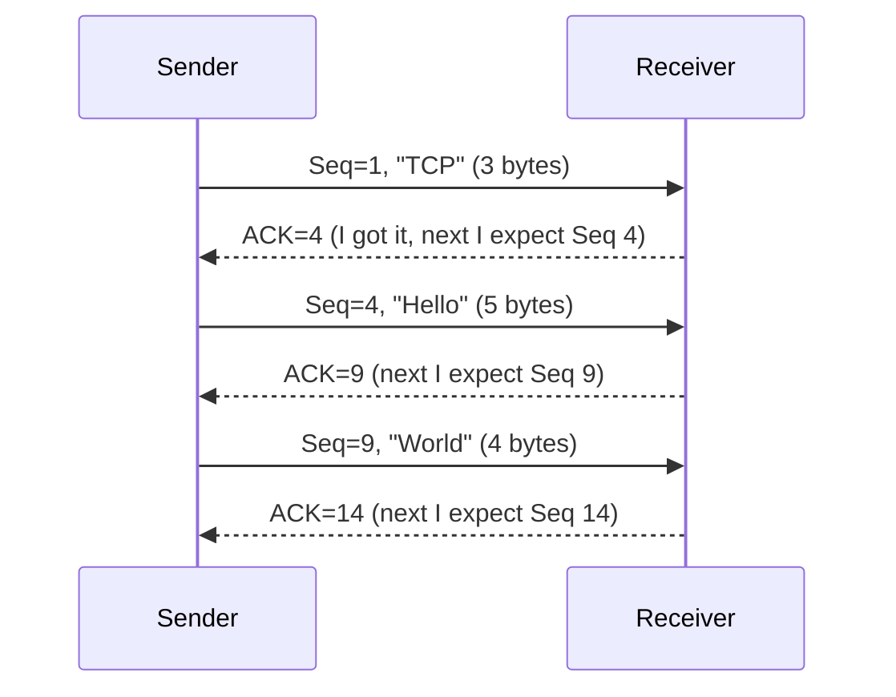
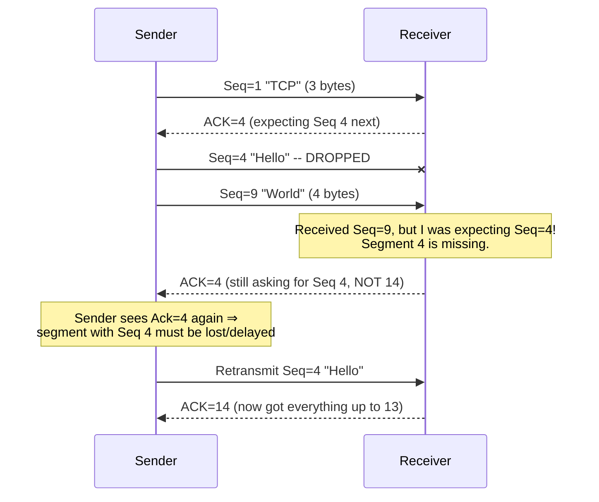
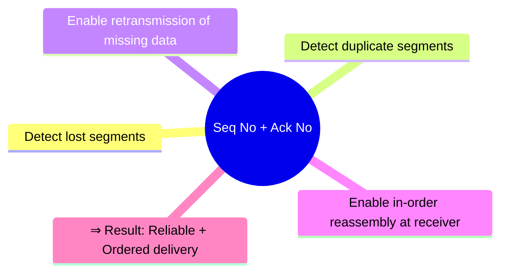

# TCP Sequence Number & Acknowledgment Number

> **Session context:** Part of the TCP deep-dive series — after *TCP Overview*, *Three-Way Handshake*, and *Four-Way Termination*. This session covers how TCP achieves **reliability** and **in-order delivery** using two header fields: Sequence Number and Acknowledgment Number.

---

## 1. Why This Topic Matters

TCP is famous for two guarantees:

- **Reliable delivery** – no data is lost; lost segments are retransmitted.
- **In-order delivery** – data arrives at the receiver in the same order it was sent, even if segments took different network paths.

Both guarantees are made possible **only** because of:

1. **Sequence Number**
2. **Acknowledgment Number**

---

## 2. TCP Sequence Number

### 2.1 Core Definition

> **Sequence Number = position of the first byte of a segment in the original byte stream.**

- Every byte sent over a TCP connection is numbered.
- The full application data (e.g., an HTTP request) is one continuous byte stream.
- TCP breaks this stream into smaller chunks — **segments**.
- Each segment gets a sequence number = position of its **first byte** in the original stream.

### 2.2 Worked Example

Original data to send: `"TCPHelloWorld"` → broken into 3 segments:

| Segment | Bytes | First Byte Position (in original stream) | Sequence Number | Segment Length |
|---|---|---|---|---|
| 1 | `TCP` | 1 | **1** | 3 bytes |
| 2 | `Hello` | 4 | **4** | 5 bytes |
| 3 | `World` | 9 | **9** | 4 bytes |

**Pattern:**
```
Next Segment's Seq No = Previous Segment's Seq No + Previous Segment's Byte Length
```
- Seg 1: Seq = 1, length = 3 → Seg 2 Seq = 1 + 3 = 4
- Seg 2: Seq = 4, length = 5 → Seg 3 Seq = 4 + 5 = 9

> ⚠️ In reality, sequence numbers **do not start at 1**. The **Initial Sequence Number (ISN)** is a large **random number** chosen during the three-way handshake (rarely 0). For teaching/simplicity, and in tools like **Wireshark**, it's shown as a **relative sequence number starting at 0** — the underlying logic stays identical, only the base value shifts.

### 2.3 Diagram — Byte Stream → Segments → Sequence Numbers



### 2.4 Where Sequence Number Lives

- TCP Segment = **Header (20 bytes)** + **Payload** (actual HTTP/SMTP/app data).
- The Sequence Number is one of the fields inside the **20-byte TCP header**.
- (Compare: UDP header = 8 bytes, simpler, no seq/ack fields for reliability.)

### 2.5 Why Segments Can Arrive Out of Order

Segments travel **independently** over the network (each wrapped in its own IP packet), so they can take different routes/hops.



This is **not a bug** — it's how packet-switched networks (the Internet) inherently work. The receiver uses sequence numbers to **reassemble data in the correct order**.

### 2.6 Uses of Sequence Number (Summary)

| Use Case | How |
|---|---|
| **Reordering** | Receiver arranges out-of-order segments using seq no. |
| **Detecting missing/lost segments** | Receiver expects `last_seq + last_len`; if it doesn't arrive, it's flagged as lost. |
| **Detecting duplicate segments** | If a segment with an already-received seq no arrives again (e.g., due to retransmission + late original arriving), receiver checks "do I already have this?" → discards duplicate. |

### 2.7 Initial Sequence Number (ISN) & Three-Way Handshake

- ISN is **shared during the three-way handshake**.
- **SYN segment** (Client → Server): "My initial sequence number is X" (X is normally random, e.g., 1000; simplified as 0 in examples).
- The SYN segment **itself consumes** that sequence number.
- So the **first actual data segment** starts at `ISN + 1`, not at `ISN`.



---

## 3. TCP Acknowledgment (ACK) Number

### 3.1 Core Definition

> **Acknowledgment Number = the next sequence number the receiver expects to receive.**

- ACK confirms successful receipt of data.
- The **ACK flag** must be set (`1`) in the TCP header for the Acknowledgment Number field to be valid/relevant.
- Formula:
```
Ack No = Sequence No of received segment + Length of that segment
```

### 3.2 Worked Example (Continuing the TCP/Hello/World example)

| Segment Received | Seq No | Length | Ack No Sent Back (= next expected seq) |
|---|---|---|---|
| `TCP` | 1 | 3 | **4** |
| `Hello` | 4 | 5 | **9** |
| `World` | 9 | 4 | **14** |

### 3.3 Diagram — ACK in Action



### 3.4 Detecting Loss via ACK — Worked Example

Sender sends Seq=1("TCP") then Seq=4("Hello") then Seq=9("World"). Suppose **Seq=4 ("Hello") is dropped** in the network.



Key insight: even though the receiver got "World" (Seq 9), it **keeps sending Ack=4** (not jumping to 14) because it's still missing byte 4 onward. This repeated/stale ACK is the signal that tells the sender to **retransmit**.

### 3.5 Uses of Acknowledgment Number (Summary)

| Use Case | How |
|---|---|
| **Confirms receipt** | Tells sender "I got data up to X". |
| **Triggers retransmission** | If sender doesn't get the expected Ack progress, it retransmits the unacknowledged segment. |
| **Tells sender what's missing** | The Ack number itself = next expected byte, pinpointing exactly where the gap is. |

---

## 4. Sequence No vs Acknowledgment No — Quick Comparison

| Aspect | Sequence Number | Acknowledgment Number |
|---|---|---|
| Set by | Sender (on each segment it sends) | Receiver (on each segment it sends back, when ACK flag = 1) |
| Meaning | Position of the **first byte of this segment** in the byte stream | The **next byte** the receiver expects to receive |
| Formula | Position of first byte in stream | `received Seq No + received segment length` |
| Purpose | Ordering, detecting duplicates | Confirming receipt, detecting loss, triggering retransmission |
| Set during handshake as | Initial Sequence Number (ISN) — random | Ack = ISN + 1 (SYN-ACK step) |

---

## 5. Overall Summary — Why These Two Make TCP Reliable



- **Sequence Number** → answers *"What order does this data go in?"*
- **Acknowledgment Number** → answers *"How much data has the receiver actually gotten so far?"*
- Together, they let TCP: reorder segments, detect missing/duplicate segments, retransmit lost data → **guaranteed, in-order delivery**, which is the defining property of TCP as a reliable transport protocol.

---

## 6. Interview Q&A

**Q1. What is a TCP sequence number?**
A: It represents the position (byte offset) of the first byte of a given segment within the original byte stream of the connection. It lets the receiver reorder segments and detect missing/duplicate data.

**Q2. Does the sequence number always start at 1 or 0?**
A: No. The real Initial Sequence Number (ISN) is a large random number chosen during the SYN of the three-way handshake (to prevent sequence prediction attacks / stale connection issues). Wireshark and textbooks often show a *relative* sequence number starting at 0 for simplicity.

**Q3. Why is the ISN random rather than always starting at a fixed number like 0?**
A: Mainly for security — a predictable ISN would make it easier for an attacker to spoof/hijack a TCP connection by guessing sequence numbers.

**Q4. What is the acknowledgment number and how is it calculated?**
A: It's the next sequence number the receiver expects to receive next. Calculated as: `Ack No = Seq No of the last successfully received (contiguous) segment + its length`.

**Q5. What's the relationship between SYN and sequence numbers in the three-way handshake?**
A: The SYN segment itself consumes one sequence number (the ISN). So the actual application data starts at `ISN + 1`, and the receiving side's SYN-ACK acknowledges with `Ack = ISN + 1`.

**Q6. How does TCP detect a lost segment?**
A: The receiver always expects a specific next sequence number. If it receives a segment with a sequence number higher than expected, it detects a gap and keeps re-sending the *same* (stale) Ack number for the missing byte, instead of advancing it — signaling the sender to retransmit.

**Q7. How does TCP handle out-of-order segments arriving at the receiver?**
A: Since segments travel independently over the network (different routes/hops), they can arrive out of order. The receiver uses the sequence number of each segment to reorder/reassemble them correctly before passing data up to the application.

**Q8. How does TCP prevent duplicate data from being accepted?**
A: If a segment is retransmitted (e.g., because an ACK was delayed) and both the original and retransmitted copies eventually arrive, the receiver checks whether it already has data for that sequence number. If yes, it discards the duplicate.

**Q9. What does the ACK flag do?**
A: When the ACK flag in the TCP header is set to 1, it indicates the Acknowledgment Number field is valid/meaningful for this segment — i.e., this segment is acknowledging previously received data.

**Q10. Why are sequence and acknowledgment numbers considered critical to TCP's reliability?**
A: Together they enable: in-order delivery (via reordering using seq no.), loss detection (via stale/missing Ack no.), retransmission of lost data, and duplicate rejection — all of which are the core mechanisms that make TCP a *reliable, connection-oriented* protocol (as opposed to UDP).

---

## 7. Quick Revision Checklist

- [ ] Seq No = position of **first byte** of a segment in the original byte stream.
- [ ] Next segment's Seq No = current Seq No + current segment's byte length.
- [ ] Real ISN is **random**, not 0 — 0/relative numbering is just for simplicity/Wireshark display.
- [ ] SYN segment consumes a sequence number → first data byte = ISN + 1.
- [ ] Ack No = next expected sequence number = `received Seq No + received length`.
- [ ] ACK flag must be set (1) for the Ack Number field to be meaningful.
- [ ] Segments can arrive **out of order** because they travel independently over the network — this is normal, not a bug.
- [ ] Receiver uses Seq No to **reorder** segments.
- [ ] Receiver uses **stale/repeated Ack No** to signal to the sender that a segment is missing → triggers **retransmission**.
- [ ] Receiver uses Seq No to **detect and discard duplicate** segments.
- [ ] Together, Seq No + Ack No = the foundation of TCP's **reliable, ordered delivery** guarantee.

---

*Source: CampusX Networking Fundamentals series — TCP Sequence Number & Acknowledgment Number session.*
