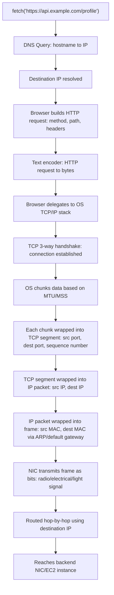

# What Happens When You Do an HTTP Request

## Summary
This is an introductory, high-level walkthrough of everything that happens under the hood when a frontend makes an HTTP request to a backend server — covering DNS resolution, TCP connection setup, data chunking, encapsulation into TCP segments, IP packets, and Ethernet frames, and finally MAC address resolution via ARP. The video is meant as a map/preview for a full networking playlist — each concept mentioned here (DNS, TCP 3-way handshake, MTU/MSS, TCP segment anatomy, IP packet anatomy, ARP, routing) will get its own dedicated deep-dive video later. Nothing here is implementation-deep; it's a conceptual flow overview.

**Setup used in the example:**
- Frontend: React JS running locally on `127.0.0.1:3000` (loopback IP, treated as "public IP" for simplicity)
- Backend: Node.js on an AWS EC2 instance at `10.0.0.1:443`, exposed via domain `https://api.example.com`

---

## Table of Contents
1. [The Starting Point — Making a Fetch Call](#1-the-starting-point--making-a-fetch-call)
2. [Step 1: DNS Resolution](#2-step-1-dns-resolution)
3. [Step 2: Structuring the HTTP Request](#3-step-2-structuring-the-http-request)
4. [Step 3: Converting Text to Bytes](#4-step-3-converting-text-to-bytes)
5. [Step 4: Browser Hands Off to the OS](#5-step-4-browser-hands-off-to-the-os)
6. [Step 5: TCP Connection & Chunking](#6-step-5-tcp-connection--chunking)
7. [Step 6: TCP Segment (Ports + Sequence Numbers)](#7-step-6-tcp-segment-ports--sequence-numbers)
8. [Step 7: Encapsulation into IP Packet](#8-step-7-encapsulation-into-ip-packet)
9. [Step 8: MAC Addresses & ARP](#9-step-8-mac-addresses--arp)
10. [Step 9: Transmission Over the Wire](#10-step-9-transmission-over-the-wire)
11. [End-to-End Flow Diagram](#11-end-to-end-flow-diagram)
12. [Comparison Tables](#12-comparison-tables)
13. [Interview Q&A](#13-interview-qa)
14. [Quick Revision Checklist](#14-quick-revision-checklist)

---

## 1. The Starting Point — Making a Fetch Call

```js
const response = await fetch("https://api.example.com/profile");
```

As developers, we write this one line and move on. But underneath, the browser and OS perform a whole chain of networking steps before a single byte reaches the backend.

**Simplification used throughout:**
- Source IP = `127.0.0.1` (loopback — not really public, but treated as such for this walkthrough)
- Destination IP = `10.0.0.1` (private-range IP — treated as public for simplicity)

---

## 2. Step 1: DNS Resolution

- The `fetch` call only has a **domain name** (`api.example.com`), not an IP.
- A domain name is just a string — you cannot route traffic across the internet using a string alone.
- The browser/OS performs a **DNS query**: hostname in → public IP out.
- DNS = Domain Name System. (Recursive resolvers, authoritative name servers, root servers, TLD servers are all deferred to a dedicated future video.)
- Result of this step: we now have the **destination IP** (`10.0.0.1`).

---

## 3. Step 2: Structuring the HTTP Request

Once we have the destination IP, the browser prepares the actual HTTP request:

```
GET /profile HTTP/1.1
Authorization: Bearer <token>
Cookie: <cookies>
X-Custom-Header: <value>
```

- **Method**: GET
- **Path**: `/profile`
- **Headers**: auth token, cookies, custom headers

> HTTP is built on top of **TCP** (Transmission Control Protocol). TCP internals (flow control, congestion control) get a dedicated multi-video module later.

---

## 4. Step 3: Converting Text to Bytes

- Network transmission only understands bits (1s and 0s), not raw text.
- The HTTP request (a string) is converted into **bytes** using a text encoder.
- These bytes can be represented as **hexadecimal** for visualization (e.g., a stream like `FE 12 0A ...`).

---

## 5. Step 4: Browser Hands Off to the OS

- The browser's job ends at: understand the request, run DNS, resolve IP/port.
- Actually transmitting data physically is **not** the browser's job — it delegates to the **OS's TCP/IP stack**.
- Every OS (Mac, Windows, Linux) has its own implementation of TCP, UDP, ICMP, IP, etc.
- The Network Interface Card (NIC) — the physical hardware that sends/receives signals — is controlled by the OS, not the browser.

---

## 6. Step 5: TCP Connection & Chunking

- HTTP rides on TCP, which is a **connection-oriented protocol**.
- Before sending data, a **TCP 3-way handshake** establishes a connection ("pipe") between client (frontend) and server (backend).
- Once the connection exists, the OS breaks the full data payload into **chunks** — necessary because payloads can range from a few hundred bytes (a typical HTTP request) to gigabytes (e.g., a large file upload).
- Chunk size is determined by **MTU** (Maximum Transmission Unit) and **MSS** (Maximum Segment Size) — covered in a dedicated future video.

---

## 7. Step 6: TCP Segment (Ports + Sequence Numbers)

Each chunk is wrapped into a **TCP segment**, which adds:

| Field | Purpose | Example in this walkthrough |
|---|---|---|
| Source Port | Identifies which process on the source machine sent the data | `3000` (React frontend) |
| Destination Port | Identifies which process on the destination machine should receive the data | `443` (Node.js backend over HTTPS) |
| Sequence Number | Ensures chunks are reassembled in the correct order at the destination, since chunks can arrive out of order over the network | — |

- A single machine can run thousands of processes on different ports (e.g., FastAPI on one port, Django on another) — the port tells the OS *which* process gets the data.
- **Sequence numbers** let TCP reorder chunks correctly even if they arrive out of order, guaranteeing in-order delivery.

---

## 8. Step 7: Encapsulation into IP Packet

The TCP segment is further wrapped into an **IP packet**, adding:

| Field | Purpose |
|---|---|
| Source IP | `127.0.0.1` — identifies the machine sending the request |
| Destination IP | `10.0.0.1` — identifies the machine that should receive it |

- The destination IP helps **routers** decide how to forward the packet toward the destination, hop by hop.
- At each hop, a router checks the destination IP: if it doesn't know where that IP is, it forwards to the next router that might know — eventually reaching the target (e.g., the AWS EC2 instance).
- The source IP is used by the backend to know **where the response should be sent back to**.

---

## 9. Step 8: MAC Addresses & ARP

- Once the packet has traveled (via routing) close to the destination's local network, we also need a **MAC address** — the physical/hardware address of the device (as opposed to IP, which is the virtual/logical internet address).

| Concept | Nature |
|---|---|
| IP Address | Virtual address — tells you *where* on the internet a device is |
| MAC Address | Physical address — tied to the actual Network Interface Card (NIC) |

- **Source MAC**: MAC address of the local machine's NIC.
- **Destination MAC**: Ideally the backend server's NIC MAC — but since the backend is *not on the local network*, its MAC is unknown directly.
- **Fallback**: the local machine sets the destination MAC to the **default gateway** (i.e., the router).
- To resolve an IP to a MAC address on the local network, the machine uses **ARP (Address Resolution Protocol)** — conceptually like a "local DNS" for MAC addresses.
  - ARP broadcasts a "Who has IP `192.168.1.1`?" request to every device on the local network (mobile, printer, router, etc.).
  - Only the device owning that IP replies with its MAC address; others ignore the request.

This completes the **frame** — the final encapsulated unit ready for transmission.

---

## 10. Step 9: Transmission Over the Wire

- The frame is converted to bits and transmitted by the NIC using:
  - Radio signals (Wi-Fi)
  - Electrical signals (Ethernet)
  - Light signals (Fiber optics)
- **Important note**: at this point, the request has only just left the local machine — it has **not yet reached the backend**. Everything described so far is what happens *before* the data even starts its journey across the internet (DNS, encapsulation, chunking, addressing all happen locally/at the OS level first).

---

## 11. End-to-End Flow Diagram



---

## 12. Comparison Tables

### Encapsulation Layers (outside-in as data travels down the stack)

| Layer | Unit | Key Fields Added | Responsible Component |
|---|---|---|---|
| Application | HTTP Request | Method, path, headers, body | Browser |
| Transport | TCP Segment | Source port, destination port, sequence number | OS TCP/IP stack |
| Network | IP Packet | Source IP, destination IP | OS TCP/IP stack |
| Link | Frame | Source MAC, destination MAC | NIC / OS via ARP |
| Physical | Bits/Signals | Radio / electrical / light signals | NIC hardware |

### IP vs MAC Address

| Aspect | IP Address | MAC Address |
|---|---|---|
| Nature | Virtual/logical | Physical/hardware |
| Scope | Internet-wide (routable) | Local network only |
| Tells you | Where a device is on the internet | Which physical NIC to deliver to |
| Resolved via | DNS (hostname → IP) | ARP (IP → MAC, within local network) |

### DNS vs ARP

| Aspect | DNS | ARP |
|---|---|---|
| Full form | Domain Name System | Address Resolution Protocol |
| Input | Hostname (e.g., `api.example.com`) | IP address |
| Output | Public IP address | MAC address |
| Scope | Global (internet-wide) | Local network only |

---

## 13. Interview Q&A

**Q1. Why does the browser need to do a DNS lookup before sending an HTTP request?**
Because domain names are just strings — routers and the network stack need an actual IP address to route traffic. DNS resolves the hostname to the destination's IP address.

**Q2. Why is HTTP said to be "built on top of TCP"?**
HTTP relies on TCP as its transport-layer protocol. TCP provides a reliable, connection-oriented pipe between client and server (via the 3-way handshake) over which HTTP request/response bytes travel.

**Q3. Why does the OS break data into chunks instead of sending it all at once?**
Because payload size can be arbitrarily large (e.g., a 1GB file), while the network has physical limits (MTU/MSS) on how much data a single unit can carry. Chunking splits data into manageable segments.

**Q4. What problem do TCP sequence numbers solve?**
Since chunks travel independently across the network, they can arrive out of order. Sequence numbers let TCP reorder chunks at the destination so the reassembled data matches the original order it was sent in.

**Q5. What is the difference between an IP address and a MAC address?**
IP is a virtual/logical address that identifies where a device is on the internet and is used for routing across networks. MAC is the physical hardware address of a device's NIC, used only within a local network to deliver frames to the correct physical device.

**Q6. Why does a machine use its default gateway's MAC address instead of the destination server's MAC address?**
Because the destination server is usually not on the local network, so its MAC address is unknown directly. The machine falls back to the default gateway's (router's) MAC address so the router can forward the packet further toward the destination.

**Q7. What does ARP do?**
ARP (Address Resolution Protocol) resolves an IP address to a MAC address within a local network. It broadcasts a "who has this IP?" request to all devices on the LAN; only the device holding that IP responds with its MAC address.

**Q8. What roles do source IP and destination port play, respectively, in this flow?**
- Source IP identifies which machine sent the request, so the backend knows where to send the response.
- Destination port identifies which specific process/service on the destination machine should receive the data (since a single machine can run many processes on different ports).

**Q9. At what point does the request actually leave the local machine in this whole flow?**
Only at the very last step — after DNS resolution, HTTP request construction, byte conversion, TCP segment creation, IP packet encapsulation, and frame creation (with MAC resolution via ARP) — does the NIC actually transmit the data as signals over the wire/air.

---

## 14. Quick Revision Checklist

- [ ] Domain names must be resolved to IPs via **DNS** before any request can be routed.
- [ ] HTTP request = method + path + headers + body, converted to **bytes** before transmission.
- [ ] Browser only prepares the request; the **OS TCP/IP stack** handles actual transmission.
- [ ] TCP is **connection-oriented** — requires a **3-way handshake** before data transfer.
- [ ] Large payloads are broken into **chunks** based on **MTU/MSS**.
- [ ] Each chunk becomes a **TCP segment** with source port, destination port, and sequence number.
- [ ] TCP segment is encapsulated into an **IP packet** with source IP and destination IP.
- [ ] Destination IP guides **routers** hop-by-hop toward the target network.
- [ ] Final encapsulation adds **MAC addresses** (source + destination) to form a **frame**.
- [ ] Destination MAC often falls back to the **default gateway (router)** MAC, resolved via **ARP**.
- [ ] Frame is transmitted as **bits** via radio (Wi-Fi), electrical (Ethernet), or light (fiber) signals.
- [ ] IP = virtual/global addressing; MAC = physical/local addressing.
- [ ] This entire chain happens **before** the request even leaves the local machine's network.
