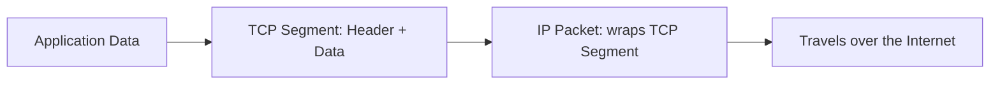
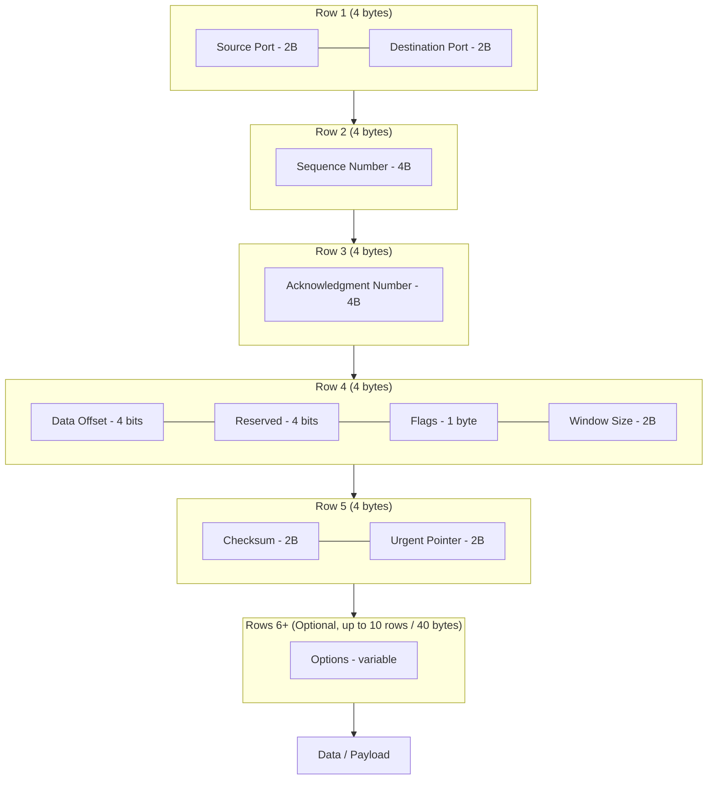
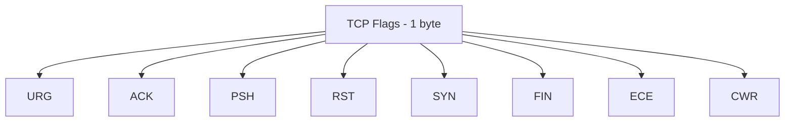
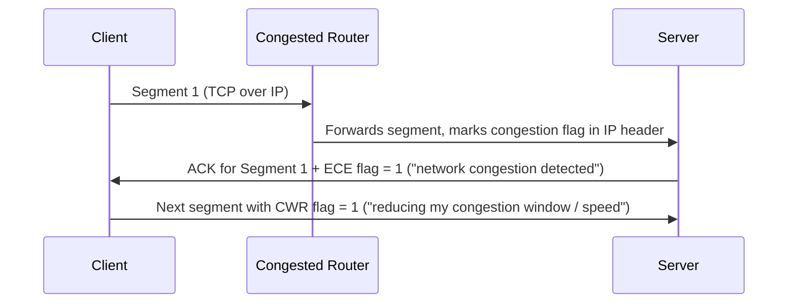
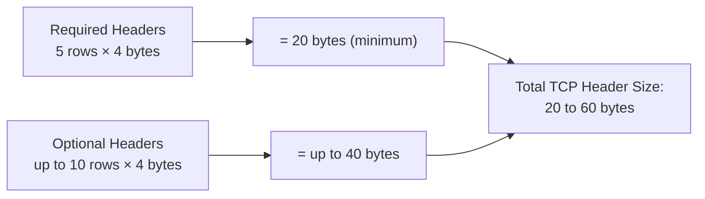

# TCP Segment — Anatomy Notes

> Source: Networking Fundamentals series — "Anatomy of TCP Segment"
> Reference: Official TCP RFC (header format section)
> Related: UDP Datagram Anatomy (previous video), Sequence & Acknowledgment Numbers (previous video)

---

## 1. Big Picture

- TCP segment = the data unit of **Transmission Control Protocol**.
- A TCP segment is **carried inside an IP packet** — IP is the common transport used by every protocol (TCP, UDP, ICMP, etc.) to route data over the internet.
- The TCP header is technically a **continuous stream of bytes**; it's drawn as rows/columns purely for teaching purposes (mirroring the RFC diagram).

---

## 2. TCP Header — Field by Field

### Field Reference Table

| Field | Size | Purpose |
|-------|------|---------|
| **Source Port** | 2 bytes | Port of the application initiating the request (e.g., a React/Angular app's port) |
| **Destination Port** | 2 bytes | Port the request is destined for |
| **Sequence Number** | 4 bytes (32 bits) | Identifies the order of this segment's bytes — enables receiver to reorder segments correctly (TCP's **ordered delivery** guarantee). Range: up to 2³² (~4 billion). Initial Sequence Number (ISN) is a large random number, not 0. |
| **Acknowledgment Number** | 4 bytes (32 bits) | The **next expected sequence number** — only meaningful/used when the ACK flag is set to 1 |
| **Data Offset** | 4 bits | Tells where the header ends and data begins. Unit = 4 bytes/row. Minimum value = 5 (5 rows × 4 bytes = 20 bytes of required headers). If Options are present, value > 5. |
| **Reserved** | 4 bits | Reserved for future use; generally set to 0 |
| **Flags (Control Bits)** | 1 byte (8 flags) | Control bits: URG, ACK, PSH, RST, SYN, FIN, ECE, CWR (see flags table below) |
| **Window Size** | 2 bytes | Receiver's (or sender's) data-handling capacity — used for **flow control** (covered in detail in a future video) |
| **Checksum** | 2 bytes | Error-detection value computed over header + data; used to validate segment integrity |
| **Urgent Pointer** | 2 bytes | Only considered if URG flag = 1; marks which byte in the data stream is "urgent" |
| **Options** | 0–40 bytes (variable) | Optional additional headers (MSS, Timestamp, Window Scale, SACK support, etc.) |
| **Data (Payload)** | Variable | Actual application data being carried (HTTP, HTTPS, SSH, FTP chunks, SMTP/email, etc.) |

> **Note**: TCP acts like a "vehicle" — the header fields provide the functionality (ordering, reliability, flow control), while the payload (data) is what the application actually cares about.

---

## 3. The 8 TCP Flags (Control Bits)

| Flag | Full Form | When Set (1) — Meaning |
|------|-----------|--------------------------|
| **SYN** | Synchronize | First step of TCP 3-way handshake — client tells server "here's my Initial Sequence Number." Requires a sequence number to also be sent. |
| **ACK** | Acknowledge | Segment carries an acknowledgment — the Acknowledgment Number field becomes valid/considered only when ACK = 1. Makes TCP "acknowledgment-oriented" → reliable. |
| **FIN** | Finish | Requests **graceful** connection closure — "I have no more data, let's close the connection" (mutual agreement from both sides). |
| **RST** | Reset | **Abrupt/critical** connection termination — used when something goes wrong (e.g., server crashed, port closed). Receiver immediately closes the connection and flushes related data. No graceful handshake. |
| **PSH** | Push | Tells the OS not to buffer the segment — push it to the application **immediately** rather than waiting to batch it with more incoming segments. Gives urgency. |
| **URG** | Urgent | Indicates the Urgent Pointer field should be considered — marks a specific "urgent" byte in the data stream (e.g., Ctrl+C sent over a Telnet session). Rarely used today due to OS-level (Windows/Linux) interpretation conflicts. |
| **ECE** | ECN-Echo | Sent by the **receiver/server** to inform the sender that network congestion was detected (signaled to it via the IP packet header, set by a congested router en route). Tells sender: "please reduce your data transfer speed." |
| **CWR** | Congestion Window Reduced | Sent by the **sender** in reply to ECE — confirms "I acknowledge the congestion notice, I am reducing my congestion window / slowing down my data transfer." |

### FIN vs RST — Quick Comparison

| Aspect | FIN | RST |
|--------|-----|-----|
| Nature | Graceful shutdown | Abrupt shutdown |
| Trigger | Both sides done sending data, mutual close | Crash / critical network or endpoint issue |
| Data handling | Orderly close | Data related to connection is flushed immediately |
| Analogy | Polite goodbye | Emergency ("mayday") disconnect |

### ECE ↔ CWR — Congestion Notification Flow

---

## 4. Data Offset — Deep Dive

- Tells the receiver **where the header ends and the data begins**.
- Unit: **1 Data Offset unit = 4 bytes** (1 row in the header diagram).
- **Minimum value = 5** → 5 rows × 4 bytes = **20 bytes** (the required/mandatory header fields: Source Port → Urgent Pointer).
- If **Options** are present, Data Offset > 5 (e.g., 6, 7, 8 …) — each extra unit = 4 more bytes from the Options field.
- Data Offset is represented in **32-bit units** total, i.e., it's a number telling you how many 4-byte blocks the header occupies.

---

## 5. Window Size (Preview)

- Indicates the **receiver's (or sender's) capacity** to handle data — cannot send unlimited data at once (e.g., can't send a full 1GB continuously).
- Directly tied to **Flow Control** and **Congestion Control** (covered in future dedicated videos).
- Size: 2 bytes.

---

## 6. Options Field

- **Optional and dynamic** — sits after the 5 mandatory rows (after Urgent Pointer).
- Can grow up to **10 additional rows → 40 bytes**.
- Common options mentioned (each to get a dedicated future video):

| Option | Purpose |
|--------|---------|
| **MSS (Maximum Segment Size)** | How much data (bytes) can fit in a single segment's data field — typically ~1460 bytes (related to MTU, Maximum Transmission Unit) |
| **Timestamp** | Used to calculate **Round Trip Time (RTT)** |
| **Window Scale** | Used to mitigate the limitations of the Window Size field |
| **SACK (Selective Acknowledgment) support** | Client/server negotiate whether selective acknowledgment (vs cumulative acknowledgment) is supported |

---

## 7. Checksum

- Computed by the **sender** over header + data → generates a hash/number, stored in the Checksum field.
- **Receiver** recomputes the checksum on what it received.
- Match → valid segment, accepted.
- Mismatch → segment is corrupted/modified in transit → **dropped**.
- (Same concept as UDP checksum, covered previously.)

---

## 8. TCP Header Size — Calculation

### Byte breakdown of required (minimum) header — 20 bytes total

| Field | Bytes |
|-------|-------|
| Source Port | 2 |
| Destination Port | 2 |
| Sequence Number | 4 |
| Acknowledgment Number | 4 |
| Data Offset + Reserved + Flags | 2 |
| Window Size | 2 |
| Checksum | 2 |
| Urgent Pointer | 2 |
| **Total** | **20 bytes** |

- **Minimum TCP header size = 20 bytes** (Data Offset = 5)
- **Maximum TCP header size = 60 bytes** (20 required + up to 40 optional, Data Offset up to 15)
- Compare: **UDP header size = 8 bytes** (fixed, no options) — TCP header is heavier because it carries more functionality (ordering, reliability, flow/congestion control).

> ⭐ **Interview-critical fact**: TCP header size ranges from **20 bytes (min) to 60 bytes (max)**.

---

## 9. TCP vs UDP Header — Quick Comparison

| Aspect | TCP | UDP |
|--------|-----|-----|
| Header size | 20–60 bytes (variable, has Options) | 8 bytes (fixed) |
| Ports | Source + Destination (2B each) | Source + Destination (2B each) |
| Sequence/Ack numbers | Yes (ordered, reliable delivery) | No |
| Flags | Yes (SYN, ACK, FIN, RST, PSH, URG, ECE, CWR) | No |
| Flow/Congestion control | Yes (Window Size, ECE/CWR) | No |
| Checksum | Yes | Yes |
| Connection-oriented | Yes | No |

---

## 10. Quick Revision Checklist

- [ ] TCP segment travels inside an IP packet (IP = common carrier for all protocols)
- [ ] Header is a continuous byte stream; diagram rows are just for visualization
- [ ] Source Port & Destination Port — 2 bytes each
- [ ] Sequence Number & Acknowledgment Number — 4 bytes each; Ack Number valid only if ACK flag = 1
- [ ] Data Offset: min 5 (20 bytes), unit = 4 bytes, grows with Options
- [ ] 8 flags: SYN, ACK, FIN, RST, PSH, URG, ECE, CWR — know what each does
- [ ] FIN = graceful close; RST = abrupt close (crash/error)
- [ ] PSH = don't buffer, push to application immediately
- [ ] ECE = "network congested" (server → client); CWR = "reducing my speed" (client → server)
- [ ] URG/Urgent Pointer = rarely used today, OS-level conflicts
- [ ] Window Size = receiver's data-handling capacity (ties into flow/congestion control)
- [ ] Checksum = validates header + data integrity; mismatch → segment dropped
- [ ] Options field: optional, up to 40 bytes (10 rows), includes MSS, Timestamp, Window Scale, SACK support
- [ ] TCP header size: **20 bytes minimum, 60 bytes maximum**
- [ ] UDP header size (for comparison): 8 bytes fixed

---

## 11. Interview Q&A

**Q1. What is a TCP segment, and how does it relate to an IP packet?**
A TCP segment is the data unit of the Transmission Control Protocol, consisting of a header and a payload. It is carried inside an IP packet, which is used to route data over the internet — IP is the common transport layer for TCP, UDP, ICMP, and other protocols.

**Q2. What is the minimum and maximum size of a TCP header?**
Minimum is 20 bytes (5 rows of required fields, Data Offset = 5). Maximum is 60 bytes (20 bytes required + up to 40 bytes of optional headers).

**Q3. What does the Data Offset field represent?**
It indicates where the TCP header ends and the data (payload) begins. Its unit is 4 bytes (one row). The minimum value is 5 (yielding a 20-byte header); if TCP Options are present, the value is greater than 5, accounting for the additional bytes those options occupy.

**Q4. Why is TCP considered a reliable, ordered-delivery protocol?**
Because of the Sequence Number (lets the receiver reorder segments correctly) and Acknowledgment Number + ACK flag (lets the receiver confirm receipt of data back to the sender), together guaranteeing ordered, acknowledged delivery.

**Q5. Explain the difference between the FIN and RST flags.**
FIN initiates a graceful connection closure — both sender and receiver agree that they're done sending data and mutually close the connection. RST is used for an abrupt termination, typically when something has gone wrong (e.g., a crash or unreachable port) — the connection is closed immediately without any graceful handshake, and buffered data is flushed.

**Q6. What is the purpose of the PSH flag?**
It tells the receiving OS not to buffer the segment waiting for more data to arrive, but to push it to the application layer immediately. This is useful when low latency/immediacy matters more than batching efficiency.

**Q7. How do ECE and CWR flags work together?**
When a router along the path experiences congestion, it marks a field in the IP packet header. When this reaches the server, the server detects the congestion and sets the ECE flag when acknowledging back to the client, signaling "there's congestion in the network, please slow down." The client then reduces its congestion window/sending rate and confirms this by setting the CWR flag in its next segment to the server.

**Q8. What is the Window Size field used for?**
It communicates the sender's or receiver's capacity to handle data at a given time — the basis for TCP's flow control mechanism, preventing a sender from overwhelming a receiver with more data than it can process.

**Q9. What is the TCP Options field, and what are some examples of options it can carry?**
It's an optional, variable-length section (up to 40 bytes / 10 rows) of the TCP header used for additional functionality beyond the mandatory fields. Examples include MSS (Maximum Segment Size — how much data fits in one segment), Timestamp (used to calculate Round Trip Time), Window Scale (mitigates Window Size field limitations), and SACK support (selective vs cumulative acknowledgment negotiation).

**Q10. How does TCP validate that a segment hasn't been corrupted in transit?**
Using the Checksum field. The sender computes a checksum over the header and data and stores it in the segment. The receiver recomputes the checksum on what it received; if it doesn't match, the segment is considered corrupted/invalid and is dropped.

**Q11. Compare TCP and UDP header sizes, and explain why they differ.**
UDP has a small, fixed 8-byte header (just source port, destination port, length, checksum) since it's a lightweight, connectionless protocol. TCP's header is 20–60 bytes because it needs to support additional functionality — ordered delivery (sequence/ack numbers), connection management (SYN/FIN/RST flags), flow control (window size), congestion control (ECE/CWR), and optional extensions (Options field) — making it a connection-oriented, reliable protocol.

**Q12. Why is the Urgent Pointer / URG flag rarely used in modern systems?**
Because its interpretation is inconsistent across operating systems (e.g., Windows vs Linux handle it differently), leading to conflicts and ambiguity, so most modern applications avoid relying on it.

---

## 12. What's Next (per session)
- Dedicated future videos on: **Maximum Segment Size (MSS)** and **Maximum Transmission Unit (MTU)**, **Flow Control** (Window Size in depth), **Congestion Control**, and **Selective vs Cumulative Acknowledgment**.
- Also planned: a later video (end of networking series) on how TCP segments are handled at the **OS/socket level**.
