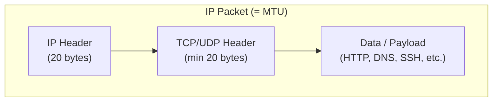
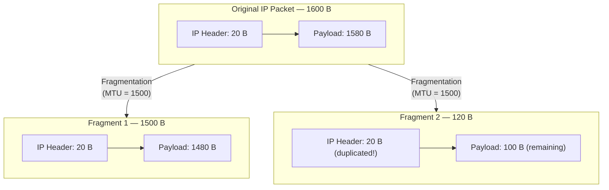
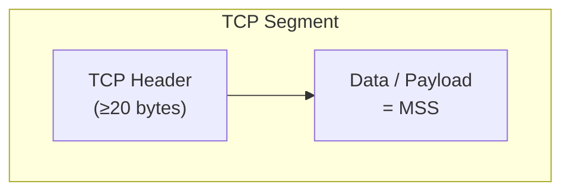
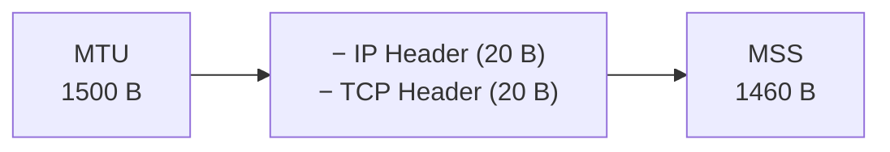
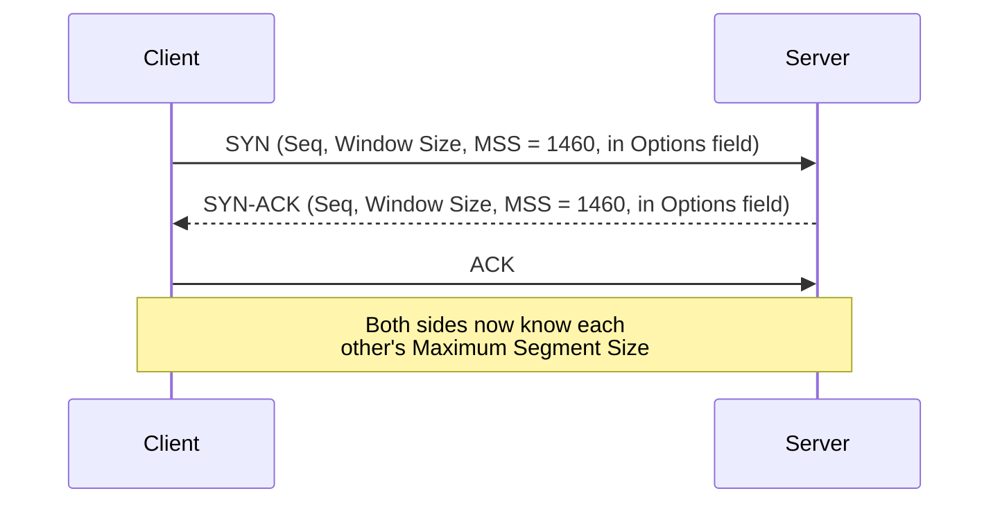
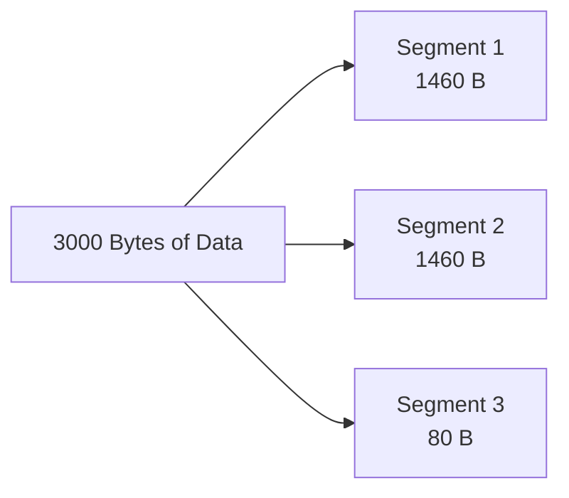
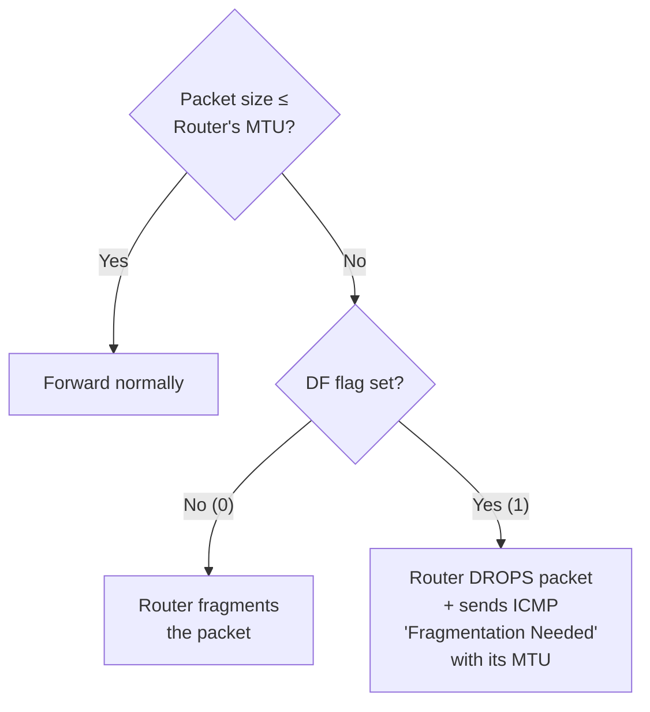
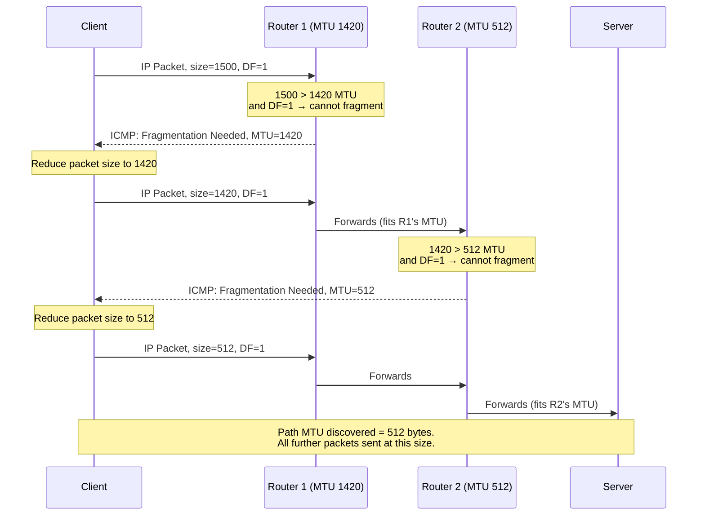

# MTU, MSS & Path MTU Discovery (PMTUD)

> Session notes — Computer Networking Fundamentals series
> Topics: Maximum Transmission Unit, IP Fragmentation, Maximum Segment Size, Path MTU Discovery

---

## 1. What Is MTU (Maximum Transmission Unit)?

> **MTU** = the largest IP packet a link (Wi-Fi, Ethernet, etc.) can carry **without fragmentation**.

MTU includes:
- IP Header
- TCP / UDP Header
- Payload (data)



- The **IP packet's payload** is the TCP segment / UDP datagram / ICMP packet — i.e., "IP's data = TCP segment itself."
- Standard home Wi-Fi/Ethernet MTU is typically **1500 bytes** (check via network settings → Wi-Fi details → Hardware → MTU).
- **Important clarification:** MTU does **not** include the Ethernet frame header (source MAC + destination MAC, ~14 bytes). MTU is purely the IP packet size.
- Different links can have different MTUs — e.g., data centers (AWS/Azure) commonly use **Jumbo Frames** with MTU up to **9000 bytes** (~6x larger than typical home MTU).

---

## 2. IP Fragmentation

When an IP packet's total size **exceeds** the link's MTU, the TCP/IP stack **fragments** it into multiple standalone IP packets.

### Worked Example

| Item | Value |
|---|---|
| Link MTU | 1500 bytes |
| Original IP packet | 1600 bytes total (IP header 20 B + payload 1580 B) |

Since 1600 > 1500, the stack splits it into **two fragments**:



| Fragment | IP Header | Payload | Total |
|---|---|---|---|
| Fragment 1 | 20 B | 1480 B | **1500 B** (matches MTU exactly) |
| Fragment 2 | 20 B (**duplicated**) | 100 B (remaining) | **120 B** |
| **Sum sent over network** | | | **1620 B** |

### The Disadvantage of Fragmentation

- Original data: **1600 bytes**
- Actually transmitted: **1620 bytes**
- **Why the extra 20 bytes?** Each fragment is now an independent IP packet, so it needs its **own IP header** — the header gets **duplicated** across fragments.
- Each fragment travels independently, gets its own Ethernet frame (source MAC / destination MAC), and must be reassembled at the destination using info in the IP header (covered in detail later, in the IP header anatomy topic).

> **Rule of thumb: Fragmentation should be avoided wherever possible** — it increases data transferred over the network and adds overhead. It's also considered somewhat riskier from a security standpoint (fragmented packets are a known attack vector).

---

## 3. What Is MSS (Maximum Segment Size)?

> **MSS** = the **maximum TCP payload** that fits inside a single TCP segment. It is a **TCP-only** concept (not applicable to UDP or ICMP).



- MSS refers **only** to the data portion of a TCP segment — the TCP header itself is **not** counted as part of MSS.

### MSS Formula

```
MSS = MTU − IP Header size − TCP Header size
```

### Worked Example (Standard Ethernet)

| Component | Size |
|---|---|
| MTU | 1500 B |
| − IP Header | 20 B |
| − TCP Header | 20 B |
| **= MSS** | **1460 B** |

> Standard Ethernet MSS is commonly **1460 bytes**. (Can differ if TCP options add extra header bytes.)



---

## 4. How MSS Is Exchanged — During the 3-Way Handshake

MSS is **advertised during the TCP 3-Way Handshake**, carried in the **Options field** of the TCP header (same field used for Window Scaling Factor — there's no dedicated MSS header field).



### Why MSS Matters — Constructing Well-Packed Segments

If the client knows the server's MSS is **1460**, and needs to send **3000 bytes** of data, TCP will construct segments like this:

| Segment | Data (Payload) |
|---|---|
| Segment 1 | 1460 B |
| Segment 2 | 1460 B |
| Segment 3 | 80 B (remaining) |



When TCP header (20 B) + IP header (20 B) are added to a 1460-byte payload segment:
```
1460 + 20 (TCP) + 20 (IP) = 1500 bytes → exactly matches MTU → no fragmentation needed
```

### What Happens If MSS Is Ignored?

If a sender mistakenly builds a segment with **1500 bytes of data** (ignoring MSS = 1460), the final IP packet becomes:
```
1500 (data) + 20 (TCP header) + 20 (IP header) = 1540 bytes
```
This exceeds the 1500-byte MTU → **fragmentation is triggered**, and 2 IP packets are delivered instead of 1 — the exact inefficiency MSS is designed to prevent.

> **MSS helps avoid fragmentation** by ensuring TCP builds segments that, once wrapped in TCP + IP headers, exactly match the link's MTU.

---

## 5. The Problem MSS Alone Doesn't Solve: Routers In Between

MSS is negotiated only between the **two endpoints** (client & server). But data travels through **multiple routers**, and **each router can have its own MTU** — sometimes smaller than the endpoints' MTU.


If the client sends a 1500-byte packet:
1. At Router 1 (MTU 1420) → packet gets **fragmented** into a 1420 B piece + a smaller remainder.
2. At Router 2 (MTU 512) → the 1420 B fragment is **further fragmented** again.
3. **Result:** a single packet sent by the client arrives at the server split into **3 fragments** — multiple, uncontrolled fragmentation events along the path.

This is exactly the scenario **Path MTU Discovery** is designed to prevent.

---

## 6. Path MTU Discovery (PMTUD)

> **PMTUD** discovers the **smallest MTU along the entire path** from sender to receiver, so the sender can size packets to avoid fragmentation anywhere along the route.

### Key Mechanism: the "Don't Fragment" (DF) Flag

- Every IP packet header has a **DF (Don't Fragment) flag**.
- If **DF = 1**: no router along the path is allowed to fragment this packet.
- If a router's MTU is smaller than the packet and DF = 1 → the router **drops the packet** and sends back an **ICMP "Fragmentation Needed"** message containing its own MTU.



### Step-by-Step PMTUD Walkthrough



### Why This Works
- The sender starts optimistically with a large packet (e.g., 1500 B) and DF=1.
- Every time a router along the path can't handle that size, it **drops the packet** and reports its MTU via **ICMP**.
- The sender **reduces its packet size** and retries.
- This repeats until the packet successfully reaches the destination **without needing fragmentation anywhere**.
- The final, successful packet size = the **Path MTU** — the smallest MTU across the entire route.

> ICMP (Internet Control Message Protocol) is the mechanism used by routers to send these "Fragmentation Needed" notifications back to the sender.

---

## 7. Quick Comparison: MTU vs MSS vs PMTUD

| Concept | Definition | Scope | Where Negotiated |
|---|---|---|---|
| **MTU** | Max size of a single IP packet a link can carry without fragmentation | Per-link (Wi-Fi, Ethernet, router interface) | Configured per network interface |
| **MSS** | Max TCP payload (data only) that fits in one TCP segment | TCP-only | 3-Way Handshake (TCP Options field) |
| **PMTUD** | Process to discover the smallest MTU across an entire multi-hop path | End-to-end path (sender → routers → receiver) | Dynamically discovered via DF flag + ICMP messages |

---

## 8. Interview Q&A

**Q1. Define MTU in one line.**
A. The largest IP packet a given link can carry without needing fragmentation — includes IP header, TCP/UDP header, and payload.

**Q2. Does MTU include the Ethernet frame header?**
A. No. MTU is the size of the IP packet only; the Ethernet frame (source/destination MAC, ~14 bytes) is separate and not counted in MTU.

**Q3. Why does IP fragmentation increase total data sent over the network?**
A. Because each fragment becomes an independent IP packet and needs its own copy of the IP header (20 bytes), so the header gets duplicated across fragments — increasing total bytes transmitted.

**Q4. What is MSS and how is it calculated?**
A. Maximum Segment Size — the max TCP payload in a single segment. Formula: `MSS = MTU − IP Header (20B) − TCP Header (20B)`. For standard Ethernet (MTU 1500), MSS = 1460 bytes.

**Q5. Is MSS relevant to UDP?**
A. No — MSS is a TCP-only concept, since "segment" specifically refers to TCP's data unit.

**Q6. Where is MSS communicated between two hosts?**
A. In the TCP Options field during the 3-Way Handshake (SYN and SYN-ACK packets).

**Q7. Why can knowing MSS alone still not guarantee zero fragmentation across a network?**
A. Because MSS is negotiated only between the two endpoints. Routers along the path may have smaller MTUs than either endpoint, causing fragmentation mid-route even if endpoint MSS is correctly set.

**Q8. What does the DF (Don't Fragment) flag do?**
A. When set to 1 in the IP header, it forbids any router along the path from fragmenting that packet. If a router's MTU is too small, it must drop the packet instead of fragmenting it.

**Q9. What happens when a router drops a DF=1 packet that's too large?**
A. It sends back an ICMP "Fragmentation Needed" message to the sender, including its own MTU value.

**Q10. What is Path MTU Discovery (PMTUD)?**
A. A process where the sender starts with a large packet (DF=1) and progressively reduces packet size based on ICMP "Fragmentation Needed" responses from routers, until it discovers the smallest MTU along the entire path — then sends all further packets at that size to avoid fragmentation.

---

## 9. Revision Checklist

- [ ] Can define MTU and list what it includes (IP header + TCP/UDP header + data)
- [ ] Know that Ethernet frame headers are NOT part of MTU
- [ ] Can walk through an IP fragmentation example and explain why total bytes increase
- [ ] Can state the MSS formula and calculate it given an MTU
- [ ] Know MSS is TCP-only and exchanged via Options field in the 3-way handshake
- [ ] Can explain how MSS helps avoid fragmentation (segment sized to fit MTU exactly)
- [ ] Understand why per-router MTU differences can still cause fragmentation despite correct MSS
- [ ] Can explain the DF flag's role and what happens when a router can't honor it
- [ ] Can trace a full PMTUD sequence (packet too big → ICMP → resend smaller → repeat → success)
- [ ] Know PMTUD's goal: find the smallest MTU along the whole path to avoid mid-route fragmentation

---

*Part of the Computer Networking Fundamentals revision series — follows notes on TCP Flow Control / Window Size / Window Scaling, and precedes the upcoming deep dive into IP Header Anatomy.*
