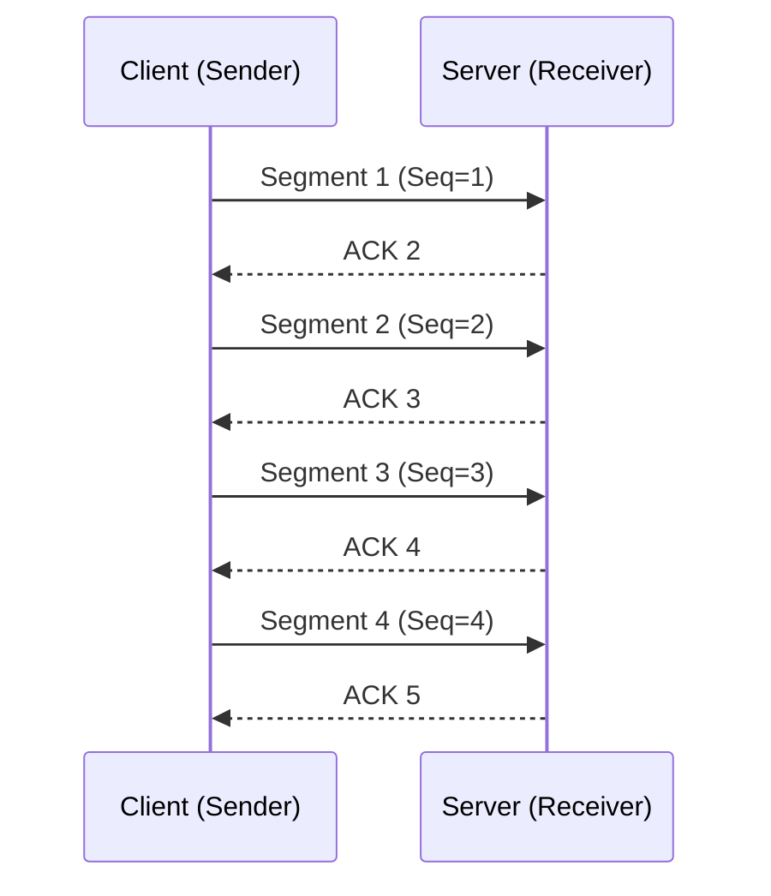
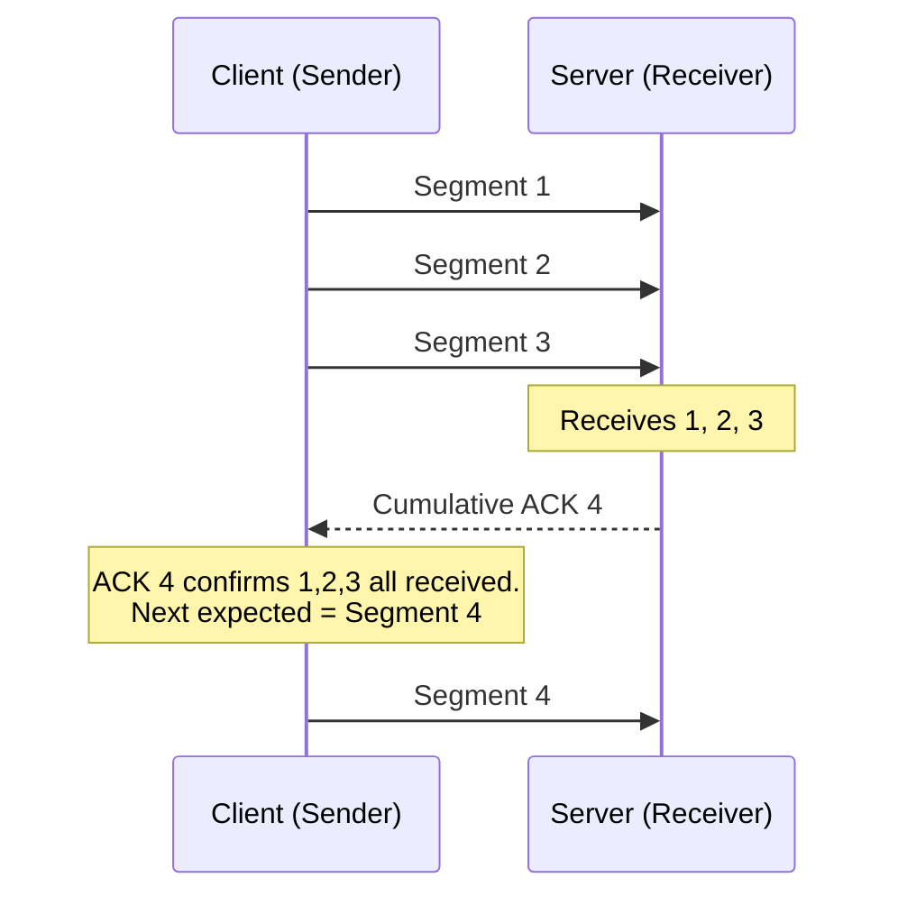
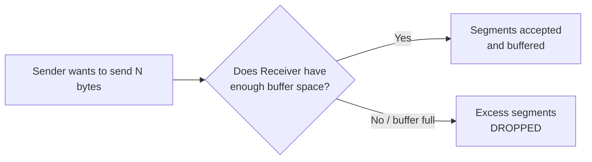
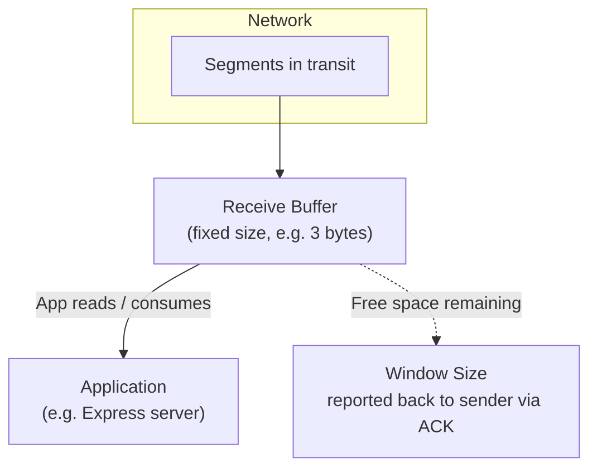
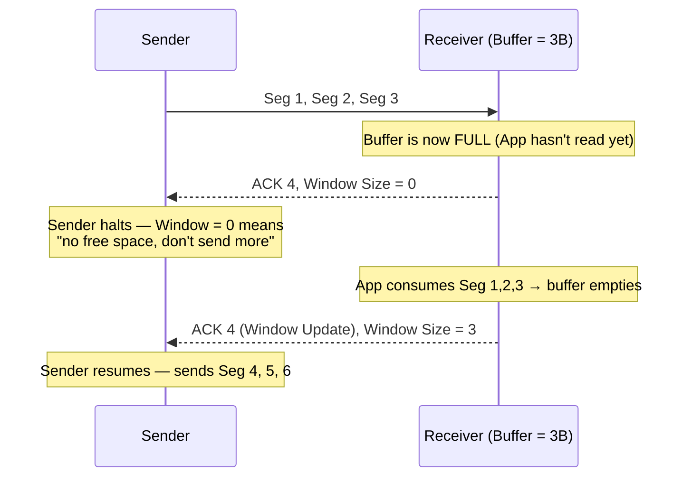
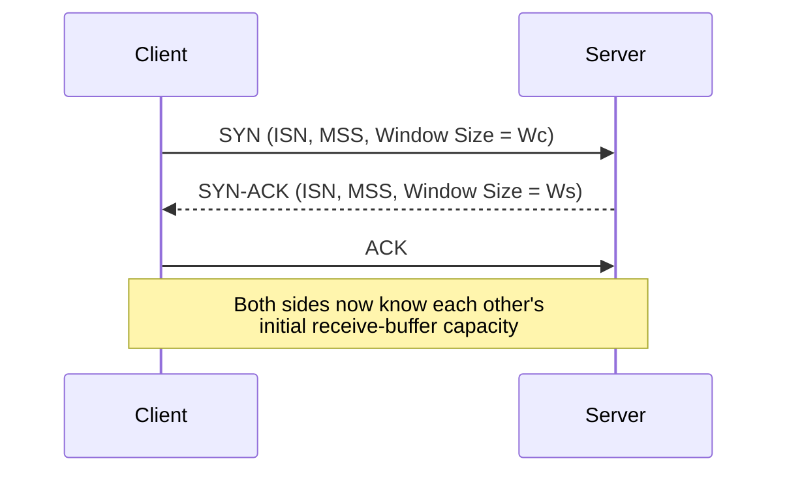
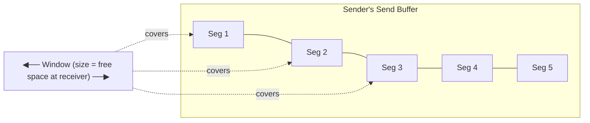
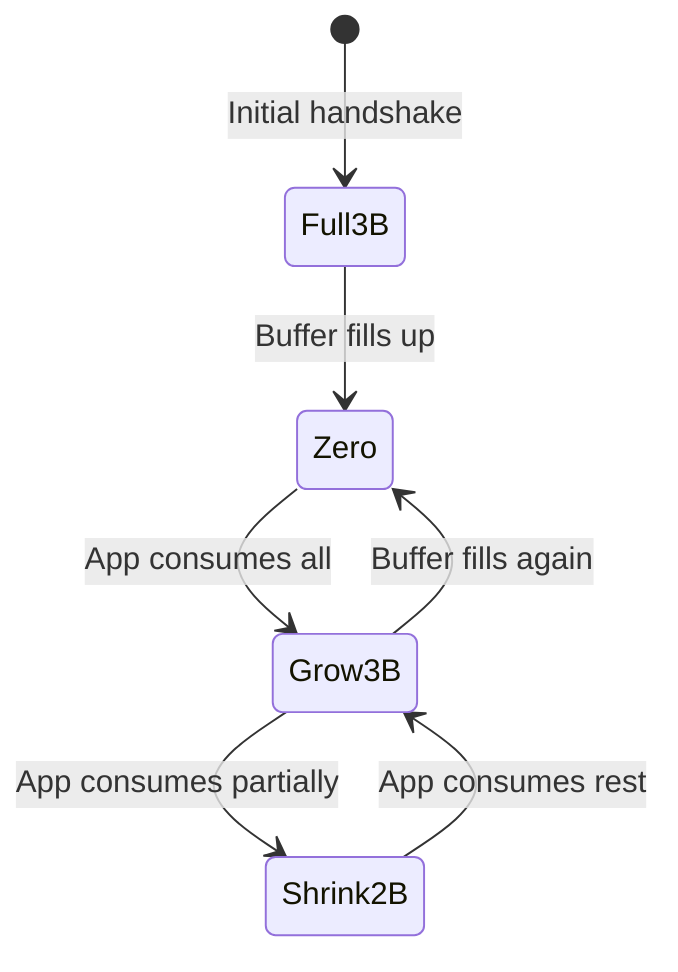
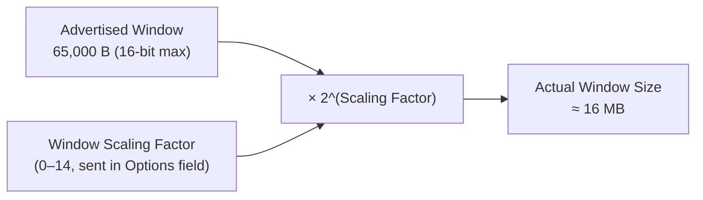

# TCP Flow Control, Window Size & Window Scaling

> Session notes — Computer Networking Fundamentals series
> Topics: Stop-and-Wait, Flow Control, Receive Buffer, Window Size, Sliding Window, Cumulative ACK, Window Scaling Factor

---

## 1. Why Flow Control? — Starting from Stop-and-Wait

Before flow control, TCP could (in theory) send data one segment at a time and wait for an ACK before sending the next. This is called **Stop-and-Wait**.

**Setup:** Client wants to send 4 segments to a Server. Each segment carries 1 byte, so sequence numbers go `1 → 2 → 3 → 4`.



### Rule of Stop-and-Wait
- Send **one** segment → wait for its ACK → only then send the next.
- Only a single segment is ever "in flight" on the wire.

### Problem with Stop-and-Wait
- Every segment costs **one full round trip** (send + wait for ACK).
- Fine for **small data** / embedded systems (simple to reason about).
- Terrible for **large transfers**. Example: sending a 2 GB file in 1 KB chunks means waiting on a round trip for *every single chunk* → extremely slow in practice.

> **Round Trip (RTT)** = time to send a segment + time to receive its ACK.

---

## 2. Improving on Stop-and-Wait: Sending Multiple Segments + Cumulative ACK

Instead of 1 segment per RTT, TCP can send **several segments at once** (e.g., 3 segments = 3 bytes here) and get them acknowledged together.



### Cumulative ACK
- Receiver doesn't need to ACK every segment individually.
- One ACK with number **N** means: *"I've received everything up to N−1. Send me segment N next."*
- **3 segments sent → 1 round trip** (instead of 3 round trips in Stop-and-Wait) → big efficiency win.

### The Open Question
How did we decide to send exactly **3** segments and not 2, or 10? → Answer: **Flow Control**, driven by two questions:
1. How much data can the **receiver** handle?
2. How much should the **sender** therefore send?

---

## 3. What Is Flow Control?

> **Flow Control** is the mechanism that prevents a sender from sending more data than a receiver can handle, so that segments aren't dropped due to the receiver being overwhelmed.

If a sender ignores the receiver's capacity (e.g., sends 4 bytes when the receiver can only buffer 3), the **excess bytes get dropped** — causing retransmissions and wasted bandwidth.



---

## 4. Receive Buffer & Window Size

### Receive Buffer
- A **finite chunk of memory** on the receiver's machine.
- Every incoming segment lands here first, **before** the application (e.g., an Express server) consumes it.
- Acts as a holding area between "arrived over the network" and "read by the application."

### Window Size
> **Window Size = the currently available free space in the receiver's Receive Buffer.**

This is literally the answer to *"how much can the receiver handle right now?"* — and therefore tells the sender *"how much you're allowed to send right now."*



### Worked Example — Buffer Full → Drop

| Step | Receive Buffer (3 B capacity) | Action |
|---|---|---|
| Sender sends Seg 1, 2, 3 (3 bytes) | Buffer fills exactly (3/3) | Fits perfectly |
| Sender sends Seg 4 *before* buffer is read | Buffer already full | **Segment 4 is dropped** — no space to land |

This is exactly the failure Flow Control exists to prevent.

---

## 5. How Window Size Flows Between Sender & Receiver



### Key Events
- **Window Size = 0** → sender must pause; receiver's buffer is full.
- **Window Update event** → triggered automatically when the application reads/consumes data from the receive buffer, freeing up space. TCP sends a fresh ACK (same ACK number) carrying the new, larger window size.
- Window size **constantly changes** — it can shrink to 0 and grow back up as the app consumes data at its own pace.

### Partial Consumption Example

If the app only consumes Segment 4 & 5 (not 6):

| Receive Buffer Content | Free Space | Window Size Reported |
|---|---|---|
| Seg 6 still sitting in buffer | 2 bytes free (out of 3) | `Window = 2` |

Sender then only sends 2 segments at a time (e.g., Seg 7, 8) — matching the receiver's *actual* free space, not the full buffer size.

---

## 6. Why Both Sides Care: TCP Is Bidirectional

TCP is bidirectional — a client can be a sender in one direction and a receiver in the other (server responses flow back). So **during the TCP 3-Way Handshake**, both sides exchange:

- Initial Sequence Number (ISN)
- Maximum Segment Size (MSS)
- **Window Size** (of their own receive buffer)



This is *how* the sender knows the receiver's window size before sending the very first batch of data.

---

## 7. Sliding Window Technique

The **Sliding Window** is the mechanism that lets TCP continuously grow/shrink its "sending window" over time based on ACKs, instead of treating flow control as a one-time negotiation.

### Components
- **Send Buffer** (sender side): holds segments that are prepared and ready to send.
- **Receive Buffer** (receiver side): holds segments that have arrived but aren't yet consumed by the app.
- **Window**: a "frame" over the send buffer indicating which bytes can currently be transmitted.



### How the Window Slides — Step by Step

| Event | Window Behavior |
|---|---|
| Initial: Receiver's buffer empty, size = 3B | Window spans Seg 1–3 → sender transmits all 3 |
| Receiver buffer fills, ACK 4 + Window=0 | Sender **halts**, window frozen |
| App reads all 3, Window Update: ACK 4 + Window=3 | Window **slides** forward and **grows** back to 3 → sender sends Seg 4,5,6 |
| App reads only 2 of them, ACK 7 + Window=2 | Window **slides** forward but **shrinks** to 2 → sender sends only 2 segments to match |
| App reads all, ACK + Window=3 | Window slides and grows again → sender sends next 3 (e.g., Seg 9,10,11) |



### Takeaway
- TCP doesn't "care" about *why* the window grows or shrinks — it just reacts to the latest advertised window size in each ACK.
- This growing/shrinking of the window is what keeps data flowing **continuously** without ever overwhelming the receiver — this *is* Flow Control in action.

---

## 8. The 16-Bit Window Size Limitation

The **Window Size field** in the TCP header is only **16 bits** wide.

```
Max value representable = 2^16 − 1 ≈ 65,535 bytes ≈ 64 KB (commonly rounded to ~65,000 / 65 KB)
```

### Why This Becomes a Bottleneck

Modern machines can easily have receive buffers in the **tens of megabytes** (thanks to 16 GB / 32 GB / 64 GB RAM), but the 16-bit field can only *report* up to ~65 KB — no matter how big the actual buffer is.

### Worked Example: The Cost of a Small Window

| Assumption | Value |
|---|---|
| Window size | 65,000 bytes |
| RTT (send + ACK) | 1 second |
| Effective throughput | 65,000 bytes/sec |
| File to send | 2 GB (2,000,000,000 bytes) |

```
Time = 2,000,000,000 / 65,000 ≈ 32,000 seconds ≈ 7–9 hours
```

**7–9 hours to send a 2 GB file** is unacceptably slow for modern networks — the bottleneck isn't bandwidth, it's the 16-bit window field.

---

## 9. Window Scaling — Solving the 65 KB Limit

> **Window Scaling Factor**: an additional value (range **0–14**) sent as a TCP header **Option** during the 3-Way Handshake, used as a multiplier to compute the receiver's *actual* window size.

### Formula

```
Actual Window Size = Advertised Window Size × 2^(Window Scaling Factor)
```

### Worked Example

| Field | Value |
|---|---|
| Advertised window (16-bit field, maxed out) | 65,000 bytes |
| Window Scaling Factor | 8 |
| Actual Window Size | 65,000 × 2⁸ ≈ **16 MB** |



### Impact on Transfer Time

| Metric | Without Scaling | With Scaling (factor = 8) |
|---|---|---|
| Effective window / throughput | 65,000 B/sec | ~16,000,000 B/sec (16 MB/sec) |
| Time to send 2 GB file | 7–9 hours | **~125 seconds (~2 minutes)** |

### Key Facts About Window Scaling
- Carried in the **TCP Options field** of the header (same place MSS is carried) — there's no dedicated header field for it.
- **Negotiated during the 3-Way Handshake**, alongside ISN, MSS, and the base window size.
- Value range: **0 to 14**.
- Tools like **Wireshark** compute and display the *actual* (scaled) window size using this factor when inspecting TCP packets.

---

## 10. Quick Comparison: Stop-and-Wait vs Sliding Window vs Window Scaling

| Aspect | Stop-and-Wait | Sliding Window | Window Scaling |
|---|---|---|---|
| Segments in flight | 1 at a time | Multiple (bounded by window size) | Multiple (bounded by *scaled* window size) |
| RTTs needed for N segments | N round trips | ~1 round trip per window's worth | Same as sliding window, but far fewer windows needed |
| Solves | Basic reliable delivery | Overwhelming the receiver (flow control) | 16-bit field's 65 KB ceiling |
| Typical use case | Embedded / very small data | Standard TCP flow control | High-throughput modern networks |

---

## 11. Interview Q&A

**Q1. What problem does Stop-and-Wait have for large transfers?**
A. Every single segment requires a full round trip before the next can be sent, making it extremely slow for large data (e.g., 7–9 hours for a 2 GB file at low throughput).

**Q2. Define TCP Flow Control in one line.**
A. A mechanism that prevents the sender from transmitting more data than the receiver's buffer can currently handle, avoiding overwhelmed receivers and dropped segments.

**Q3. What exactly is "Window Size"?**
A. It's the amount of free space currently available in the receiver's receive buffer — advertised to the sender via ACKs.

**Q4. What is a Cumulative ACK?**
A. A single ACK that acknowledges multiple segments at once by stating the next expected sequence number, rather than acknowledging every segment individually.

**Q5. What happens when Window Size = 0?**
A. The sender must stop sending — the receiver's buffer is full and has no space for more incoming data. Sending continues only after a "Window Update" event with a non-zero window size.

**Q6. What triggers a Window Update event?**
A. When the receiving application reads/consumes data from the receive buffer, freeing up space — TCP then sends an ACK with the updated (larger) window size.

**Q7. Why is TCP's advertised window size capped at ~65 KB?**
A. Because the Window Size field in the TCP header is only 16 bits wide, and 2^16 − 1 ≈ 65,535 is the maximum value it can represent.

**Q8. How does Window Scaling solve this limitation?**
A. By sending an additional Window Scaling Factor (0–14) as a TCP header Option during the handshake. The actual window size is computed as `advertised window × 2^(scaling factor)`, allowing effective windows up to tens of MB.

**Q9. Where is the Window Scaling Factor transmitted?**
A. In the TCP header's **Options** field, negotiated during the 3-Way Handshake — same location used for Maximum Segment Size (MSS).

**Q10. Why does TCP need window size info from *both* sides during the handshake?**
A. Because TCP is bidirectional — each side can act as both sender and receiver, so both need to know the other's receive buffer capacity.

---

## 12. Revision Checklist

- [ ] Can explain why Stop-and-Wait is slow for large data transfers
- [ ] Can define Flow Control and explain the two guiding questions (receiver capacity → sender limit)
- [ ] Can explain Receive Buffer vs Send Buffer
- [ ] Can explain what Window Size represents and where it's advertised (ACK)
- [ ] Can trace through a Sliding Window example (grow / shrink / slide)
- [ ] Can explain Cumulative ACK
- [ ] Know the 16-bit limitation → 65 KB max window size
- [ ] Can calculate transfer time impact (65 KB vs 16 MB window, given RTT)
- [ ] Can state the Window Scaling formula: `Actual = Advertised × 2^(scaling factor)`
- [ ] Know Window Scaling Factor range (0–14) and where it's carried (TCP Options, during 3-way handshake)

---

*Part of the Computer Networking Fundamentals revision series — follows notes on TCP 3-Way Handshake, TCP Segment Anatomy, and Sequence/Acknowledgment Numbers.*
