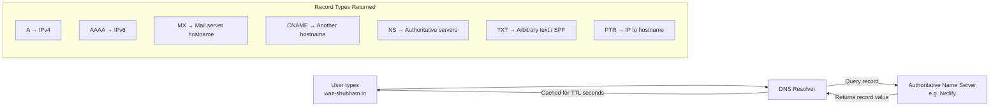
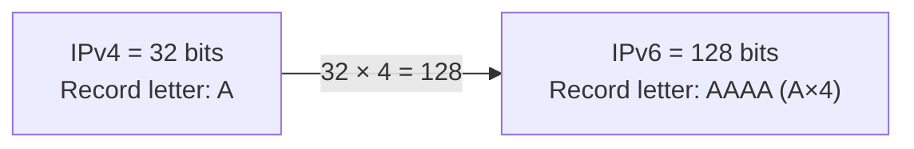
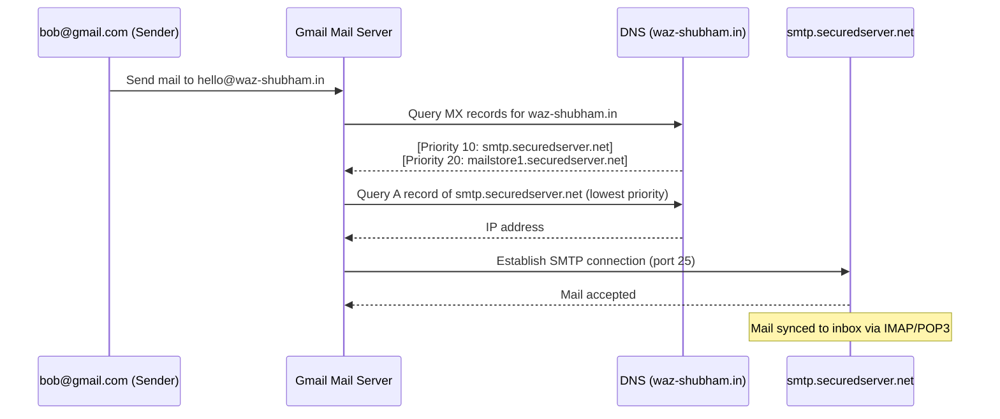
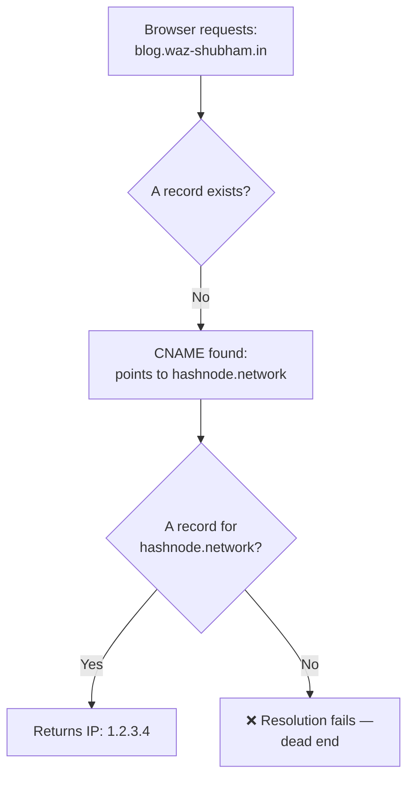
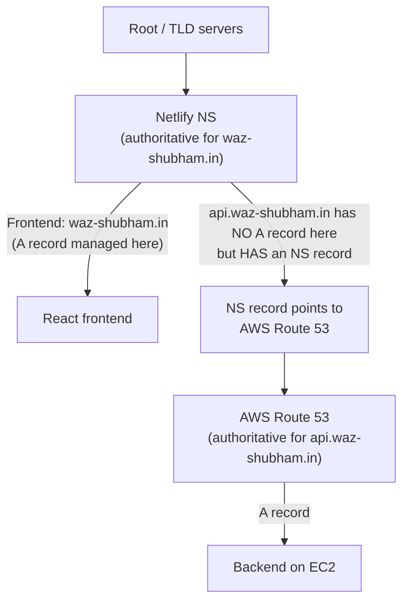
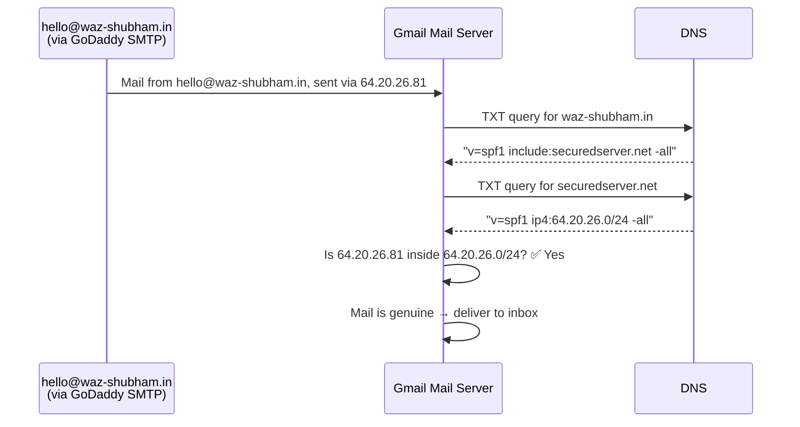
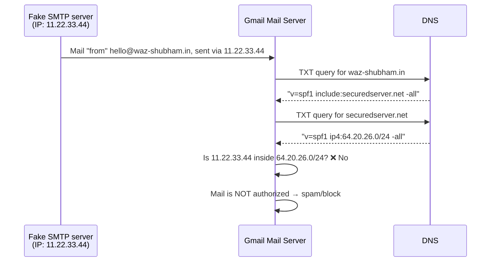
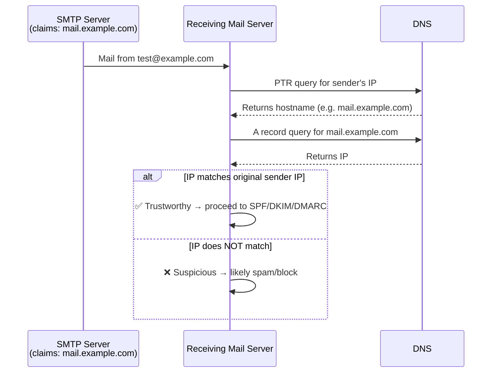

# DNS Records — Complete Revision Notes

> Part of the CampusX Networking series. Covers every major DNS record type: A, AAAA, MX, CNAME, NS, TXT (SPF), and PTR — with mechanics, worked examples, and interview Q&A.

---

## 1. Big Picture — Where Records Fit



---

## 2. A Record (Address Record)

**Purpose:** Maps a hostname → **IPv4 address**.

| Field | Meaning |
|---|---|
| Name | Hostname (apex domain like `waz-shubham.in` OR subdomain like `api.waz-shubham.in`) |
| Type | `A` |
| Value | IPv4 address of the server |
| TTL | How long resolvers may cache this record (in seconds) |

### Key Facts
- A single hostname **can have multiple A records** → used for **load balancing** / **failover**.
- TTL controls caching: e.g. `TTL = 3600` → resolver won't re-query the authoritative server for **1 hour**; it just serves the cached IP.
- **Lower TTL = faster propagation of changes, but more DNS query load.**

### Worked Example
```
Name: qr-api.waz-shubham.in
Type: A
Value: 31.87.14.8
TTL: 3600 (1 hour)
```
Add a second A record with the **same name**, different IP, TTL = 10s:
```
Name: qr-api.waz-shubham.in
Type: A
Value: 31.87.14.9
TTL: 10
```
`nslookup qr-api.waz-shubham.in` → returns **both** IPs (148 and 149).

Delete one record → old result still returned until the TTL of the *previous cached lookup* expires (resolver serves stale cache, not live data). After TTL expiry → resolver re-queries → only the remaining IP is returned.

**Takeaway:** DNS caching is TTL-driven, not real-time. Deleting a record doesn't instantly propagate — clients see old data until their cached TTL lapses.

---

## 3. AAAA Record (Quad-A Record)

**Purpose:** Same as A record, but returns **IPv6** instead of IPv4.

### Why "Quad-A"?

- IPv4 = 32 bits → single **A**.
- IPv6 = 128 bits = 32 × 4 → **AAAA** (literally "quadruple-A").

### Facts
- A hostname can have **multiple AAAA records** too.
- `nslookup -type=AAAA google.com` returns IPv6 addresses; default `nslookup` (no type) returns A (IPv4) records.

---

## 4. MX Record (Mail Exchange)

**Purpose:** Tells the internet **which mail servers** handle email for a domain. Points to a **hostname**, never an IP.

### Structure
| Field | Meaning |
|---|---|
| Priority (Preference) | **Lower number = higher priority** |
| Value | Hostname of the mail/SMTP server (e.g. `smtp.securedserver.net`) |

> MX records never store IPs directly — because the mail provider (e.g. GoDaddy) may change the mail server's IP anytime. Instead they hand out a stable **hostname**, and that hostname's own A record is looked up separately.

### Full Email Delivery Flow



### Key Facts
1. **Lower preference value = higher priority** — sender's server tries the lowest-numbered MX first.
2. **Failover:** if the top-priority server is down, sender falls back to the next-priority MX record.
3. **Load balancing:** multiple MX records can share the **same priority** — sender picks one (often randomly) to spread load.
4. MX records themselves **don't store or handle mail** — they only point to the hostname of the server that does.
5. SMTP (mail transfer between servers) runs on **port 25** by default.
6. Query with: `nslookup -type=mx waz-shubham.in`

### Example DNS Response
```
Priority 10 → smtp.securedserver.net
Priority 20 → mailstore1.securedserver.net
```

---

## 5. CNAME Record (Canonical Name)

**Purpose:** Maps one hostname → **another hostname** (an alias), not directly to an IP.

### Resolution Flow



### Critical Rule
> Whatever hostname a CNAME points to **must itself have an A record** (or another CNAME that eventually resolves to an A record). Otherwise resolution dead-ends and the site fails to load.

### Worked Example
```
blog.waz-shubham.in   CNAME   hashnode.network
hashnode.network       A       1.2.3.4   (managed by Hashnode's DNS)
```
`nslookup blog.waz-shubham.in` (using `-debug`/verbose) shows:
1. First answer: CNAME → hashnode.network
2. Second query: A record of hashnode.network → returns the IP

**Use case:** point a subdomain to a third-party platform (blog engine, CDN, SaaS app) without knowing/managing its IP directly.

---

## 6. NS Record (Name Server Record)

**Purpose:** Declares **which DNS servers are authoritative** for a domain — i.e., the source of truth for all its DNS records.

### Facts
- Without NS records, resolvers would never know where to find a domain's DNS data at all.
- Domains usually have **multiple NS records** for **redundancy and high availability** — if one name server is down, others still answer.

### DNS Delegation (Common Use Case)

A common real-world pattern in bigger teams: different subdomains are managed by different DNS providers.



**Step by step:**
1. Frontend team manages `waz-shubham.in` on Netlify.
2. Backend team manages `api.waz-shubham.in` on AWS Route 53.
3. Netlify's DNS has **no A record** for `api.waz-shubham.in`, but has an **NS record** delegating it to Route 53's name servers.
4. Resolver: asks Netlify (authoritative for `waz-shubham.in`) → gets redirected via NS record → asks Route 53 → gets the actual A record/IP.

This is called **DNS delegation** — very common when different teams/providers manage different parts of the same domain tree.

---

## 7. TXT Record (Text Record)

**Purpose:** Stores arbitrary **text** against a domain entry. Originally just human-readable notes; now heavily used for **verification and security** (SPF, DKIM, DMARC).

### Facts
- A domain can have **many** TXT records — no inherent limit or logical significance to the DNS system itself.
- DNS treats TXT record content as plain text — **meaning is entirely defined by the application reading it** (e.g., mail servers interpreting SPF syntax).
- TXT records **don't affect website routing**; they're informational for applications/services.

---

### 7.1 SPF (Sender Policy Framework) — Deep Dive

**Goal:** Let receiving mail servers verify that an email genuinely came from a server **authorized** by the sender's domain.

#### Legitimate Flow



#### Spoofed / Attack Flow



**Why this works:** the attacker can spin up a fake SMTP server and *claim* to be `hello@waz-shubham.in`, but they **cannot edit the domain owner's DNS/TXT records** — that's controlled only by the actual domain + mail provider. SPF leverages this trust boundary.

**Key insight:** SPF validates the **sending server's IP** against an IP range published (indirectly, via TXT) by the domain owner — not anything in the email content itself.

---

## 8. PTR Record (Pointer Record)

**Purpose:** **Reverse DNS lookup** — maps an **IP address → hostname**. Exact opposite of A/AAAA records.

| Record | Direction |
|---|---|
| A / AAAA | Hostname → IP |
| PTR | IP → Hostname |

### Critical Ownership Rule
> PTR records are configured by the **owner of the IP address block**, NOT the domain owner.

- E.g., if your server's IP is inside AWS's IP range, **AWS** controls the PTR record for that IP — not you, even though you own the domain.
- This is why you **cannot manage PTR records inside your normal domain DNS panel** — you don't own the IP.

### Effect of Missing PTR
- ✅ Website still works fine — PTR absence does **not** break normal DNS resolution/browsing.
- ❌ Can **hurt mail server reputation** — many receiving mail servers use PTR lookups as a trust signal before accepting mail. Missing/mismatched PTR → higher chance of landing in spam or being blocked.

### How Mail Servers Use PTR (Trust Check — Happens BEFORE SPF)



### Spoofing Scenario
An attacker who **owns** an IP block can manipulate the PTR record for their own IP to *claim* it maps to `mail.example.com`. But when the receiving server does the **forward A-record check** on that claimed hostname, the returned IP won't match the attacker's actual sending IP → mismatch detected → flagged as untrustworthy.

**Sequence recap:**
1. Reverse lookup: IP → hostname (PTR).
2. Forward lookup: hostname → IP (A record).
3. Compare: does the forward-resolved IP match the original sender IP?
4. Match → proceed to SPF/DKIM/DMARC checks. Mismatch → treat as suspicious.

---

## 9. Master Comparison Table

| Record | Maps | Typical Value | Who Configures It | Multiple Allowed? |
|---|---|---|---|---|
| **A** | Hostname → IPv4 | IP address | Domain/DNS owner | ✅ Yes (load balancing/failover) |
| **AAAA** | Hostname → IPv6 | IP address | Domain/DNS owner | ✅ Yes |
| **MX** | Domain → Mail server hostname | Hostname + priority | Domain owner (values given by mail provider) | ✅ Yes (priority/failover/load balance) |
| **CNAME** | Hostname → Another hostname | Hostname (alias) | Domain owner | One per hostname (target must resolve via A) |
| **NS** | Domain → Authoritative name servers | Name server hostnames | Domain owner / registrar | ✅ Yes (redundancy, delegation) |
| **TXT** | Domain → Arbitrary text | Free text (e.g. SPF string) | Domain owner | ✅ Yes, unlimited |
| **PTR** | IP → Hostname | Hostname | **IP address owner** (e.g. AWS), not domain owner | Usually one per IP |

---

## 10. Interview Q&A

**Q1. What's the difference between an A record and a CNAME record?**
A: An A record maps a hostname directly to an IPv4 address. A CNAME maps a hostname to *another hostname* (an alias), which must itself eventually resolve via an A record.

**Q2. Why can't MX records store IP addresses directly?**
A: Because the mail provider (e.g., GoDaddy) may change its mail servers' IPs at any time; using a stable hostname avoids requiring every customer to update DNS whenever the underlying IP changes.

**Q3. In MX records, does a lower or higher priority number win?**
A: **Lower** preference/priority value = higher priority. The sending server tries the lowest-numbered MX record first, falling back to higher numbers if that server is unavailable.

**Q4. What happens if a CNAME points to a hostname that has no A record?**
A: DNS resolution dead-ends — the browser/resolver can't get an IP, so the request fails. Any hostname a CNAME points to must eventually resolve to an A record.

**Q5. What is DNS delegation, and which record type enables it?**
A: DNS delegation is when authority over part of a domain's DNS (e.g. a subdomain) is handed off to a different DNS provider. It's enabled by **NS records** — the primary DNS returns NS records pointing the resolver to the delegated provider's authoritative servers.

**Q6. Who is responsible for configuring a PTR record — the domain owner or someone else?**
A: The **owner of the IP address block** (e.g. AWS, the hosting provider) configures PTR records — not the domain owner, since PTR maps IP → hostname and only the IP owner controls that IP's reverse zone.

**Q7. Does a missing PTR record break a website?**
A: No — normal web browsing/DNS resolution is unaffected. However, it can hurt **email deliverability/reputation**, since many receiving mail servers use PTR lookups as a trust signal.

**Q8. Explain how SPF prevents email spoofing.**
A: The receiving mail server looks up a TXT (SPF) record for the sender's domain, which lists authorized sending IP ranges. It compares the actual sending server's IP against that range. If the IP isn't in the authorized range, the mail is flagged as likely spoofed/spam — because attackers can't edit the real domain owner's DNS records.

**Q9. What does TTL control, and what happens right after a record is deleted but before TTL expiry?**
A: TTL controls how long a resolver may cache a DNS record before re-querying the authoritative server. If a record is deleted, resolvers that already cached it will continue to serve the old (cached) value until that TTL expires — deletion isn't instantly visible everywhere.

**Q10. Why is AAAA called "quad-A"?**
A: IPv4 addresses are 32 bits (represented by a single "A" record). IPv6 addresses are 128 bits — exactly 4× the size (32 × 4 = 128) — so the record type is named "AAAA," i.e., four A's.

**Q11. What's the two-step DNS process a receiving mail server performs to validate PTR trust?**
A: (1) Reverse lookup: query PTR for the sender's IP to get a claimed hostname. (2) Forward lookup: query the A record of that hostname to get an IP. If the forward-resolved IP matches the original sending IP, the sender is trusted; if not, it's flagged as suspicious — before SPF/DKIM/DMARC checks even run.

**Q12. Can a single hostname have multiple A records, and why would you want that?**
A: Yes. This is commonly used for **load balancing** (traffic spread across multiple servers) or **failover** (if one server/IP is down, others can still serve the domain).

---

## 11. Revision Checklist

- [ ] Can explain A vs AAAA (IPv4 vs IPv6, 32-bit vs 128-bit, why "quad-A")
- [ ] Can trace the full MX record email delivery flow end-to-end (MX lookup → A lookup of mail host → SMTP connect on port 25)
- [ ] Understand MX priority rule: lower number = higher priority; same priority = load balancing
- [ ] Can explain CNAME chaining and the "must resolve to an A record" rule
- [ ] Can explain NS records and walk through a DNS delegation example (Netlify frontend + Route 53 backend)
- [ ] Understand TXT records are generic text, with SPF/DKIM/DMARC as security use cases layered on top
- [ ] Can explain SPF validation flow and how it defeats a naive spoofing attempt
- [ ] Understand PTR = reverse DNS (IP → hostname), and that **IP owner**, not domain owner, configures it
- [ ] Can explain the PTR-based mail trust check (reverse lookup + forward lookup + IP match) and where it sits relative to SPF/DKIM/DMARC
- [ ] Understand TTL's role in caching and why record changes/deletions aren't instantly visible everywhere
- [ ] Comfortable running and interpreting: `nslookup`, `nslookup -type=AAAA`, `nslookup -type=MX`, `nslookup -debug` (for CNAME chains)

---

### Related videos referenced
- Previous video in series: *"What is DNS / How DNS Query Flow Works"* (root servers → TLD → authoritative name servers)
- Previous video: *IPv4 structure / 32-bit addressing, CIDR notation*
