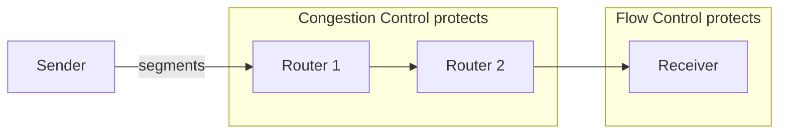
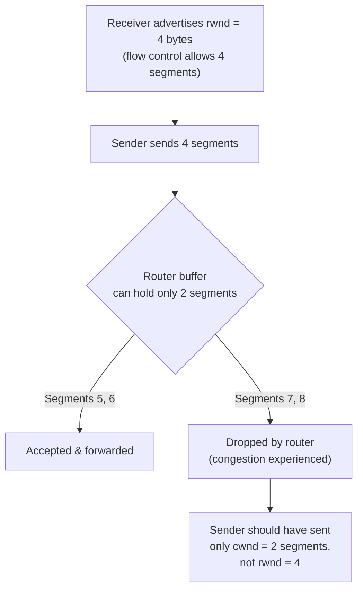
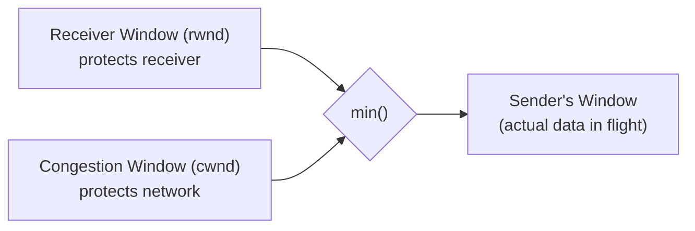
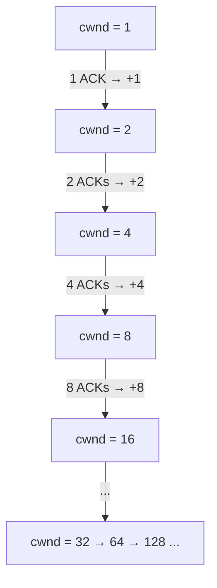
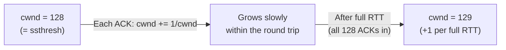
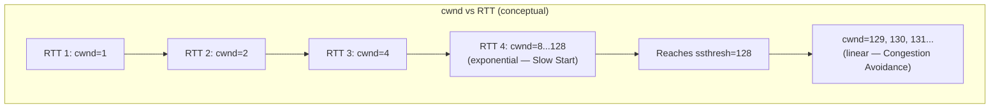
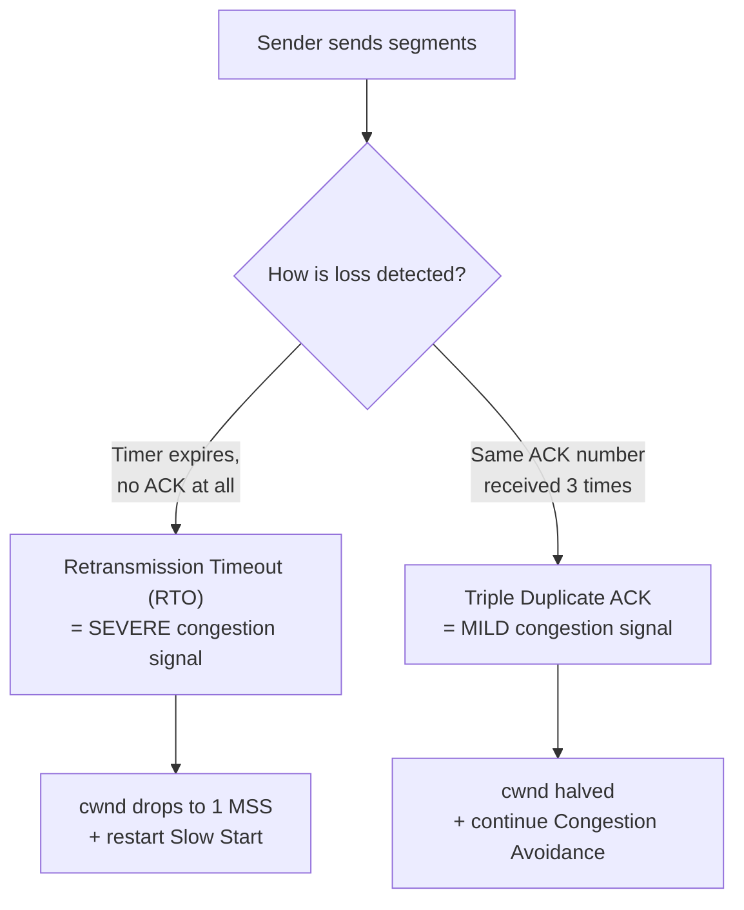
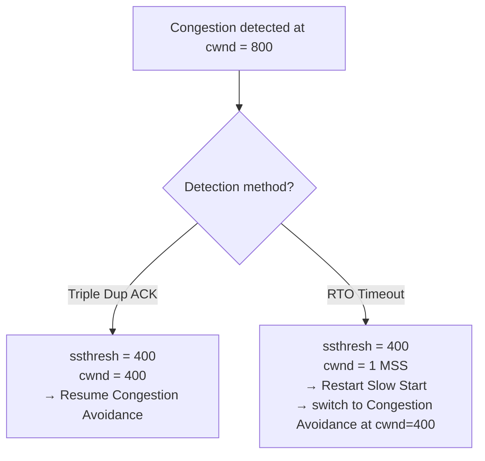
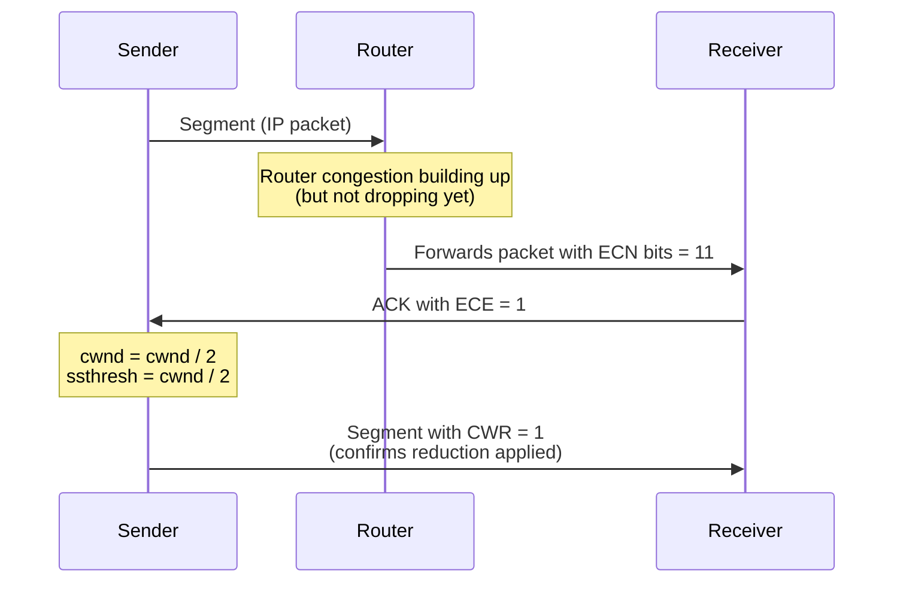
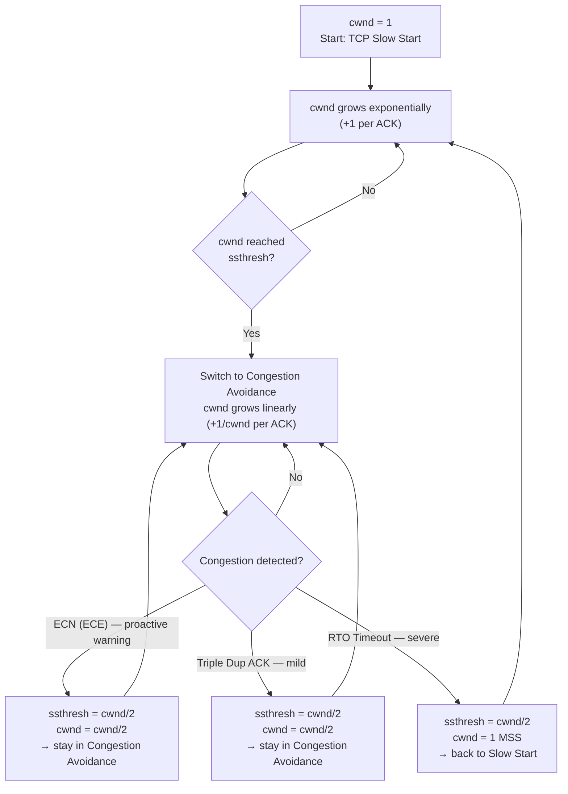

# TCP Congestion Control

> **Session context:** Part of the CampusX Networking Fundamentals revision series. Follows directly after **TCP Flow Control** (sliding window, receiver window / `rwnd`). This note assumes familiarity with the 3-way handshake, TCP segment anatomy, sequence/ack numbers, and MSS/MTU/PMTUD.

---

## Table of Contents
1. [Congestion Control vs Flow Control](#1-congestion-control-vs-flow-control)
2. [Why Congestion Control Exists](#2-why-congestion-control-exists)
3. [Setup & Assumptions Used in Examples](#3-setup--assumptions-used-in-examples)
4. [The Congestion Window (cwnd)](#4-the-congestion-window-cwnd)
5. [Sender's Window = min(rwnd, cwnd)](#5-senders-window--minrwnd-cwnd)
6. [Algorithm 1: TCP Slow Start](#6-algorithm-1-tcp-slow-start)
7. [Slow Start Threshold (ssthresh)](#7-slow-start-threshold-ssthresh)
8. [Algorithm 2: Congestion Avoidance](#8-algorithm-2-congestion-avoidance)
9. [Slow Start vs Congestion Avoidance — Growth Comparison](#9-slow-start-vs-congestion-avoidance--growth-comparison)
10. [How TCP Detects Congestion](#10-how-tcp-detects-congestion)
11. [Reaction to Congestion: Duplicate ACKs vs Timeout](#11-reaction-to-congestion-duplicate-acks-vs-timeout)
12. [Explicit Congestion Notification (ECN)](#12-explicit-congestion-notification-ecn)
13. [Full Lifecycle Diagram](#13-full-lifecycle-diagram)
14. [Terminology Reference](#14-terminology-reference)
15. [Interview Q&A](#15-interview-qa)
16. [Quick Revision Checklist](#16-quick-revision-checklist)

---

## 1. Congestion Control vs Flow Control

These two are the most confused concepts in TCP. They solve **different problems** for **different parties**.

| Aspect | Flow Control | Congestion Control |
|---|---|---|
| Protects | The **receiver** | The **network** (routers/devices in between) |
| Problem prevented | Sender overwhelming the receiver's buffer | Sender overwhelming routers/links in the path |
| Signal source | Receiver explicitly advertises `rwnd` | Sender must **infer/detect** it — nobody tells it directly |
| Controlled via | Receiver Window (`rwnd`) | Congestion Window (`cwnd`) |
| Who is responsible | Both sender (obeys) and receiver (advertises) | Entirely the **sender** |



**Core idea:** Flow control = "don't flood the receiver." Congestion control = "don't flood the network path (routers) between sender and receiver."

---

## 2. Why Congestion Control Exists

Between a sender and receiver there can be hundreds of routers. Each router has **limited memory** to buffer incoming IP packets before forwarding them. If a sender pushes data faster than a router can process/forward it, that router's buffer fills up and it starts **dropping packets** — this is congestion.

- The receiver may be perfectly capable of handling 1000 bytes at once (large `rwnd`).
- But a router in the middle may only be able to handle 2 bytes/sec.
- If the sender only looks at `rwnd`, it will overload the router even though the receiver is fine.

So the sender's transmission rate must respect **both**: what the receiver can handle AND what the network path can handle.

---

## 3. Setup & Assumptions Used in Examples

To keep the math simple, all examples in this note use:

- **1 segment = 1 MSS = 1 byte** (in reality MSS is usually ~1460 bytes — see the MTU/MSS/PMTUD note for why).
- **RTT (Round Trip Time) = 1 second.**
- Receiver sends a **separate ACK per segment** (not cumulative ACK), since segments can arrive out of order over independent network paths.

---

## 4. The Congestion Window (cwnd)

`cwnd` is the sender-side variable representing **how much data the network path can currently handle**.

Unlike `rwnd` (which the receiver explicitly advertises during the handshake and in every ACK), **no one tells the sender what `cwnd` should be**. With potentially hundreds of routers in the path, the sender cannot query every router's buffer/free space. So TCP **detects** it via trial and error using two algorithms:

1. **TCP Slow Start**
2. **TCP Congestion Avoidance**

### Worked Example — Router Overload



Router capacity here = 2 bytes/sec, but sender sent 4 (based on `rwnd` alone) → router drops segments 7 and 8. This shows why `cwnd` must also be factored in.

---

## 5. Sender's Window = min(rwnd, cwnd)

This is **the** central formula of TCP congestion + flow control combined:

```
sender_window = min(receiver_window, congestion_window)
```

- `rwnd` protects the **receiver**.
- `cwnd` protects the **network**.
- The sender is the single point of control for both — it must never send more than either can handle.

**Why `min` and never allow cwnd to exceed rwnd is irrelevant — it's always the smaller of the two that governs:**
If `cwnd` grows larger than `rwnd` (e.g., cwnd = 1001, rwnd = 1000), the sender window is still capped at `rwnd = 1000`. Prioritizing `cwnd` here would overwhelm the receiver even though the network could handle it — defeating flow control.



---

## 6. Algorithm 1: TCP Slow Start

Despite the name, slow start is **aggressive** — it grows `cwnd` **exponentially**, doubling roughly every RTT.

**Rule:** `cwnd = cwnd + 1` for **every ACK received** (not per RTT).

### Step-by-step trace (assumptions from Section 3)

| Round | cwnd at start | Segments sent | ACKs received | cwnd update | New cwnd |
|---|---|---|---|---|---|
| 1 | 1 | 1 | 1 | +1 | 2 |
| 2 | 2 | 2 | 2 | +2 | 4 |
| 3 | 4 | 4 | 4 | +4 | 8 |
| 4 | 8 | 8 | 8 | +8 | 16 |
| 5 | 16 | 16 | 16 | +16 | 32 |
| 6 | 32 | 32 | 32 | +32 | 64 |
| 7 | 64 | 64 | 64 | +64 | 128 |

Since each ACK adds +1 to `cwnd`, and the number of ACKs per round equals the current `cwnd`, the window **effectively doubles every RTT** — this is exponential growth.



Slow start continues until `cwnd` reaches **ssthresh** — at that point TCP switches algorithms.

---

## 7. Slow Start Threshold (ssthresh)

`ssthresh` is a variable (in bytes/MSS) known to the sender's TCP stack that marks **where to stop the aggressive exponential growth** of slow start and switch to the more conservative congestion avoidance algorithm.

```
if cwnd < ssthresh:  use TCP Slow Start
if cwnd >= ssthresh: use TCP Congestion Avoidance
```

Example: if `ssthresh = 128` bytes, slow start runs until `cwnd` hits 128, then TCP switches to congestion avoidance.

---

## 8. Algorithm 2: Congestion Avoidance

Once `cwnd` reaches `ssthresh`, aggressive growth would risk congesting the network. Congestion avoidance grows `cwnd` **linearly** instead of exponentially.

**Rule (applied on every ACK):**

```
cwnd = cwnd + (1 / cwnd)
```

### Worked Example (cwnd starts at 128, ssthresh = 128)

| ACK # | cwnd calculation | New cwnd |
|---|---|---|
| 1st | 128 + 1/128 | 128.0078 |
| 2nd | 128.0078 + 1/128 | 128.015 |
| 32nd | — | 128.25 |
| 64th | — | 128.5 |
| 128th (full round trip) | 128 + 1 | **129** |

Compare this to slow start: under slow start, `cwnd` would have jumped from 128 → **129 on the very first ACK**, and to **256** after the same 128 ACKs (128 + 128, since it's +1 per ACK × 128 ACKs). Congestion avoidance instead needs a **full round trip** (all 128 segments ACKed) just to increase `cwnd` by 1.



**Why be conservative here?** TCP has already grown aggressively via slow start. Continuing to double could congest the network. Congestion avoidance grows `cwnd` cautiously so TCP can detect the network's true ceiling without causing repeated packet loss.

---

## 9. Slow Start vs Congestion Avoidance — Growth Comparison

| Aspect | TCP Slow Start | TCP Congestion Avoidance |
|---|---|---|
| Growth pattern | Exponential (doubles ~every RTT) | Linear (+1 per full RTT) |
| Formula per ACK | `cwnd = cwnd + 1` | `cwnd = cwnd + (1/cwnd)` |
| Speed | Fast / aggressive | Slow / conservative |
| Used when | `cwnd < ssthresh` | `cwnd >= ssthresh` |
| Purpose | Quickly discover rough network capacity | Carefully approach the actual ceiling without overshooting |



---

## 10. How TCP Detects Congestion

TCP has no direct signal from routers (traditionally) — it infers congestion using these methods:

### a) Retransmission Timeout (RTO)
- Sender starts a timer when a segment is sent.
- If the timer expires before an ACK arrives, TCP assumes the segment was lost due to congestion.
- Treated as a **strong / serious indication of congestion**.

### b) Triple Duplicate ACKs
- Sender sends segments 1, 2, 3. Segment 2 is lost; 1 and 3 arrive.
- Receiver keeps sending `ACK 2` (asking for the missing segment) repeatedly.
- Sender receiving the **same ACK 3 times** concludes segment 2 was lost — but treated as a **milder / less serious** signal than a timeout.



---

## 11. Reaction to Congestion: Duplicate ACKs vs Timeout

TCP reacts **differently** depending on which signal triggered the detection — this is a key exam/interview point.

### Case A — Triple Duplicate ACK (mild signal)

Example: congestion detected when `cwnd = 800` bytes.

```
new ssthresh = current cwnd / 2  = 800 / 2 = 400
new cwnd     = current cwnd / 2  = 800 / 2 = 400
```

TCP does **not** restart Slow Start — it directly resumes **Congestion Avoidance** starting at `cwnd = 400`, since this isn't considered a severe problem (only one segment lost).

### Case B — Retransmission Timeout (severe signal)

Same scenario: congestion detected at `cwnd = 800`.

```
new ssthresh = current cwnd / 2  = 800 / 2 = 400
new cwnd     = 1 MSS   (dropped all the way down!)
```

TCP restarts from **Slow Start**, using exponential growth again until it reaches the new `ssthresh = 400`, and only then switches to Congestion Avoidance.

### Side-by-side comparison

| Trigger | Severity | New ssthresh | New cwnd | Algorithm after |
|---|---|---|---|---|
| Triple Duplicate ACK | Mild | `cwnd / 2` | `cwnd / 2` | Congestion Avoidance (resume directly) |
| Retransmission Timeout (RTO) | Severe | `cwnd / 2` | `1 MSS` | Slow Start (restart from scratch) → switches to Congestion Avoidance once `cwnd` reaches new `ssthresh` |



**Intuition:** a lost segment with duplicate ACKs still means most of the data got through fine — the network isn't in serious trouble. A timeout with zero ACKs suggests a much bigger problem, so TCP resets almost completely and rebuilds trust in the network from the ground up.

---

## 12. Explicit Congestion Notification (ECN)

Everything above detects congestion **after** a packet is already lost. ECN lets TCP detect congestion **before** it actually happens — a proactive/preventive mechanism.

### How it works

1. **ECN bits in the IP header** (2 bits): a router experiencing congestion, but not yet dropping packets, marks these bits as `11` on packets it forwards — meaning *"I forwarded this, but I'm experiencing congestion; if this continues, I may start dropping."*
2. **ECE flag in the TCP segment** (Explicit Congestion Echo): when the receiver sees the ECN-marked IP packet, it echoes this back to the sender by setting `ECE = 1` in its ACK segment.
3. **CWR flag in the TCP segment** (Congestion Window Reduced): once the sender reduces its `cwnd` in response to ECE, it informs the receiver by sending a segment with `CWR = 1`, confirming the reduction has been applied.



### Reaction to ECE (same formula as duplicate ACK — mild reaction)

```
new ssthresh = current cwnd / 2
new cwnd     = current cwnd / 2
```

Example: `cwnd = 400` → ECE received → `ssthresh = 200`, `cwnd = 200`, continue with Congestion Avoidance.

### Why ECN matters

| Without ECN | With ECN |
|---|---|
| TCP finds out about congestion only after a packet is actually dropped | TCP is warned in advance and proactively shrinks `cwnd` |
| Causes real data loss & retransmission | No data loss — smoother throughput |
| Reactive | Preventive |

**Fields involved:**
- `ECN` bits — in the **IP header** (router → informs both ends indirectly).
- `ECE` (ECN-Echo) — in the **TCP header** (receiver → sender).
- `CWR` (Congestion Window Reduced) — in the **TCP header** (sender → receiver, acknowledging the reduction).

---

## 13. Full Lifecycle Diagram



---

## 14. Terminology Reference

| Term | Meaning |
|---|---|
| **cwnd** | Congestion Window — sender-estimated capacity of the network path |
| **rwnd** | Receiver Window — receiver-advertised buffer capacity (flow control) |
| **ssthresh** | Slow Start Threshold — cwnd value at which TCP switches from Slow Start to Congestion Avoidance |
| **MSS** | Maximum Segment Size — the data unit `cwnd`/`rwnd` are measured in |
| **RTO** | Retransmission Timeout — timer expiry with no ACK; strong congestion signal |
| **Triple Duplicate ACK** | Same ACK number received 3 times; mild congestion signal |
| **ECN** | Explicit Congestion Notification — 2-bit field in IP header set by routers |
| **ECE** | ECN-Echo flag — TCP flag receiver sets to tell sender about a router's ECN mark |
| **CWR** | Congestion Window Reduced — TCP flag sender sets to confirm cwnd was reduced |

---

## 15. Interview Q&A

**Q1. What is the core difference between flow control and congestion control in TCP?**
Flow control prevents the sender from overwhelming the *receiver* using the receiver-advertised window (`rwnd`). Congestion control prevents the sender from overwhelming the *network* (routers in between) using the congestion window (`cwnd`), which the sender must detect on its own.

**Q2. Why can't the sender simply ask routers for their buffer capacity?**
A packet may travel through hundreds of routers, and asking each one for its free buffer space is impractical. So TCP instead uses trial-and-error algorithms (Slow Start, Congestion Avoidance) to estimate network capacity indirectly.

**Q3. How is the sender's actual window size determined?**
`sender_window = min(rwnd, cwnd)`. Even if the network can handle more, the sender is still capped by the receiver's capacity, and vice versa.

**Q4. Why is TCP Slow Start called "slow" if it grows exponentially?**
It starts from a small value (`cwnd = 1`) — that's the "slow" part — but its growth rate is exponential (roughly doubling every RTT) via `cwnd += 1` per ACK, making it aggressive after the initial phase.

**Q5. What triggers the switch from Slow Start to Congestion Avoidance?**
When `cwnd` reaches `ssthresh` (slow start threshold), TCP switches from exponential growth (Slow Start) to linear growth (Congestion Avoidance).

**Q6. What's the formula for cwnd growth in Congestion Avoidance, and why is it different from Slow Start?**
`cwnd = cwnd + (1/cwnd)` per ACK, which effectively increases `cwnd` by only 1 per full round trip. This is far more conservative than Slow Start's `cwnd += 1` per ACK, because by this point TCP is close to the network's real capacity and needs to probe cautiously.

**Q7. What are the two main ways TCP detects congestion after data loss, and how do their severities differ?**
(1) Retransmission Timeout (RTO) — no ACK before the timer expires; treated as a **severe** signal. (2) Triple Duplicate ACK — same ACK received three times; treated as a **milder** signal since most segments are still getting through.

**Q8. How does TCP's reaction differ between an RTO and a Triple Duplicate ACK?**
Both set `ssthresh = cwnd/2`. But RTO also drops `cwnd` all the way to 1 MSS and restarts Slow Start, while Triple Duplicate ACK only halves `cwnd` (`cwnd = cwnd/2`) and continues directly with Congestion Avoidance — no restart needed.

**Q9. What is ECN and how does it differ from the other two detection methods?**
ECN (Explicit Congestion Notification) is a **proactive** mechanism: routers mark the ECN bits in the IP header *before* dropping any packets, warning the sender in advance. RTO and Triple Duplicate ACK are both **reactive** — they only detect congestion after a packet has already been lost.

**Q10. What are the roles of the ECE and CWR flags?**
`ECE` (ECN-Echo) is set by the receiver in its ACK to tell the sender that a router along the path is experiencing congestion (based on the ECN-marked IP packet it received). `CWR` (Congestion Window Reduced) is set by the sender in a subsequent segment to confirm to the receiver that it has reduced its `cwnd` in response.

**Q11. Can cwnd ever be allowed to exceed rwnd in the sender's actual window?**
No. Even if `cwnd` grows past `rwnd`, the sender's window is always `min(rwnd, cwnd)` — because if the sender prioritized the (larger) `cwnd`, it would overwhelm the receiver, defeating the purpose of flow control.

**Q12. Why does TCP reduce cwnd by half (multiplicative decrease) but only increase it linearly during congestion avoidance (additive increase)?**
This is TCP's classic **AIMD** (Additive Increase, Multiplicative Decrease) behavior: grow cautiously and slowly when things are fine, but back off aggressively and immediately the moment congestion is detected — this keeps the network stable and avoids repeated congestion collapse.

---

## 16. Quick Revision Checklist

- [ ] Flow control protects the **receiver**; congestion control protects the **network** (routers).
- [ ] `sender_window = min(rwnd, cwnd)` — always the smaller value wins.
- [ ] `rwnd` is explicitly told by the receiver; `cwnd` must be **detected** by the sender.
- [ ] **Slow Start**: exponential growth, `cwnd += 1` per ACK, runs while `cwnd < ssthresh`.
- [ ] **Congestion Avoidance**: linear growth, `cwnd += 1/cwnd` per ACK, runs while `cwnd >= ssthresh`, effectively +1 per full RTT.
- [ ] **RTO (timeout)** = severe congestion signal → `ssthresh = cwnd/2`, `cwnd = 1 MSS`, restart Slow Start.
- [ ] **Triple Duplicate ACK** = mild congestion signal → `ssthresh = cwnd/2`, `cwnd = cwnd/2`, stay in Congestion Avoidance.
- [ ] **ECN** = proactive detection using IP header ECN bits + TCP `ECE`/`CWR` flags, reacts same as duplicate ACK (halve `cwnd` and `ssthresh`) — but *before* any packet loss occurs.
- [ ] This overall growth/backoff pattern is TCP's **AIMD** (Additive Increase, Multiplicative Decrease) strategy.
- [ ] `ssthresh` is the pivot point that tells TCP when to switch algorithms in both directions (growing up and resetting down).
