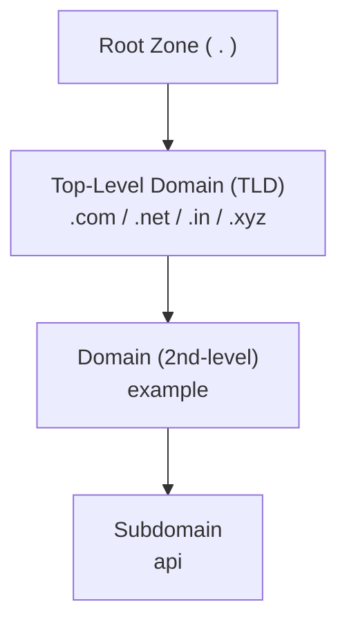
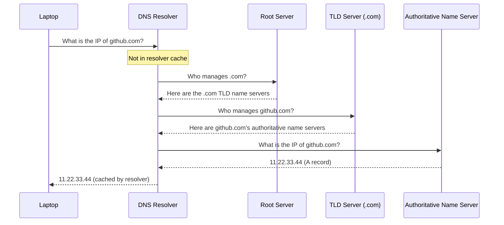
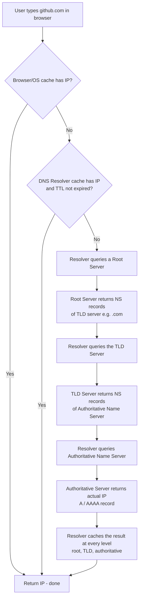

# DNS (Domain Name System) — Revision Notes

## 1. Overview

**DNS (Domain Name System)** is the protocol that maps **human-readable domain names** to **machine-readable IP addresses**.

### Why DNS is needed
- Humans can remember domain names (`google.com`, `github.com`) but **not** thousands of IP addresses.
- Even if you memorized IPs, they can **change over time**.
- Computers only understand IP addresses — a domain name is just a string to them.
- DNS acts as the **linkage/mapping layer** between domain names and IP addresses.

### Problems DNS solves

| Problem | How DNS Solves It |
|---|---|
| IP can change while the domain stays the same | Just update the **A record** — all users automatically get the new IP without being individually notified |
| Directing users to the nearest server / CDN | DNS resolver can return the IP of the **geographically nearest** server (e.g., Mumbai user → Mumbai server), reducing latency |
| Load balancing | DNS can point different users to different servers based on criteria (not as fine-grained as tools like Nginx, but still a valid mechanism) |

### Key protocol facts

| Property | Value |
|---|---|
| Transport protocol | **UDP** (built on top of UDP) |
| Port | **53** (standard for all DNS servers/resolvers, e.g., Google `8.8.8.8`, Cloudflare `1.1.1.1`) |

---

## 2. URL / Domain Structure (Hierarchy)

A URL like `api.example.com` actually has a **hidden trailing dot** representing the **Root Zone**:

```
api.example.com.
```

### Hierarchy (top → bottom)



| Part | Example | Meaning |
|---|---|---|
| Root Zone | `.` (hidden, after the TLD) | Starting point of every DNS query |
| TLD (Top-Level Domain) | `.com`, `.in`, `.net`, `.xyz` | Managed by big organizations |
| Domain (2nd-level) | `example` in `example.com` | Your "identity" |
| Subdomain | `api` in `api.example.com` | Optional, further nested under domain |

> Every top-level domain has its own set of domains, and every domain has its own subdomains — it's a **nested hierarchy**, and the DNS server infrastructure mirrors this hierarchy (Root → TLD → Authoritative).

---

## 3. Caching Layers (Checked in Order)

Before any network-wide DNS resolution happens, multiple **local caches** are checked first:


1. **Browser cache** — browsers maintain their own domain→IP cache.
2. **OS cache** — the operating system also caches resolved IPs.
3. **DNS Resolver cache** — if not found locally, the query goes to the configured DNS resolver (often your router, or public resolvers like `8.8.8.8` / `1.1.1.1`), which has its own cache.
4. Only if **all caches miss** does the resolver perform full resolution via Root → TLD → Authoritative servers.

### TTL (Time To Live)
- Every cached DNS record has a **TTL** (in seconds) that determines how long it's considered valid.
- While TTL is **not expired** → cached IP is returned directly, no further steps needed.
- Once TTL **expires** → the record must be re-fetched by repeating the full resolution process.
- TTL value is configured as part of DNS records (A, AAAA, CNAME, MX, TXT, etc.).

---

## 4. The Three Server Types in DNS Resolution

DNS uses a **hierarchy of servers** instead of one giant global database — because billions of domains exist and centralizing them would be massively unoptimized given millions of queries per second.



### a) Root Server
- Represented by the hidden **`.`** (root zone) at the end of every domain.
- There are **13 root servers** globally, managed by large organizations (NASA, US Army, ICANN, etc.), listed at `iana.org/domains/root/servers`.
- **Only job:** knows which servers manage each **TLD** (`.com`, `.in`, `.dev`, etc.) — does NOT know about individual domains like `github.com`.
- DNS resolvers come **pre-configured** with a "root hints file" containing the names/IPs of root servers, so resolution can bootstrap.

### b) TLD (Top-Level Domain) Server
- Different TLDs (`.com`, `.in`, `.dev`, `.xyz`) are managed by **different TLD servers**.
- **Only job:** knows the **Authoritative Name Servers** for domains under that TLD (e.g., knows GitHub's authoritative name servers for `.com`).
- Does NOT store actual DNS records (A, MX, TXT, etc.) — only stores **NS (name server) records**.

### c) Authoritative Name Server
- This is where the **actual DNS records** live (A, AAAA, CNAME, MX, TXT, etc.).
- Managed by whoever manages your domain's DNS (e.g., GoDaddy, Netlify, Cloudflare).
- **Only server that can return the real IP address** for a domain via its A record.

### Summary Table

| Server Type | Knows About | Returns |
|---|---|---|
| Root Server | Which server manages each TLD | NS records of the TLD server |
| TLD Server | Which server is authoritative for a specific domain | NS records of the Authoritative Name Server |
| Authoritative Name Server | The actual DNS records of the domain | The real IP (A/AAAA record) |

---

## 5. Full DNS Resolution Flow (Step-by-Step)



**Key point:** The resolver caches results at **every level** it queried (root's answer, TLD's answer, authoritative's answer) — not just the final IP — to speed up future lookups.

---

## 6. DNS Record Types (mentioned, to be covered in detail later)

| Record | Purpose |
|---|---|
| A | Maps domain → IPv4 address |
| AAAA (Quad-A) | Maps domain → IPv6 address |
| CNAME | Maps domain → another domain (alias) |
| MX | Mail server records |
| TXT | Text records (verification, SPF, etc.) |
| NS | Name server records (used by Root/TLD servers to point to next server) |

---

## 7. Hands-on: `nslookup` Demonstration

Simulating the resolver's manual steps using `nslookup`:

```bash
# Step 1: Ask a Root Server for the NS records of the TLD (.com)
nslookup
> server <root-server-ip>
> set type=NS
> com

# Step 2: Use one of the returned TLD name servers to ask for
# github.com's Authoritative Name Servers
> server <tld-nameserver>
> github.com

# Step 3: Use an Authoritative Name Server to get the actual IP
> server <authoritative-nameserver>
> set type=A
> github.com
```

Directly resolving via a public resolver:
```bash
nslookup github.com 8.8.8.8
```
- Response shows **"non-authoritative answer"** — because `8.8.8.8` is a **resolver**, not the authoritative source.
- Querying the actual authoritative name server directly gives the answer **without** the "non-authoritative" tag, since it's the original source of truth.

> This same process was validated for a `.in` domain (e.g. `wazeshubam.in`) — Root returned `.in` TLD NS records → TLD returned the domain's Authoritative Name Servers (hosted on Netlify) → Authoritative server returned the final IP.

---

## 8. Interview Q&A

**Q1. What problem does DNS fundamentally solve?**
> Translates human-friendly domain names into machine-usable IP addresses, since computers can't interpret domain names and humans can't memorize IPs at scale.

**Q2. Why not just hardcode IPs everywhere instead of using DNS?**
> IPs can change (server migration, scaling, failover). With DNS, only the DNS record (e.g., A record) needs updating — every user automatically gets the new IP on their next resolution, instead of having to be individually informed.

**Q3. What transport protocol does DNS use, and on what port?**
> UDP, on port 53 (a few scenarios like zone transfers use TCP, but standard queries are UDP).

**Q4. Explain the role of Root, TLD, and Authoritative Name Servers.**
> Root servers know which server manages a given TLD. TLD servers know the authoritative name servers for domains under that TLD. Authoritative name servers hold the actual DNS records (A, MX, TXT, etc.) and return the real IP.

**Q5. What is the difference between a "recursive resolver" and an "authoritative name server"?**
> The recursive resolver does all the legwork of querying Root → TLD → Authoritative on the client's behalf and caches results. The authoritative name server is the actual source of truth for a domain's records and gives "authoritative" (non-cached, original) answers.

**Q6. What does "non-authoritative answer" mean in `nslookup` output?**
> It means the answer came from a resolver's cache/relay (e.g., `8.8.8.8`), not directly from the domain's authoritative name server.

**Q7. What is TTL in DNS and why does it matter?**
> Time-To-Live — the duration (in seconds) a cached DNS record is considered valid. Once expired, the resolver must re-query the full chain to get a fresh record. It balances freshness of data vs. reducing load on DNS infrastructure.

**Q8. How does DNS help with latency / performance (e.g., GeoDNS)?**
> A resolver can return the IP of the server geographically nearest to the user's resolver location (e.g., Mumbai user gets Mumbai server IP instead of a New York server), significantly reducing round-trip latency.

**Q9. Can DNS be used for load balancing?**
> Yes, to some extent — by returning different IPs (of different servers) based on criteria like location. It's not as fine-grained as dedicated load balancers (e.g., Nginx), but it is a valid load-distribution mechanism.

**Q10. Where is the caching checked first — browser, OS, or resolver?**
> Order: Browser cache → OS cache → DNS Resolver cache → full resolution (Root → TLD → Authoritative) only if all caches miss.

**Q11. What's the significance of the trailing dot in a domain name (e.g., `example.com.`)?**
> It represents the Root Zone — the starting point of the DNS hierarchy. Browsers hide it, but conceptually every domain query starts from root.

**Q12. Why don't Root servers directly store records for every domain like `github.com`?**
> Scale — billions of domains exist and millions of queries happen per second. A single centralized database would be a massive bottleneck. The hierarchical design (Root → TLD → Authoritative) distributes load across many specialized, delegated servers.

---

## 9. Revision Checklist

- [ ] Can explain why DNS exists (human memory vs IP, IP mutability)
- [ ] Can draw the domain hierarchy: Root → TLD → Domain → Subdomain
- [ ] Can explain caching order: Browser → OS → Resolver → Full Resolution
- [ ] Understand TTL and when a cached record is considered expired
- [ ] Can explain the distinct roles of Root Server, TLD Server, Authoritative Name Server
- [ ] Can trace a full DNS resolution flow step-by-step (sequence diagram)
- [ ] Know DNS runs on UDP, port 53
- [ ] Understand GeoDNS / nearest-server routing and DNS-based load balancing
- [ ] Know the difference between "authoritative" and "non-authoritative" answers
- [ ] Familiar with `nslookup` usage to manually trace Root → TLD → Authoritative
- [ ] Aware of record types to study next: A, AAAA, CNAME, MX, TXT, NS

---

## 10. Topics Flagged for Future Deep-Dive (from source material)
- Detailed breakdown of DNS record types: A, AAAA (Quad-A), CNAME, MX, TXT
- TTL configuration in real DNS management platforms (GoDaddy, Netlify)
- Wireshark packet-level inspection of DNS traffic
