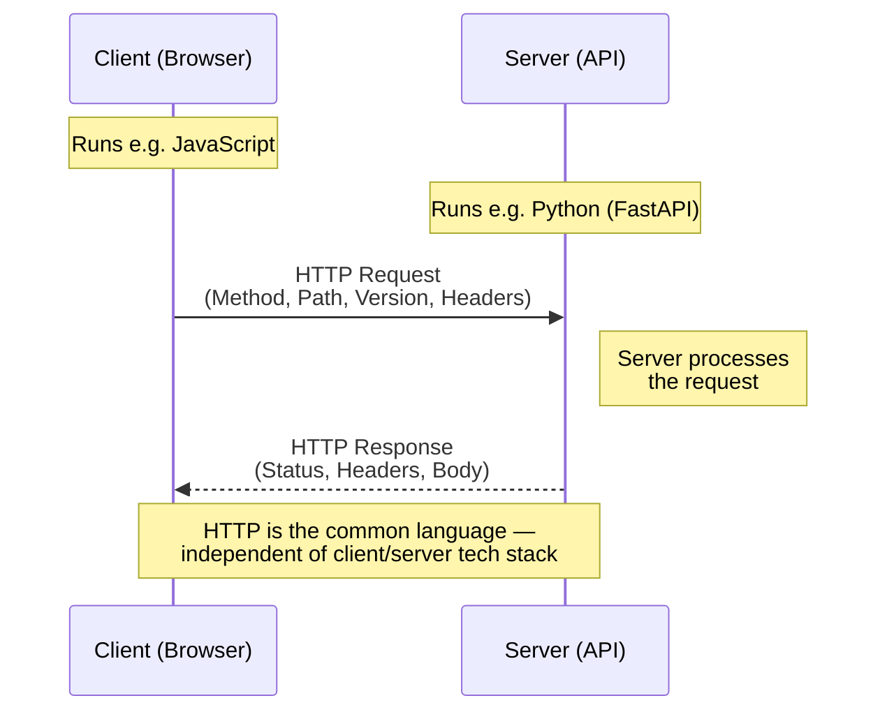
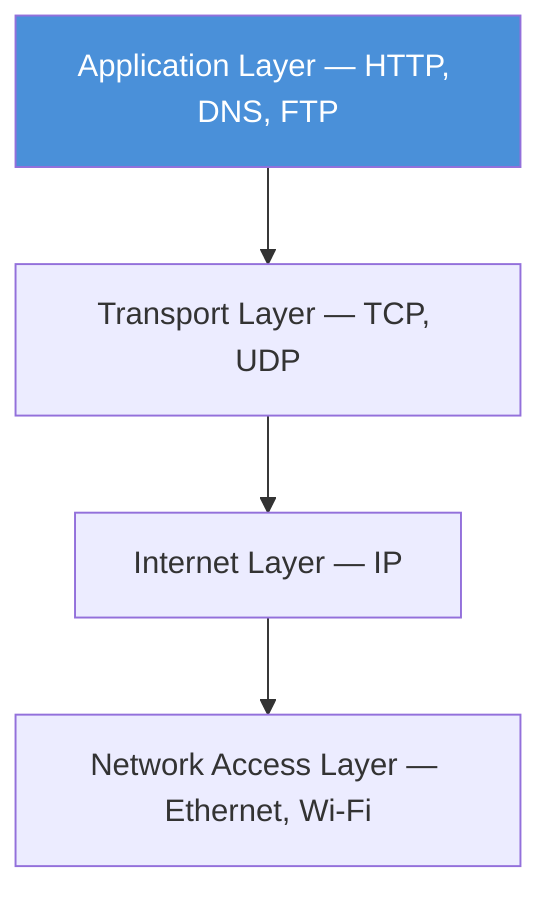
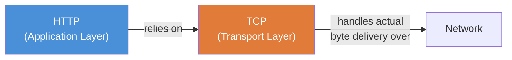
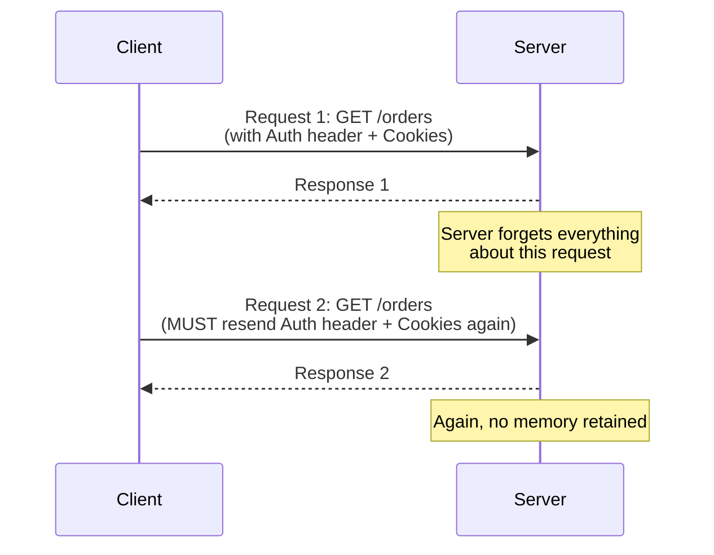

# HTTP Fundamentals — Introduction

> **Session context:** CampNX Networking Fundamentals series. This is the opening lecture of the dedicated HTTP module — comes after the TCP/UDP and DNS lectures. Covers: what HTTP actually stands for, client-server architecture, and the core properties of HTTP. Future lectures in this module will cover HTTP versions (0.9 → 3), methods, status codes, headers, TLS/HTTPS, and WebSockets.

---

## 1. What Does HTTP Actually Mean?

**HTTP = HyperText Transfer Protocol**

Break the name into three parts:

| Part | Meaning |
|---|---|
| **Hyper Text** | Text that contains **hyperlinks** — pieces of content that point to *other* documents (e.g. a "Click me" link that navigates to an About page). Because HTML lets you embed such links (via the `<a href="">` tag), HTML = *HyperText Markup Language*. |
| **Transfer** | Governs *how* that linked content moves correctly from one machine to another — e.g., from a server to your browser after you click a link. |
| **Protocol** | A **set of rules** defining exactly how that transfer happens — the structure of a valid request, the structure of a valid response, etc. |

So HTTP is simply: **the rulebook that governs how hyperlinked content is requested and delivered between two machines.**

---

## 2. Client-Server Architecture (Where HTTP Fits)

- Client and server can be written in **completely different languages** (browser JS ↔ Python/FastAPI, for example).
- HTTP acts as the **shared, language-independent contract** both sides agree to follow, so there's no ambiguity in how requests/responses are structured.

---

## 3. Core Properties of HTTP

### 3.1 Application Layer Protocol

- HTTP sits at the **topmost layer** of the TCP/IP model.
- It doesn't concern itself with how bytes physically travel across the network — that's delegated to the layers below.

### 3.2 Communication Protocol Between Client & Server

- Defines a **common language** so client and server, regardless of tech stack, understand each other consistently.

### 3.3 Defines Exact Structure of Requests & Responses

A client can't just say "give me the user's profile" in plain English — HTTP mandates a strict shape:

- **Method** (e.g. `GET`)
- **Path** (e.g. `/profile`)
- **HTTP Version** (e.g. `HTTP/1.1`)
- **Headers** (e.g. `Content-Type`)

This standardization removes ambiguity and keeps client/server in sync on format.

### 3.4 Built on Top of TCP

- HTTP doesn't worry about reliable delivery, retransmission, or ordering — **TCP handles all of that underneath.**
- HTTP only cares that its own rules (request/response format) are being followed correctly.

### 3.5 Stateless Protocol ⭐ (High-yield interview topic)

- Once the server responds, it **does not remember** anything about that request.
- Every new request must carry its **entire state** with it — e.g., `Authorization` header, cookies.
- **Practical implication:** even if a user is already logged in, *every single request* that needs auth must independently include the auth header — the server won't "remember" the previous login on its own.

### 3.6 Media Independent

- Modern HTTP can transport **almost any content type**: HTML, JSON, XML, PDF, audio, video, etc.
- **Historical note:** HTTP/0.9 (the very first version) had **no concept of headers at all**, including no `Content-Type` header — it only ever served plain HTML pages by default. As the web evolved, support for other content types was added.

### 3.7 Does NOT Encrypt Data by Itself

- Plain HTTP traffic is **not encrypted**.
- Encryption is added via **TLS**, which is what turns HTTP into **HTTPS** (covered in a dedicated future lecture).

### 3.8 Does NOT Guarantee Delivery by Itself

- HTTP has no built-in delivery guarantee.
- It relies entirely on the **underlying transport protocol (TCP)** for reliable, guaranteed delivery.

### 3.9 Independent of Programming Language

- Browsers, mobile apps, `curl`, Postman, Node.js — anything that wants to communicate over HTTP just needs to **implement/support the HTTP spec**. Most languages/tools do this by default.

---

## 4. Summary Table — HTTP Properties at a Glance

| Property | What It Means |
|---|---|
| Application layer protocol | Sits at the top of the TCP/IP stack |
| Client-server communication protocol | Language-independent contract between client & server |
| Defines request/response structure | Strict format: method, path, version, headers |
| Built on top of TCP | Delegates reliable transport to TCP |
| Stateless | Server retains no memory between requests; full state must be resent each time |
| Media independent | Can carry HTML, JSON, XML, PDF, audio, video, etc. |
| No built-in encryption | Needs TLS (→ HTTPS) for encryption |
| No built-in delivery guarantee | Relies on TCP for reliability |
| Language independent | Any client/server tech can implement it |

---

## 5. Worked Example — Why Statelessness Matters

**Scenario:** A logged-in user wants to fetch their order history.

1. Client sends `GET /orders` with an `Authorization` header and session cookies.
2. Server validates the header, processes the request, returns the orders.
3. Server **immediately forgets** this request ever happened.
4. If the client wants the orders again (e.g., a page refresh), it must send `GET /orders` **again**, with the **same Authorization header and cookies attached again** — the server will not recall the earlier request.

This is why frontend apps consistently attach auth tokens/cookies to *every* API call rather than just the first one.

---

## 6. Interview Q&A

1. **Q: What does HTTP stand for, and what does each word mean?**
   A: HyperText Transfer Protocol. "HyperText" = text containing links to other documents; "Transfer" = rules governing how that content moves between machines; "Protocol" = the set of rules itself.

2. **Q: Why is HTML called a "markup language" and HTTP a "transfer protocol"?**
   A: HTML *structures* content and embeds hyperlinks (it's the hypertext itself). HTTP defines the *rules for moving* that hypertext (or any content) between client and server.

3. **Q: At which layer of the TCP/IP model does HTTP operate?**
   A: The Application layer — the topmost layer.

4. **Q: What transport-layer protocol does HTTP rely on, and why?**
   A: TCP — because TCP provides reliable, ordered, guaranteed delivery, so HTTP doesn't need to reimplement that logic itself.

5. **Q: Is HTTP stateful or stateless? Explain.**
   A: Stateless. The server does not retain any memory of a prior request once it has responded; each new request must independently carry all necessary state (auth headers, cookies, etc.).

6. **Q: If HTTP is stateless, how do logged-in sessions work in practice?**
   A: The client resends authentication info (e.g., `Authorization` header or session cookie) with *every single request* — the server doesn't remember the user was already authenticated from a previous call.

7. **Q: Does HTTP guarantee message delivery? If not, what does?**
   A: No, HTTP itself does not guarantee delivery. It depends on TCP underneath to provide reliable delivery.

8. **Q: Does HTTP encrypt data by default?**
   A: No. Plain HTTP is unencrypted. Encryption is added via TLS, which is what makes HTTPS.

9. **Q: What is meant by "HTTP is media independent"?**
   A: HTTP can transport virtually any content type — HTML, JSON, XML, PDF, audio, video — not just text.

10. **Q: Was HTTP always media independent? What changed?**
    A: No — HTTP/0.9, the first version, had no headers at all (including no `Content-Type`), and only ever served HTML pages by default. Support for other content types was added as the web evolved.

11. **Q: Why is HTTP considered independent of programming language?**
    A: Because any client or server — regardless of implementation language (JS, Python, Java, etc.) — just needs to conform to the HTTP spec to communicate; the protocol itself is language-agnostic.

12. **Q: What information must a valid HTTP request specify, according to the protocol?**
    A: At minimum, the method (e.g. GET), path (e.g. `/profile`), HTTP version, and headers.

13. **Q: Why does HTTP need a strict, standardized request/response format instead of free-form messages?**
    A: To eliminate ambiguity between client and server implementations written in different languages/stacks — without a shared strict format, they'd have no consistent way to interpret each other's messages.

14. **Q: True or False: HTTP handles retransmission of lost packets.**
    A: False — that's TCP's job. HTTP just trusts TCP to deliver its messages reliably.

15. **Q: What's the relationship between HTTP and HTTPS?**
    A: HTTPS is HTTP plus TLS encryption layered on top — the request/response semantics of HTTP stay the same, but the data is encrypted in transit.

---

## 7. Revision Checklist

- [ ] Can explain HTTP as Hyper + Text + Transfer + Protocol in your own words
- [ ] Can draw the client-server request/response flow from memory
- [ ] Can place HTTP correctly in the TCP/IP layer stack
- [ ] Can explain *why* HTTP is stateless with a concrete example (auth header resend)
- [ ] Can list all 6 core properties without looking: application-layer, language-independent contract, strict format, built on TCP, stateless, media-independent
- [ ] Know HTTP does NOT encrypt (needs TLS) and does NOT guarantee delivery (needs TCP)
- [ ] Know the HTTP/0.9 historical trivia (no headers, HTML-only) as a "why is it called *HyperText* Transfer Protocol" hook

---

## 8. What's Next

Upcoming lectures in this HTTP module (per the instructor's roadmap):

- HTTP/1.0, HTTP/1.1, HTTP/2, HTTP/3 — version-by-version deep dive
- WebSockets
- TLS and HTTPS in depth
- (Possibly, based on demand) HTTP methods, status codes, and headers in detail
