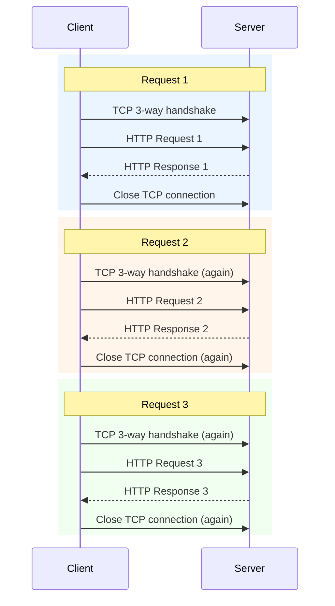
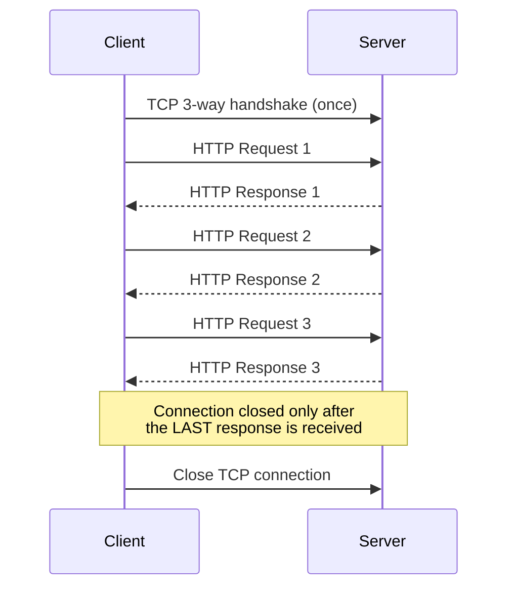
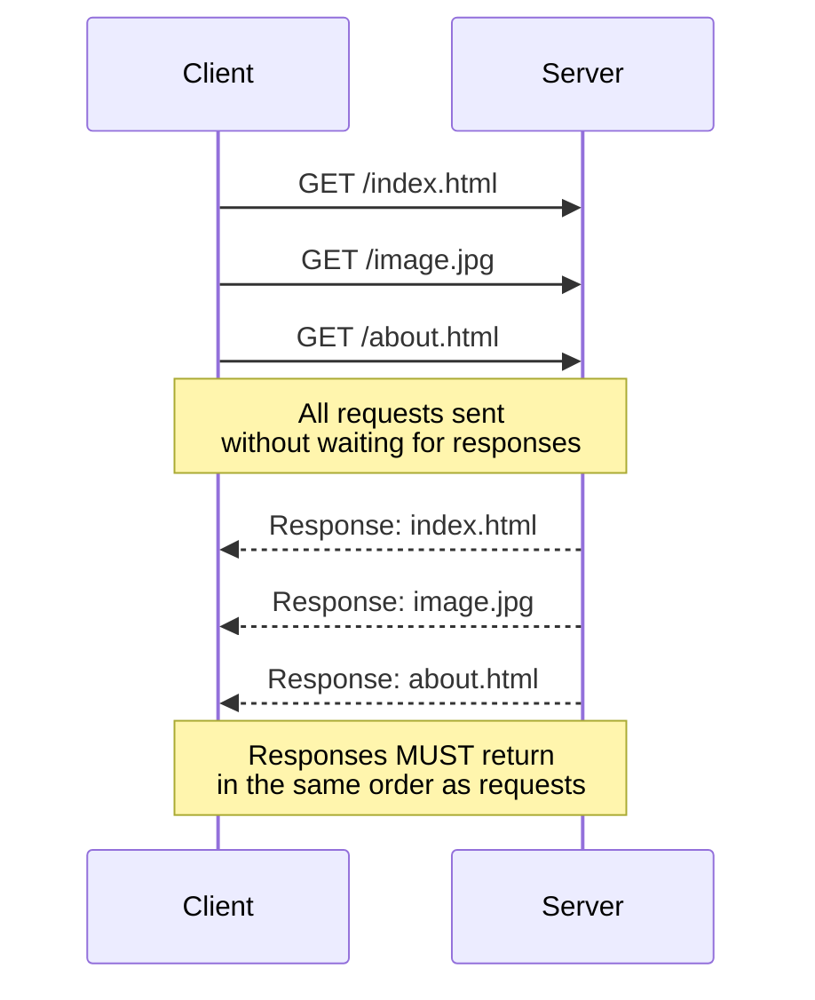
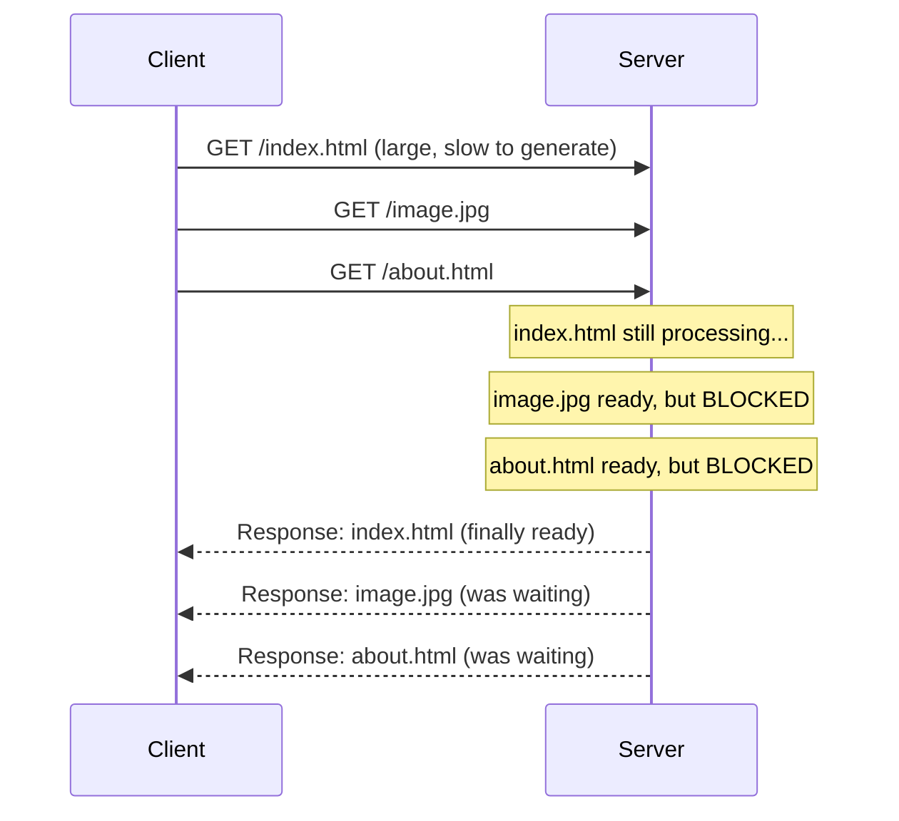

# HTTP/1.0 vs HTTP/1.1

> **Session context:** CampNX Networking Fundamentals series — HTTP module, lecture 2 (follows the "HTTP Overview" lecture). Covers why HTTP has multiple versions, what problem each version solves, and the connection-handling differences between HTTP/0.9 → 1.0 → 1.1, including pipelining and head-of-line blocking. Next up: HTTP/2 and HTTP/3.

---

## 1. Why Multiple HTTP Versions Exist

Each new HTTP version exists to fix a specific limitation of the previous one. The versions covered here:

| Version | Era | Key idea |
|---|---|---|
| HTTP/0.9 | ~1990s | Bare minimum — HTML only, no headers |
| HTTP/1.0 | After 0.9 | Introduced headers (`Content-Type` etc.); one TCP connection per request |
| HTTP/1.1 | After 1.0 | Persistent connections by default; pipelining (optional, disabled by default) |

---

## 2. HTTP/0.9 — The Starting Point (Recap)

- Extremely basic protocol — could only serve **HTML** templates.
- **No concept of headers at all**, so there was no way to specify content type (JSON, XML, PDF, audio, etc.).
- That's exactly why it defaulted to HTML-only responses.

---

## 3. HTTP/1.0 — Headers Arrive, But One Connection Per Request

### 3.1 What HTTP/1.0 Fixed

- Introduced **HTTP headers**, most importantly `Content-Type` — now the server can specify *what kind* of content it's returning (HTML, PDF, video, audio, zip, etc.), and the client knows how to interpret the response.

### 3.2 The New Problem: A Fresh TCP Connection for Every Request

- Since HTTP runs on top of TCP (a **connection-oriented protocol**), sending anything requires a **TCP 3-way handshake** first.
- In HTTP/1.0's default behavior: **as soon as a response is received, the TCP connection is closed.**
- So for 3 requests → **3 separate TCP connections** → 3 handshakes + 3 teardowns.
- Establishing and tearing down TCP connections **consumes resources** — doing this unnecessarily for every single request is wasteful.

### 3.3 The Workaround: `Connection: keep-alive` Header

- HTTP/1.0 *did* support persistent connections, but only via an **optional header**: `Connection: keep-alive`.
- If sent, the same TCP connection could be reused across multiple request/response cycles: open connection → send request → receive response → send next request → receive next response → ... → close connection.
- But since this was **optional and not the default**, most implementations still paid the cost of opening a fresh TCP connection per request unless they explicitly opted in.

---

## 4. HTTP/1.1 — Persistent Connections by Default

### 4.1 The Fix

- In HTTP/1.1, **persistent connections are the default behavior** — what required an explicit `keep-alive` header in HTTP/1.0 is now automatic.
- One TCP connection is reused to send multiple requests; it's closed only once the final response has been received.
- **This is the core difference between HTTP/1.0 and HTTP/1.1.**

### 4.2 Remaining Limitation: One Request at a Time

- Rule in plain HTTP/1.1: **until the response for a request arrives, the next request cannot be sent** on that connection.
- This is a real limitation, but it's still acceptable — many servers/websites continue to use HTTP/1.1 today.

---

## 5. HTTP/1.1 Pipelining (and Its Big Problem) ⭐ Common Interview Topic

### 5.1 What Pipelining Tries to Do

- Instead of strictly waiting for each response before sending the next request, the client sends **multiple requests back-to-back without waiting** for previous responses.
- Example: request `index.html`, then immediately (without waiting) request `image.jpg`, then `about.html` — then receive multiple responses.

### 5.2 The Catch: Responses Must Come Back In Order

- If requests were sent as `index.html → image.jpg → about.html`, the responses **must** arrive in that exact same order.

### 5.3 Head-of-Line (HOL) Blocking

- Suppose `index.html` is a large file that takes a long time to generate on the server.
- Even though `image.jpg` and `about.html` might be **ready much sooner**, they are **stuck waiting** because `index.html`'s response — the *head of the line* — hasn't been sent yet.
- The client cannot receive the remaining responses until the first one in the queue is fulfilled, **even though those later requests are completely independent** and have no real relationship to `index.html`.
- This problem is called **Head-of-Line (HOL) Blocking**.
- **Consequence:** Because of HOL blocking, pipelining provides little real benefit and can actively hurt performance — so **it's disabled by default in HTTP/1.1.**

> **Note:** What browsers actually do to get parallelism under HTTP/1.1 is **open multiple separate TCP connections** and send requests across them in parallel — this is different from "pipelining" (which specifically means multiple requests over the *same* connection without waiting for responses).

---

## 6. Summary Table — HTTP/1.0 vs HTTP/1.1

| Aspect | HTTP/1.0 | HTTP/1.1 |
|---|---|---|
| Headers | Introduced (fixes 0.9's lack of `Content-Type`, etc.) | Retained, expanded |
| Default connection behavior | New TCP connection per request (closed right after response) | **Persistent connection by default** — reused across requests |
| Persistent connections | Only via optional `Connection: keep-alive` header | Default behavior, no extra header needed |
| Sending next request | N/A (new connection each time anyway) | Must wait for current response before sending next (in plain 1.1) |
| Pipelining | Not applicable | Supported in spec, but **disabled by default** due to HOL blocking |
| Real-world usage | Rare today | Still very widely used |

---

## 7. Worked Example — Resource Cost of HTTP/1.0's Model

**Scenario:** A page needs 3 resources: `index.html`, `style.css`, `logo.png`.

- **HTTP/1.0 (no keep-alive):**
  1. TCP handshake → request `index.html` → response → close connection
  2. TCP handshake → request `style.css` → response → close connection
  3. TCP handshake → request `logo.png` → response → close connection
  - Total: **3 handshakes + 3 teardowns** just to load one page.

- **HTTP/1.1 (default):**
  1. TCP handshake (once)
  2. Request `index.html` → response
  3. Request `style.css` → response
  4. Request `logo.png` → response
  5. Close connection
  - Total: **1 handshake + 1 teardown** for the same 3 resources.

This is the concrete resource savings HTTP/1.1's default persistent connection behavior delivers.

---

## 8. Interview Q&A

1. **Q: What was the core limitation of HTTP/0.9?**
   A: No concept of headers — so it could only serve HTML by default, with no way to signal other content types.

2. **Q: What did HTTP/1.0 introduce to fix HTTP/0.9's limitation?**
   A: HTTP headers, especially `Content-Type`, allowing the server to specify what kind of content (HTML, PDF, JSON, audio, video, etc.) is being returned.

3. **Q: What is the default connection behavior in HTTP/1.0?**
   A: A new TCP connection is established for every single request, and it's closed immediately after the response is received.

4. **Q: How could HTTP/1.0 avoid opening a new connection per request?**
   A: By explicitly sending the `Connection: keep-alive` header — this was optional, not the default.

5. **Q: What is the single biggest difference between HTTP/1.0 and HTTP/1.1?**
   A: HTTP/1.1 makes persistent connections the **default** behavior — no need to explicitly request `keep-alive`; one TCP connection can serve multiple requests.

6. **Q: Why is opening a new TCP connection per request considered wasteful?**
   A: Because establishing (3-way handshake) and tearing down a TCP connection both consume system/network resources — doing this repeatedly for requests that could share a connection is unnecessary overhead.

7. **Q: In plain HTTP/1.1 (without pipelining), can a client send a second request before receiving the response to the first?**
   A: No — the rule is you must receive the response to the current request before sending the next one.

8. **Q: What is HTTP/1.1 pipelining?**
   A: A technique where the client sends multiple requests back-to-back over the same connection without waiting for each individual response first.

9. **Q: What constraint does pipelining place on the order of responses?**
   A: Responses must be returned in the **exact same order** the requests were sent in.

10. **Q: What is Head-of-Line (HOL) blocking in the context of HTTP/1.1 pipelining?**
    A: When the first request in a pipelined sequence is slow to process, all subsequent responses — even if they're independently ready — get stuck waiting behind it because responses must return in request order.

11. **Q: Give a concrete example of HOL blocking.**
    A: Requesting `index.html`, `image.jpg`, and `about.html` in that order — if `index.html` is large and slow to generate, `image.jpg` and `about.html`'s responses are blocked even though they're ready, because `index.html`'s response hasn't been sent yet.

12. **Q: Is pipelining enabled by default in HTTP/1.1? Why or why not?**
    A: No, it's disabled by default — because of head-of-line blocking, it can hurt performance more than help, since unrelated requests end up blocking each other.

13. **Q: How do browsers achieve parallelism under HTTP/1.1 if pipelining is disabled?**
    A: By opening multiple separate TCP connections in parallel, rather than pipelining multiple requests over a single connection.

14. **Q: Why is it important to understand HTTP/1.0 and 1.1 even though newer versions exist?**
    A: Because HTTP/1.1 is still extensively used today, and understanding its design (and limitations like HOL blocking) is foundational context for understanding *why* HTTP/2 and HTTP/3 were created.

15. **Q: True or False: HTTP/1.1's persistent connection closes after every individual response.**
    A: False — it stays open across multiple request/response cycles and is closed only after the last response in that sequence is received.

---

## 9. Revision Checklist

- [ ] Can explain what problem HTTP/1.0 solved (headers / `Content-Type`) vs HTTP/0.9
- [ ] Can draw HTTP/1.0's "new TCP connection per request" flow from memory
- [ ] Know that `Connection: keep-alive` was optional in 1.0, default in 1.1
- [ ] Can draw HTTP/1.1's persistent-connection flow from memory
- [ ] Can explain pipelining and why it's disabled by default (HOL blocking) — **high-frequency interview question**
- [ ] Can walk through the head-of-line blocking example (index.html blocking image.jpg/about.html) without notes
- [ ] Understand that browsers use parallel TCP connections (not pipelining) for concurrency under HTTP/1.1

---

## 10. What's Next

- HTTP/2 — how it solves head-of-line blocking (multiplexing over a single connection, binary framing, header compression)
- HTTP/3 — QUIC-based transport
- WebSockets
- TLS / HTTPS in depth
