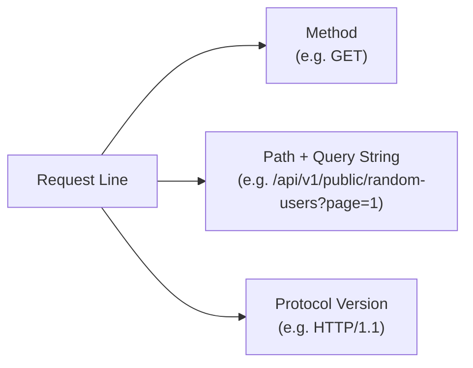
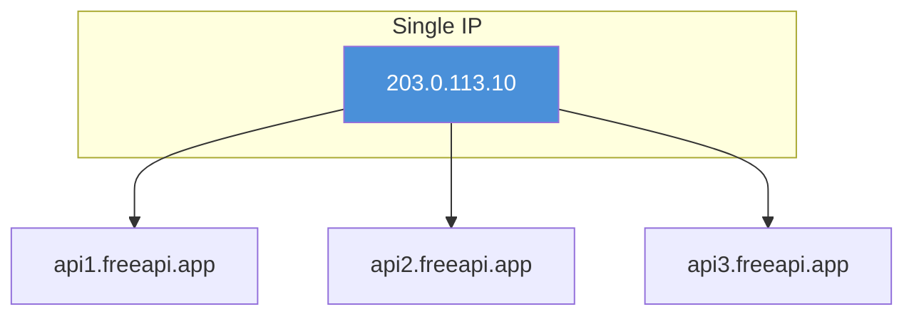
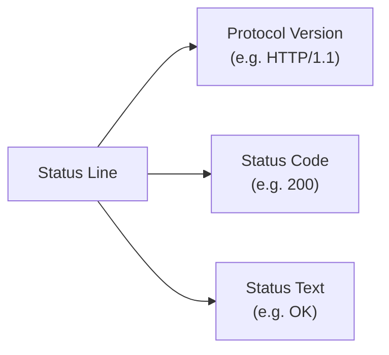
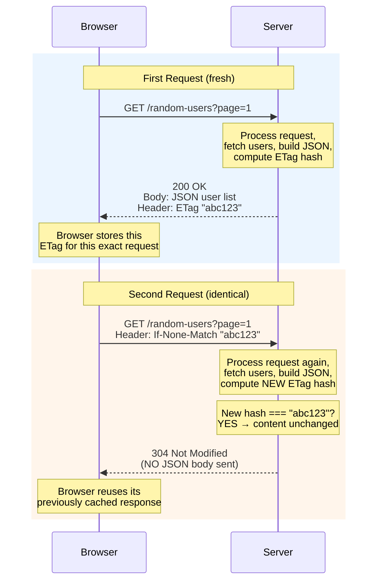

# Structure of HTTP Request & Response (with Headers)

> **Session context:** CampNX Networking Fundamentals series — HTTP module, lecture 3 (follows "HTTP Overview" and "HTTP/1.0 vs HTTP/1.1"). Demonstrated live using a real API call to `freeapi.app` (`GET /api/v1/public/random-users`, running over HTTP/1.1) inspected via Chrome DevTools. Covers the anatomy of a request line, common request headers, response line + status code, common response headers, and a deep dive into ETag-based caching (304 Not Modified). Note: this lecture intentionally skips deep dives on individual status codes and full header catalogs — those are flagged as separate future videos.

---

## 1. HTTP Request Structure

An HTTP request is genuinely simple — it boils down to **3 things on the request line**, followed by headers.

```
GET /api/v1/public/random-users?page=1&limit=10 HTTP/1.1
<headers...>
```



| Part | What it is | Example |
|---|---|---|
| **Method** | The action being requested | `GET` |
| **Path** | The endpoint being hit | `/api/v1/public/random-users` |
| **Query string** | Key-value pairs after `?`, separated by `&`, giving extra parameters | `?page=1&limit=10` |
| **Protocol version** | Which HTTP version this request uses | `HTTP/1.1` (would say `HTTP/2` if using HTTP/2) |

That's the entire "core" of a request. Everything after it is **headers** — and headers vary request to request, application to application.

### 1.1 Common Request Headers (observed in this demo)

| Header | Purpose |
|---|---|
| `Accept-Encoding` | Which **compression algorithms** the client supports (e.g. gzip, deflate, br, zstd) |
| `Accept-Language` | Which language(s) the client prefers (e.g. English) |
| `Connection: keep-alive` | Signals persistent connection. Technically **not required by HTTP/1.1** (persistent by default) — but sent anyway in case the request passes through a **proxy/load balancer running HTTP/1.0**, so that intermediary can also keep the connection alive |
| `Cookie` | Sends cookies stored for this site (same ones visible under DevTools → Application → Cookies) |
| `Host` | The exact domain name being targeted — **critical** because a single IP can serve **multiple different domains**; `Host` tells the server which one this request is actually for |
| `Referer` | The **exact page** the request originated from (e.g. `/test`) — different from `Host`, which is the domain regardless of route |
| `User-Agent` | The client's underlying OS/browser info (e.g. Mozilla, Chrome, AppleWebKit strings) |
| `Accept` | What response **content type** the client expects/will accept (e.g. `application/json`) — if the server sent PDF or XML instead, the client wouldn't accept it |
| *(various security-related headers)* | Not covered in depth in this lecture |

### 1.2 `Host` vs `Referer` — Key Distinction



- **Host** = the target **domain name**, regardless of which route/page you're on. Needed because one IP can back multiple domains — the server uses `Host` to route the request to the correct application.
- **Referer** = the **exact page** (full route, e.g. `/test`) that triggered this particular request.

---

## 2. HTTP Response Structure

The response looks almost identical to the request, with two key differences: it leads with **protocol + status code**, and it carries different headers.

```
HTTP/1.1 200 OK
<headers...>
<body>
```



| Part | What it is | Example |
|---|---|---|
| **Protocol version** | Same idea as in the request | `HTTP/1.1` |
| **Status code** | Numeric result of the request | `200` (OK) — others include `201`, `400`, `404`, `409`, etc. |
| **Status text** | Short human-readable description of the code | `OK` |

### 2.1 Common Response Headers (observed in this demo)

| Header | Purpose |
|---|---|
| `Server` | The underlying web server software handling the request (e.g. Express) |
| `Date` | The date/time the response was generated |
| `Content-Type` | The content type of **this response body** — should match what the client's `Accept` header asked for (e.g. `application/json` ↔ `application/json`) |
| `Content-Length` | The **exact byte length** of the response body — lets the client know exactly where the response ends |
| `Connection: keep-alive` | Same reasoning as on the request side — added redundantly in HTTP/1.1 so any HTTP/1.0 proxy in the path can also keep its connection alive |
| `X-Powered-By` | Framework info (e.g. Express — Node.js framework) |
| CORS headers | Cross-Origin Resource Sharing related |
| Rate-limiting headers | Generated by the API platform itself (application-level, not part of the HTTP spec itself — injected by the application into the response) |
| `ETag` | A **hash/fingerprint** of the response content — used for caching (see below) |

### 2.2 Validating `Content-Length`

- The demo copied the full response body and pasted it into a byte-counting tool: the body was measured at **10,757 bytes**, and the `Content-Length` header in the response matched **exactly**.
- This confirms `Content-Length`'s purpose: it tells the receiving application precisely where the response body ends.

---

## 3. ETag & Conditional Requests (304 Not Modified) ⭐ Important Caching Concept

### 3.1 What Is an ETag?

- The server processes a request (e.g., fetches 10 users from the DB), generates the JSON response, and computes a **hash of that response content** — this hash is the `ETag`.
- The `ETag` is returned as a response header alongside the actual JSON body.

### 3.2 The Flow — First Request vs Repeated Identical Request



**Step by step:**

1. **First request:** Browser sends `GET /random-users?page=1` with no conditional header (fresh request, nothing to compare against yet).
2. Server processes it, builds the JSON response, computes an `ETag` (a hash of that content), and returns `200 OK` with the JSON body **and** the `ETag` header.
3. The browser **remembers this ETag**, associated with this exact request/path.
4. **Second, identical request:** The browser now sends the **same request**, but this time includes an `If-None-Match` header carrying the **previously received ETag**.
5. The server processes the request again (fetches the same data, regenerates a fresh ETag) — and **compares** the newly generated ETag against the one sent in `If-None-Match`.
6. **If they match** → the content is identical/unmodified → server responds with **`304 Not Modified`** and **does NOT send the JSON body again**.
7. The browser understands `304` to mean "reuse what you already have" — it serves the response it already cached locally.

### 3.3 Why This Matters: Bandwidth Savings

- Technically, the server still **does the work** of processing the request and fetching/building the data.
- But because the content is identical, it **skips re-sending the (potentially large) response body** — only a small `304` status is sent instead of the full JSON.
- **Net effect: reduced bandwidth consumption** for repeated, unchanged requests.

---

## 4. Summary Table — Request vs Response Structure

| | Request | Response |
|---|---|---|
| **First line contains** | Method, Path (+ query string), Protocol version | Protocol version, Status code, Status text |
| **Example** | `GET /api/v1/public/random-users?page=1 HTTP/1.1` | `HTTP/1.1 200 OK` |
| **Followed by** | Headers (request-specific) | Headers (response-specific) |
| **Then** | (No body for GET) | Response body (e.g. JSON) — *unless 304* |

## 5. Summary Table — Headers Covered

| Header | Side | Purpose |
|---|---|---|
| `Accept-Encoding` | Request | Compression algorithms client supports |
| `Accept-Language` | Request | Preferred language |
| `Connection: keep-alive` | Both | Persistent connection hint (redundant safety net for HTTP/1.0 proxies) |
| `Cookie` | Request | Site cookies sent with the request |
| `Host` | Request | Target domain (critical when one IP serves multiple domains) |
| `Referer` | Request | Exact page that triggered the request |
| `User-Agent` | Request | Client OS/browser identity |
| `Accept` | Request | Expected response content type |
| `Server` | Response | Underlying server software |
| `Date` | Response | Response generation timestamp |
| `Content-Type` | Response | Content type of the response body |
| `Content-Length` | Response | Exact byte length of response body |
| `X-Powered-By` | Response | Framework info |
| `ETag` | Response | Content hash, used for caching/validation |
| `If-None-Match` | Request | Client sends back a previously received ETag to validate cache |

---

## 6. Interview Q&A

1. **Q: What three components make up the first line of an HTTP request?**
   A: The method (e.g. `GET`), the path/query string (e.g. `/users?page=1`), and the protocol version (e.g. `HTTP/1.1`).

2. **Q: What three components make up the first line of an HTTP response?**
   A: The protocol version, the status code (e.g. `200`), and the status text (e.g. `OK`).

3. **Q: What's a query string, and where does it appear?**
   A: The key-value pairs appearing after `?` in the path, separated by `&` — used to pass extra parameters with the request.

4. **Q: Why does the `Host` header matter even though the server has one IP?**
   A: Because a single IP address can serve multiple different domains; `Host` tells the server exactly which domain/application this request is meant for, so it can route correctly.

5. **Q: What's the difference between the `Host` and `Referer` headers?**
   A: `Host` is the target domain name regardless of the specific route. `Referer` is the exact page (full path) that triggered this request.

6. **Q: Why might a client send `Connection: keep-alive` even under HTTP/1.1, where it's not required?**
   A: Because the request might pass through a proxy or load balancer that's still using HTTP/1.0 — sending the header lets that intermediary also keep its connection persistent.

7. **Q: What does the `Accept` header do, and what happens if the server ignores it?**
   A: It tells the server what content type the client expects (e.g. `application/json`). If the server sent back a different type (e.g. PDF or XML) than what was requested, the client would not accept it.

8. **Q: What does `Content-Length` represent, and why does the client need it?**
   A: The exact byte length of the response body — it lets the client know precisely where the response ends.

9. **Q: What is an ETag?**
   A: A hash/fingerprint the server computes over the response content, returned as a response header — used to detect whether content has changed between requests.

10. **Q: Walk through what happens on a repeated identical request using ETag caching.**
    A: The browser sends the same request again, but includes an `If-None-Match` header with the ETag it received last time. The server reprocesses the request, computes a fresh ETag, and compares it to the one sent by the client. If they match, it returns `304 Not Modified` without resending the body.

11. **Q: Does the server skip processing the request entirely when it returns a 304?**
    A: No — the server still processes the request and regenerates the data/ETag to compare; what it skips is **re-sending the response body**.

12. **Q: What's the main benefit of the ETag / 304 mechanism?**
    A: Reduced bandwidth consumption — unchanged content doesn't need to be re-transmitted, only a small `304` status is sent.

13. **Q: In the demo, why did the first request not include `If-None-Match`?**
    A: Because it was a fresh request — the browser had no previously cached ETag for that request to send back yet.

14. **Q: What does `X-Powered-By` typically indicate?**
    A: The underlying framework used to build the server/application (e.g. Express for Node.js).

15. **Q: Are all response headers part of the core HTTP spec?**
    A: No — some, like custom rate-limiting headers or `X-Powered-By`, are **application-level headers** injected by the specific application/framework, not mandated by HTTP itself.

---

## 7. Revision Checklist

- [ ] Can write out the 3 parts of a request line and 3 parts of a response line from memory
- [ ] Can explain query strings and where they sit in the path
- [ ] Know the difference between `Host` and `Referer`
- [ ] Can explain why `Connection: keep-alive` still gets sent under HTTP/1.1
- [ ] Can explain `Content-Length`'s purpose
- [ ] Can walk through the full ETag → `If-None-Match` → `304 Not Modified` flow diagram from memory — **high-yield interview topic**
- [ ] Understand that 304 still involves server-side processing; only the body transmission is skipped
- [ ] Can distinguish core HTTP headers from application-injected headers (e.g. rate-limit headers, `X-Powered-By`)

---

## 8. What's Next

Flagged by the instructor as candidate future dedicated videos (based on viewer interest):

- Detailed breakdown of all/major HTTP status codes
- Detailed breakdown of all/major HTTP headers not covered here
- HTTP/2, HTTP/3
- WebSockets
- TLS / HTTPS in depth
