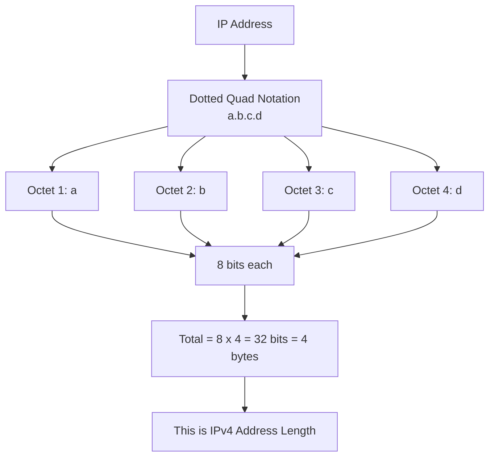

# IP Address Structure — Octets, Dotted Quad Notation & Binary Format

## Summary
This note covers the fundamentals of how an IPv4 address is structured: what an **octet** is, what **dotted quad notation** means, how to represent an IP in **binary**, and why an IPv4 address is exactly **32 bits (4 bytes)** long. This is the foundational concept before moving to subnet masks, default gateways, MAC addresses, and routing.

---

## Table of Contents
- [1. What is IP (Internet Protocol)?](#1-what-is-ip-internet-protocol)
- [2. Dotted Quad Notation](#2-dotted-quad-notation)
- [3. What is an Octet?](#3-what-is-an-octet)
- [4. Binary Representation of an IP](#4-binary-representation-of-an-ip)
- [5. Why is IPv4 32 Bits Long?](#5-why-is-ipv4-32-bits-long)
- [6. Visual Flowchart](#6-visual-flowchart)
- [7. Interview Q&A](#7-interview-qa)
- [8. Quick Revision Checklist](#8-quick-revision-checklist)

---

## 1. What is IP (Internet Protocol)?
- **IP = Internet Protocol** — one of the most important protocols of the internet.
- As a software developer, you've almost certainly already worked with an IP address — every time you run a frontend/backend app on your local machine, it runs on **localhost**, i.e. `127.0.0.1`.
- `127.0.0.1` is itself an example of an IP address structured in the standard format.

## 2. Dotted Quad Notation
An IP address looks like this:

```
a.b.c.d
```

Where `a`, `b`, `c`, `d` are **non-negative integers**, separated by dots.

**Example:**
```
192.168.1.4
```

This dot-separated integer format is called **Dotted Quad Notation**.

## 3. What is an Octet?
- Each individual dot-separated part of the IP (`a`, `b`, `c`, or `d`) is called an **octet**.
- Example: In `192.168.1.4`
  - First three octets: `192`, `168`, `1`
  - Last octet: `4`
- The term "octet" is used because each part is represented using **8 bits** in binary.
- This decimal format (`192.168.1.4`) is the **Decimal Representation** of the IP — the one we commonly use.

## 4. Binary Representation of an IP
- An IP can also be represented in **binary format**, not just decimal.
- Each octet = 8 bits → so an IP written in binary shows 4 groups of 8 bits each.
- Understanding this binary breakdown becomes essential later when learning about **subnetting** — it helps explain *why* subnets are needed.

## 5. Why is IPv4 32 Bits Long?
Simple math based on the octet structure:

| Component | Value |
|---|---|
| Bits per octet | 8 |
| Number of octets | 4 |
| **Total bits** | **8 × 4 = 32 bits** |
| **Total bytes** | **4 bytes** |

> ⚠️ Note: This 32-bit structure applies specifically to **IPv4**. **IPv6** is structured differently (covered in a separate topic).

## 6. Visual Flowchart



---

## 7. Interview Q&A

**Q1. What does IP stand for?**
A. Internet Protocol — one of the core protocols governing communication over the internet.

**Q2. What is an octet in the context of IP addresses?**
A. Each of the four dot-separated numeric parts of an IPv4 address (e.g., in `192.168.1.4`, `192`, `168`, `1`, and `4` are each an octet). Each octet is represented using 8 bits.

**Q3. What is Dotted Quad Notation?**
A. The standard human-readable format for writing an IPv4 address as four decimal integers separated by dots: `a.b.c.d`.

**Q4. Why is an IPv4 address 32 bits long?**
A. Because it consists of 4 octets, and each octet is 8 bits → 8 × 4 = 32 bits (equivalent to 4 bytes).

**Q5. What is `127.0.0.1` commonly known as?**
A. Localhost — the loopback IP address referring to the local machine itself.

**Q6. Can an IP address be represented in a format other than decimal?**
A. Yes, an IP address can also be represented in binary format (4 groups of 8 bits), which is especially useful for understanding subnetting.

**Q7. Is the 32-bit structure applicable to IPv6 as well?**
A. No, IPv6 has a different (longer) structure. The 32-bit rule applies specifically to IPv4.

---

## 8. Quick Revision Checklist
- [ ] I can define IP (Internet Protocol) and give a real-world example (`127.0.0.1`).
- [ ] I can explain Dotted Quad Notation (`a.b.c.d`).
- [ ] I can identify what an octet is and count them in an IP address.
- [ ] I know each octet = 8 bits.
- [ ] I can calculate why IPv4 = 32 bits (8 × 4).
- [ ] I understand IPv4 addresses can be represented in both decimal and binary formats.
- [ ] I know IPv6 has a different structure than IPv4.
- [ ] I understand this is foundational for future topics: subnet masks, default gateway, MAC addresses, routing.

---
*Source: Video transcript — "Structure of an IP" (Chapters 1–5: IP Structure & Octets, Basics of IP, Dotted Quad Notation, Binary Format, IPv4 Length)*
