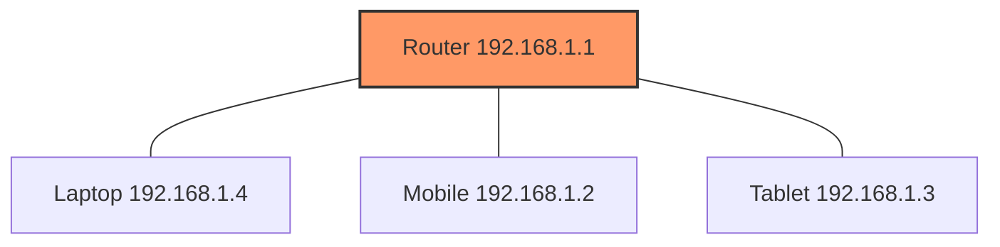
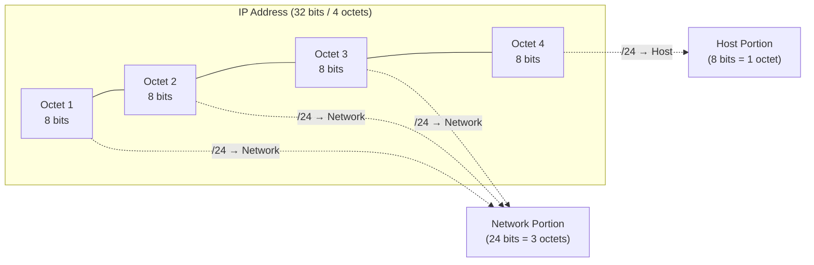

# Network, Host & CIDR Notation

> Understanding how devices form a network, what a host is, and how CIDR notation (`/X`) splits an IP into network and host portions — foundational knowledge before diving into Subnetting.

---

## Table of Contents

- [1. What is a Network?](#1-what-is-a-network)
- [2. What is a Host?](#2-what-is-a-host)
- [3. How Devices Get an IP (DHCP)](#3-how-devices-get-an-ip-dhcp)
- [4. What is CIDR Notation?](#4-what-is-cidr-notation)
- [5. Network Portion vs Host Portion](#5-network-portion-vs-host-portion)
- [6. Worked Example: /24](#6-worked-example-24)
- [7. Calculating Number of Hosts](#7-calculating-number-of-hosts)
- [8. Common CIDR Ranges Comparison](#8-common-cidr-ranges-comparison)
- [9. Special CIDR Notations](#9-special-cidr-notations)
- [10. Interview Q&A](#10-interview-qa)
- [11. Quick Revision Checklist](#11-quick-revision-checklist)

---

## 1. What is a Network?

A **network** is simply the set of connections formed between devices — e.g., a router with a laptop, mobile, and tablet connected to it. Any devices connected to the same router form a **single network**.

Key insight: devices in the same network can communicate directly with each other using their IPs — **even without internet access**. Internet is not required for intra-network communication.



This type of network (devices connected via a single router, typically in a home/office) is called a **LAN — Local Area Network**, as opposed to a **WAN — Wide Area Network**.

---

## 2. What is a Host?

A **host** is any individual machine that holds a **unique IP address** within a network.

> **Network** = the connection/group formed between devices.
> **Host** = an individual device holding a unique IP inside that network.

---

## 3. How Devices Get an IP (DHCP)

When a new device connects to a router, the router automatically assigns it an IP using **DHCP (Dynamic Host Configuration Protocol)**.

- The router maintains a table/pool of available IPs.
- As soon as a device connects, DHCP dynamically assigns it a free IP from that pool.
- This is why your Wi-Fi settings show an IP address — it was handed to you dynamically by the router.

*(A dedicated deep-dive video on DHCP is planned as a follow-up topic.)*

---

## 4. What is CIDR Notation?

**CIDR = Classless Inter-Domain Routing**

It's an IP addressing scheme that uses **slash (`/`) notation** to define IP address ranges — i.e., how many bits of the IP are reserved for the **network** vs the **host**.

```
192.168.1.0/24
      ↑        ↑
  Network IP   X = number of bits reserved for network
```

- `X` is an integer **between 0 and 32** (since an IPv4 address is 32 bits total).
- The **network IP** (first IP of the range) is reserved to represent the entire network as a whole — typically ending in `.0`.
- This reserved network IP is used to determine whether a target device is **inside** or **outside** your network (explained further when covering subnet masks).

---

## 5. Network Portion vs Host Portion

An IPv4 address = **32 bits total** = **4 octets** (8 bits each).



- The `X` in `/X` tells you how many **leading bits** are locked/reserved for the network.
- The **remaining bits** are free to assign uniquely to each host (device) in that network.

---

## 6. Worked Example: /24

Given: `192.168.1.0/24`

| Component | Value | Meaning |
|---|---|---|
| Network IP | `192.168.1.0` | Represents the whole network |
| CIDR bits | `/24` | First 24 bits (3 octets) reserved for network |
| Network portion | `192.168.1` | Always constant for every device in this network |
| Host portion | Last octet (8 bits) | Unique per device |

**Example device IPs on this network:**

| Device | IP Address |
|---|---|
| Router | 192.168.1.1 |
| Mobile | 192.168.1.2 |
| Tablet | 192.168.1.3 |
| Laptop | 192.168.1.4 |
| New Printer | 192.168.1.5 |

Since the first three octets (`192.168.1`) are fixed by the network, only the **last octet changes** to make each device's IP unique.

---

## 7. Calculating Number of Hosts

**Formula:** `2^(number of host bits)` = max hosts on that network

| CIDR | Network bits | Host bits | Max Hosts |
|---|---|---|---|
| `/24` | 24 | 8 | `2^8` = 256 |
| `/16` | 16 | 16 | `2^16` ≈ 65,000 |
| `/8` | 8 | 24 | `2^24` ≈ 16.7 million |

For a `/24` network:
- Only **8 bits** are available for host assignment.
- Max devices connectable = **256**.
- The 257th device connection attempt **fails** — no bits left to assign a unique IP.

---

## 8. Common CIDR Ranges Comparison

| CIDR | Bits for Network | Bits for Host | Max Hosts | Typical Use |
|---|---|---|---|---|
| `/8` | 8 | 24 | ~16.7M | Very large networks |
| `/16` | 16 | 16 | ~65,000 | Large networks |
| `/24` | 24 | 8 | 256 | Common home/office LAN |
| `/32` | 32 | 0 | 1 | Single host |
| `/0` | 0 | 32 | All IPs | Represents entire internet range |

---

## 9. Special CIDR Notations

- **`0.0.0.0/0`** — Represents **every possible IP** on the internet. No bits are reserved for the network, meaning all octets are dynamic/unrestricted. Commonly seen in routing tables as the "default route."
- **`/16`** — First 16 bits (2 octets) reserved for network; remaining 16 bits (2 octets) available for hosts → ~65,000 hosts per network.

You'll frequently encounter CIDR notation while working with **AWS, DigitalOcean**, or other cloud/DevOps platforms (e.g., VPC CIDR blocks, security group rules).

---

## 10. Interview Q&A

**Q1: What is the difference between a network and a host?**
A: A network is the logical group/connection formed between devices (e.g., all devices connected to one router). A host is an individual device within that network that holds a unique IP address.

**Q2: Can two devices communicate without internet access?**
A: Yes — if they're on the same local network (LAN), they can communicate directly using their local IPs without requiring internet connectivity.

**Q3: What does CIDR stand for and what does it do?**
A: CIDR stands for Classless Inter-Domain Routing. It uses slash notation (`/X`) to define how many bits of an IP address are reserved for the network portion vs the host portion.

**Q4: In `192.168.1.0/24`, how many hosts can this network support?**
A: 24 bits are reserved for the network (3 octets), leaving 8 bits for hosts → `2^8 = 256` possible hosts.

**Q5: What assigns an IP to a newly connected device automatically?**
A: DHCP (Dynamic Host Configuration Protocol) — the router dynamically assigns an available IP from its pool to the new device.

**Q6: What does `0.0.0.0/0` represent?**
A: It represents the entire range of possible IP addresses on the internet, since zero bits are reserved for the network — meaning nothing is fixed/constant.

**Q7: Why is the first IP in a CIDR range (e.g., `192.168.1.0`) usually reserved?**
A: It's reserved to represent the network itself as a whole, used to help determine whether a target IP belongs to the same network or an external one.

**Q8: How do you calculate the number of usable host bits from a CIDR value?**
A: Subtract the CIDR number from 32 (total IPv4 bits): `Host bits = 32 - X`. Then max hosts = `2^(host bits)`.

---

## 11. Quick Revision Checklist

- [ ] Understand network = group of interconnected devices; host = individual device with a unique IP
- [ ] Know that devices on the same LAN can talk without internet
- [ ] Recall DHCP dynamically assigns IPs to new devices
- [ ] Understand CIDR (`/X`) defines bits reserved for network vs host (X ranges 0–32)
- [ ] Memorize: 1 octet = 8 bits, IPv4 = 4 octets = 32 bits total
- [ ] Practice calculating max hosts: `2^(32 - X)`
- [ ] Know common CIDR values: `/8`, `/16`, `/24`, `/32`
- [ ] Recognize `0.0.0.0/0` as representing the entire internet's IP range
- [ ] Understand why the network portion octets stay constant while host portion varies
- [ ] Remember CIDR notation is heavily used in AWS/cloud/DevOps configs (VPCs, security groups)

---

*Next topic: Subnetting, subnet masks, and default gateway routing.*
