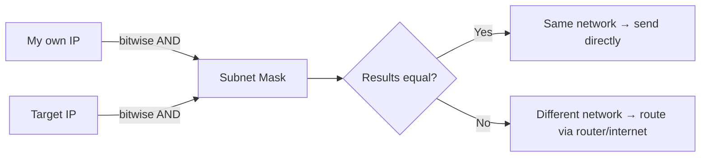
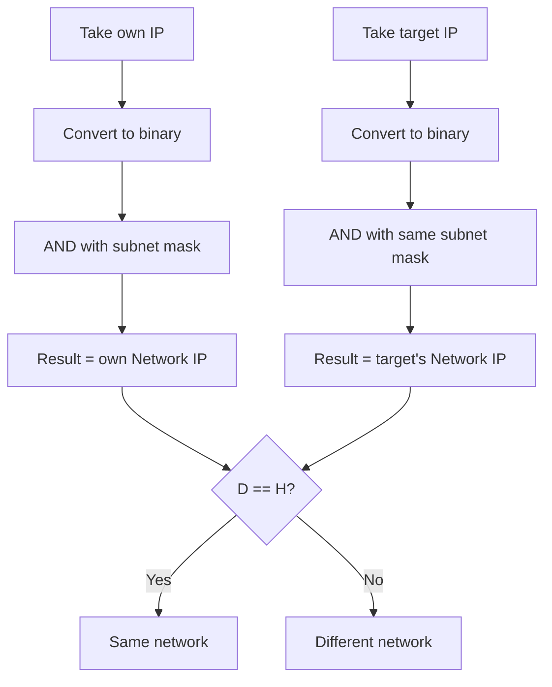
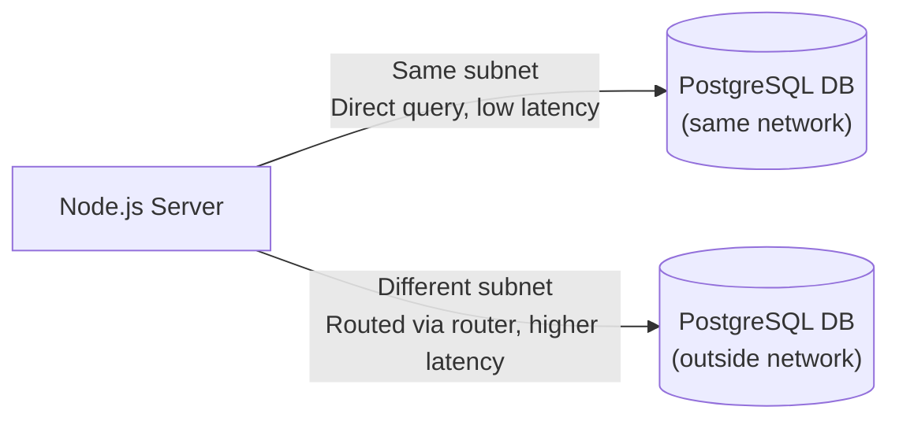

# Subnet Mask Basics

> How devices determine whether a target IP is inside their own network or outside it — using bitwise AND operations between an IP and its subnet mask. Builds directly on [Network, Host & CIDR Notation](./network-host-cidr-notation.md).

---

## Table of Contents

- [1. Recap: CIDR = Subnet](#1-recap-cidr--subnet)
- [2. What is a Subnet Mask?](#2-what-is-a-subnet-mask)
- [3. Why Does a Device Need to Know This?](#3-why-does-a-device-need-to-know-this)
- [4. How Subnet Mask Detection Works](#4-how-subnet-mask-detection-works)
- [5. Worked Example: Same Network](#5-worked-example-same-network)
- [6. Worked Example: Different Network](#6-worked-example-different-network)
- [7. Common Subnet Masks Comparison](#7-common-subnet-masks-comparison)
- [8. Real-World Relevance: Latency & Architecture](#8-real-world-relevance-latency--architecture)
- [9. Interview Q&A](#9-interview-qa)
- [10. Quick Revision Checklist](#10-quick-revision-checklist)

---

## 1. Recap: CIDR = Subnet

From the previous topic: CIDR notation (`/X`) tells you how many bits of an IP are reserved for the network portion. This network portion is also called the **subnet**.

> **Subnet** = the representation of "which network a device belongs to." It's what tells a device (tab, laptop, mobile) which network it is a part of.

Knowing which network a device belongs to matters because it decides **how data gets sent**:
- **Same network** → send directly, device-to-device, **no router or internet needed**.
- **Different network** → data must be routed **through the router** (and typically the internet).

---

## 2. What is a Subnet Mask?

A **subnet mask** is itself shaped like an IP address, but it's **not a usable/assignable IP**. Instead, it's a tool used to **determine whether a target IP is part of your own network**.



Every device uses its subnet mask against **any IP it wants to reach** to decide: is this IP part of my own network or not?

---

## 3. Why Does a Device Need to Know This?

A device (e.g., a laptop) does **not automatically know** whether another device (e.g., a mobile) is on the same network. To find out, it uses the subnet mask.

- If **same network** → laptop can send data directly to mobile, no internet/router required.
- If **different network** → laptop must go through the router (and generally the internet) to route the packet to the mobile.

---

## 4. How Subnet Mask Detection Works

The core mechanism is a **bitwise AND operation**, since computers only understand binary (1s and 0s) — IPs are human-readable but are always processed by machines in binary form.

**AND operation rules:**

| A | B | A AND B |
|---|---|---|
| 1 | 1 | 1 |
| 1 | 0 | 0 |
| 0 | 1 | 0 |
| 0 | 0 | 0 |

Key takeaway: **AND with 1 keeps the value unchanged; AND with 0 always makes the result 0.**

Since a subnet mask like `255.255.255.0` in binary is `11111111.11111111.11111111.00000000`:
- The first 3 octets (all `1`s) → preserve the original IP bits unchanged.
- The last octet (all `0`s) → forces the result to `0`.

**Steps a device follows to check network membership:**



---

## 5. Worked Example: Same Network

**Setup:**
- Laptop IP: `192.168.1.4`
- Mobile IP: `192.168.1.2`
- Subnet Mask: `255.255.255.0`

**Step 1 — Apply subnet mask to laptop's own IP:**

```
  192.168.1.4    → 11000000.10101000.00000001.00000100
& 255.255.255.0  → 11111111.11111111.11111111.00000000
------------------------------------------------------
  Result          → 192.168.1.0   (Network IP)
```

**Step 2 — Apply the same subnet mask to mobile's IP:**

```
  192.168.1.2    → 11000000.10101000.00000001.00000010
& 255.255.255.0  → 11111111.11111111.11111111.00000000
------------------------------------------------------
  Result          → 192.168.1.0   (Network IP)
```

**Step 3 — Compare results:**

| | Result |
|---|---|
| Laptop's network | `192.168.1.0` |
| Mobile's network | `192.168.1.0` |
| Match? | ✅ Yes |

**Conclusion:** Laptop and mobile are on the **same network** → data can be sent **directly**, without a router or internet connection.

---

## 6. Worked Example: Different Network

**Setup:**
- Laptop IP: `192.168.1.4`
- Mobile IP (now on a different network): `10.0.0.1`
- Subnet Mask: `255.255.255.0`

**Step 1 — Laptop's own network (same as before):** `192.168.1.0`

**Step 2 — Apply subnet mask to mobile's new IP:**

```
  10.0.0.1       → 00001010.00000000.00000000.00000001
& 255.255.255.0  → 11111111.11111111.11111111.00000000
------------------------------------------------------
  Result          → 10.0.0.0
```

**Step 3 — Compare results:**

| | Result |
|---|---|
| Laptop's network | `192.168.1.0` |
| Mobile's network | `10.0.0.0` |
| Match? | ❌ No |

**Conclusion:** Laptop and mobile are **NOT** on the same network → data must be sent **through the router** (and typically needs an internet connection) to be routed to the mobile.

---

## 7. Common Subnet Masks Comparison

| Subnet Mask | Binary (last relevant octets) | CIDR Equivalent | Network Bits | Host Bits |
|---|---|---|---|---|
| `255.255.255.0` | `11111111.11111111.11111111.00000000` | `/24` | 24 | 8 |
| `255.255.0.0` | `11111111.11111111.00000000.00000000` | `/16` | 16 | 16 |
| `255.0.0.0` | `11111111.00000000.00000000.00000000` | `/8` | 8 | 24 |

Pattern: `255` in an octet = all bits `1` (reserved for network). `0` in an octet = all bits `0` (available for host).

For `255.255.0.0` (`/16`): the first two octets are reserved for network, and the last two octets (16 bits) are available for host addressing.

---

## 8. Real-World Relevance: Latency & Architecture

As a developer, you don't usually interact with subnet masks directly — but your machines constantly use them to decide whether traffic can go **directly** to the destination or must **hop through a router**.

**Why this matters for performance:**
- Same network/subnet → **direct communication**, **lower latency**, no router hops.
- Different network → traffic must hop through the router (and possibly the internet), **adding latency**.

**Practical example:**



This is why it's generally advisable to keep your application server and database **within the same network/subnet** — queries and responses avoid extra router hops, improving latency.

---

## 9. Interview Q&A

**Q1: What is a subnet mask?**
A: It's an IP-shaped value (not itself a usable/assignable IP) used to determine whether a target IP address belongs to the same network as the device performing the check.

**Q2: How does a device use a subnet mask to check network membership?**
A: It performs a bitwise AND operation between its own IP and the subnet mask to get its network IP, then does the same AND operation between the target IP and the subnet mask. If both results match, the devices are on the same network.

**Q3: What is the result of AND-ing a bit with 1? With 0?**
A: AND with `1` preserves the original bit value unchanged. AND with `0` always results in `0`, regardless of the original bit.

**Q4: What subnet mask corresponds to a `/24` CIDR range, and what does it mean?**
A: `255.255.255.0`. It means the first 24 bits (3 octets) are reserved for the network, and the last 8 bits (1 octet) are available for host addresses.

**Q5: Why does it matter whether two devices are on the same network?**
A: If they're on the same network, data can be sent directly device-to-device without needing a router or internet connection, reducing latency. If not, data must be routed through a router, adding hops and latency.

**Q6: In a database/application architecture context, why keep your DB and server in the same subnet?**
A: Because same-subnet communication is direct (no router hops), resulting in lower latency for queries and responses compared to cross-network communication which must be routed.

**Q7: Is a subnet mask a usable IP address?**
A: No — it's structured like an IP address but is not assignable/usable as a device IP. It exists purely to perform the AND-based network-membership check.

---

## 10. Quick Revision Checklist

- [ ] Understand subnet = representation of "which network a device belongs to"
- [ ] Know subnet mask is IP-shaped but NOT a usable/assignable IP
- [ ] Recall subnet mask is used to check if a target IP is in the same network via bitwise AND
- [ ] Memorize AND rules: `1 AND 1 = 1`, `1 AND 0 = 0`, `0 AND anything = 0`
- [ ] Practice converting IP + subnet mask to binary and computing the AND result
- [ ] Know that matching AND results = same network; mismatched = different network
- [ ] Understand same network → direct send, no router/internet needed
- [ ] Understand different network → must route through router (usually + internet)
- [ ] Recall `255.255.255.0` = `/24`, `255.255.0.0` = `/16`, `255.0.0.0` = `/8`
- [ ] Connect to real-world use: keeping app server + DB in same subnet reduces latency

---

*Related: [Network, Host & CIDR Notation](./network-host-cidr-notation.md)*
