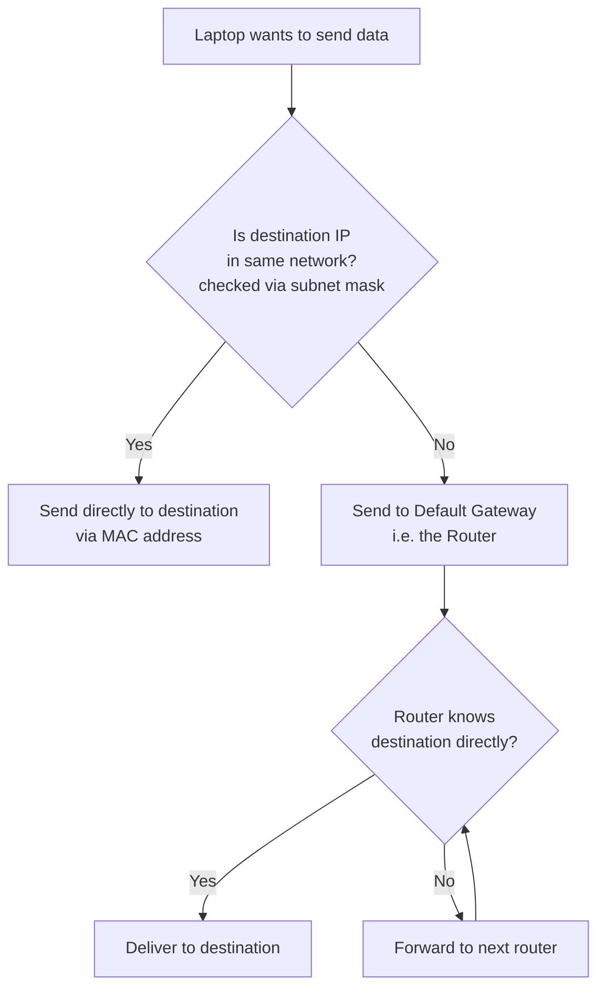

# Default Gateway — Networking Fundamentals

> Part of the Networking Fundamentals series — follows: IP Structure → Network/Host bits → CIDR → Subnet Mask → **Default Gateway**

## 1. Overview

The **Default Gateway** is the device (usually your router) that a host sends traffic to when the destination IP address is **not part of its own local network**. It acts as the "exit door" from a local network to the outside world (other networks / the internet).

## 2. The Problem It Solves

Given a setup: Laptop, Mobile, and Tablet all connected to the same Router.

- If the destination IP **is** in the same subnet (determined using the subnet mask — see previous notes), the sender can transmit data **directly** to the receiver (using MAC addresses at the link layer — covered in a future topic).
- If the destination IP **is not** in the same subnet, the sender doesn't know *how* to physically reach it — it only knows the IP (often resolved via DNS), not the path.
- This is where the **default gateway** comes in.

## 3. How It Works — Step by Step

1. Host wants to send data to a destination IP.
2. Host checks (using subnet mask) whether the destination IP belongs to its own network.
3. **If yes** → send directly to the destination on the local network.
4. **If no** → host doesn't know the route, so it forwards the packet to its **default gateway** (the router).
5. The router decides the next hop — it may forward the packet to another router, and so on, until it eventually reaches the destination network.
6. Essentially, the host says: *"I don't know where this destination is, but I'm assuming you (gateway) do — please forward this for me."*

## 4. Where Does the Default Gateway IP Come From?

- The default gateway is **pre-configured** on the device.
- When a device connects to a router (e.g., joins Wi-Fi or LAN), it automatically learns its default gateway's IP (typically via DHCP).
- No manual reasoning needed each time — the device just knows where to "fall back" to when it can't resolve a route itself.

## 5. Key Concepts Table

| Concept | Description |
|---|---|
| Default Gateway | Device (usually a router) that handles traffic destined for networks outside the local subnet |
| Local delivery | Direct communication when source & destination share the same network (via MAC address) |
| Non-local delivery | Routed through the default gateway when destination is outside the local network |
| How gateway is known | Pre-configured / auto-assigned (commonly via DHCP) when device joins the network |
| Role of router | Decides the next hop; may forward through multiple routers before reaching the destination |

## 6. Interview Q&A

**Q1: What is a default gateway?**
A: It's the device (typically a router) that a host forwards traffic to when the destination IP is not part of the host's own local network — it acts as the gateway to external networks.

**Q2: How does a device know whether to send data directly or via the default gateway?**
A: It uses the subnet mask to determine whether the destination IP falls within its own network. If yes, direct delivery; if no, it's sent to the default gateway.

**Q3: How does a host know its default gateway's IP address?**
A: It's pre-configured on the device, typically assigned automatically (e.g., via DHCP) when the device connects to the router/network.

**Q4: What happens after a packet reaches the default gateway?**
A: The router evaluates the destination and decides the next hop — it may forward the packet to another router, repeating until the packet reaches its destination network.

**Q5: Does the sending device need to know the full path to the destination?**
A: No. The device only forwards the packet to its default gateway and relies on routers along the way to figure out the path.

## 7. Quick Revision Checklist

- [ ] Understand that direct delivery only happens within the same network (same subnet)
- [ ] Know that subnet mask is used to determine "same network or not"
- [ ] Understand default gateway = router = exit point to outside networks
- [ ] Know that gateway IP is pre-configured / auto-learned, not manually calculated each time
- [ ] Understand that routing beyond the gateway involves router-to-router hops
- [ ] Remember: MAC addresses are used for direct/local delivery (deeper detail in future topic)

---
*Source: CampusX Networking Fundamentals playlist — video on Default Gateway (watch prior videos on IP structure, network/host bits, and subnet mask first for full context).*
