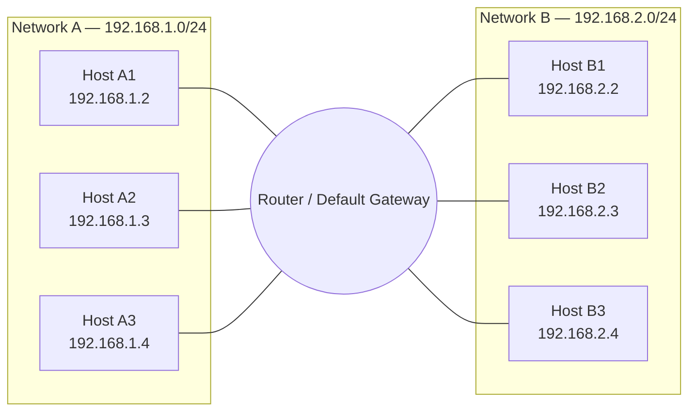
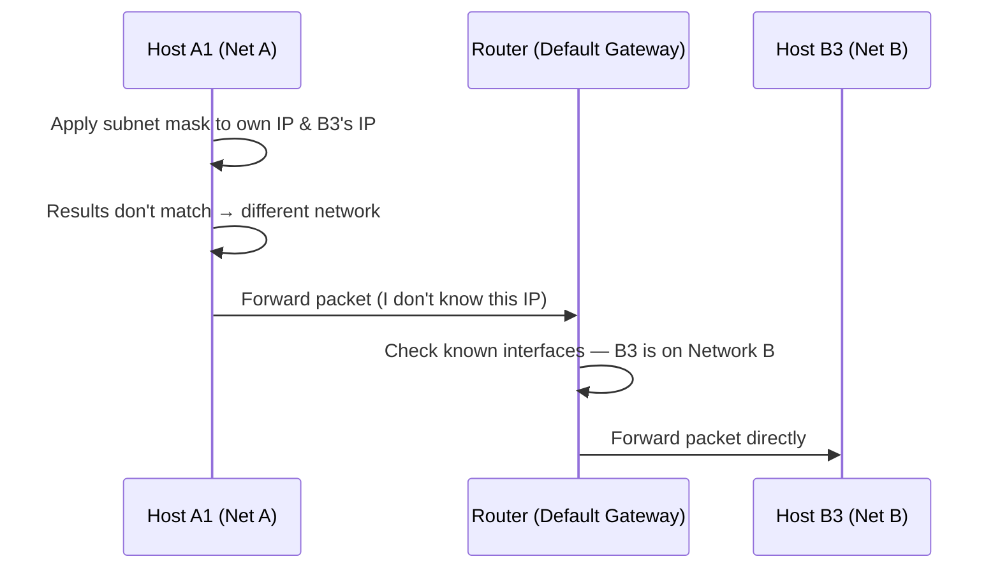

# Router as a Default Gateway — Networking Fundamentals

> Part of the Networking Fundamentals series — follows: IP Structure → Network/Host bits → CIDR → Subnet Mask → Default Gateway → **Router as a Default Gateway (Practical Application)**

## 1. Overview

This is a practical, applied video that ties together everything learned so far — IP structure, network vs. host bits, subnet mask, and default gateway — using **two worked examples**:

1. Communication **within the same network** (intra-network)
2. Communication **between two different networks** (inter-network)

A router can have **multiple network interfaces** (e.g., multiple Ethernet ports), each connected to a different network/subnet. This is what allows it to act as a bridge (default gateway) between networks — including connecting your home network to your ISP's network.

## 2. The Setup

| Entity | Subnet | Sample Hosts |
|---|---|---|
| **Network A** | `192.168.1.0/24` | A1, A2, A3 → `192.168.1.2`, `.3`, `.4` |
| **Network B** | `192.168.2.0/24` | B1, B2, B3 → `192.168.2.2`, `.3`, `.4` |
| **Router** | Has an IP in **both** networks | One interface in Network A, one interface in Network B |

- `/24` → first 3 octets (24 bits) = network portion, last octet = host portion.
- The router has **two Ethernet/network interfaces** — one facing Network A, one facing Network B (conceptually similar to how your home router has one side facing your home network and another facing your ISP).

## 3. Scenario 1: Intra-Network Communication (A1 → A3)

**Goal:** Host A1 wants to send data to Host A3 (both in Network A).

**Steps:**
1. A1 applies its **own subnet mask** to its **own IP** using a bitwise AND operation.
   - `192.168.1.2` AND `255.255.255.0` → `192.168.1.0`
2. A1 applies the **same subnet mask** to **A3's IP**.
   - `192.168.1.4` AND `255.255.255.0` → `192.168.1.0`
3. Compare results: `192.168.1.0 == 192.168.1.0` → **match** → A1 and A3 are in the **same network**.
4. Since they're in the same network, A1 sends data **directly** to A3 — no need to route through the default gateway.

> **Note:** In some edge cases, the router/switch may still be involved for MAC-address resolution or switching purposes, but this is a negligible-latency exception. Conceptually, same-network hosts communicate directly.

## 4. Scenario 2: Inter-Network Communication (A1 → B3)

**Goal:** Host A1 wants to send data to Host B3 (different networks).

**Steps:**
1. A1 applies its **own subnet mask** to its **own IP**.
   - `192.168.1.2` AND `255.255.255.0` → `192.168.1.0`
2. A1 applies the **same subnet mask** (its own — it has no knowledge of B's subnet) to **B3's IP**.
   - `192.168.2.4` AND `255.255.255.0` → `192.168.2.0`
3. Compare results: `192.168.1.0 != 192.168.2.0` → **no match** → A1 and B3 are **not** in the same network.
4. A1 sends the packet to its **default gateway** (the router), effectively saying: *"I don't know where this IP is — please handle it."*
5. The router checks its known interfaces/networks and recognizes that **Network B** is reachable via one of its other interfaces.
6. The router **forwards the packet directly to B3** on Network B.

## 5. Key Takeaway

This video is essentially a **synthesis** of all prior concepts:
- IP structure (binary representation) →
- Network vs. host bits →
- Subnet mask & AND operation →
- Same-network detection →
- Default gateway fallback →
- Router forwarding across its multiple interfaces

The router doesn't just "know everything" — it knows because it **directly owns interfaces on multiple networks**. Each network is unaware of the other; only the router has visibility across both.

## 6. What's Next (Future Topics)

- **MAC Address** — hardware-level addressing
- **ARP (Address Resolution Protocol)** — how IP → MAC resolution works
- **Switches** — how data actually moves from Host A to Host B under the hood
- **OSI Model**
- A dedicated deep-dive video on **routing** and **packet movement between hops**

## 7. Comparison Table: Same Network vs. Different Network

| Aspect | Same Network (Intra) | Different Network (Inter) |
|---|---|---|
| Subnet mask check result | Matches | Doesn't match |
| Path taken | Direct (host to host) | Via default gateway (router) |
| Router's role | Mostly not needed (occasional switching help) | Mandatory — decides next hop |
| Example in this video | A1 → A3 | A1 → B3 |

## 8. Interview Q&A

**Q1: How does a host determine whether the destination IP is on the same network?**
A: It applies its subnet mask (via bitwise AND) to both its own IP and the destination IP, then compares the resulting network addresses. A match means same network.

**Q2: What does a host do if the destination is not on its own network?**
A: It forwards the packet to its default gateway (the router), since it doesn't know how to reach that IP directly.

**Q3: Why can a router communicate with multiple networks?**
A: Because it has multiple network interfaces, each configured with an IP on a different subnet — effectively making it a member of each of those networks.

**Q4: When checking if a destination IP is in a different network, whose subnet mask is used?**
A: The sender's own subnet mask is used — the sender has no knowledge of the destination network's subnet configuration.

**Q5: Is a router always required for two hosts in the same network to communicate?**
A: Technically no — same-network hosts can communicate directly. A router/switch may occasionally assist (e.g., for MAC resolution), but this is a minor exception, not the general rule.

## 9. Quick Revision Checklist

- [ ] Understand a router can have multiple network interfaces, each on a different subnet
- [ ] Know how to apply subnet mask (AND operation) to determine same-network vs. different-network
- [ ] Same network → direct communication (no gateway needed)
- [ ] Different network → send to default gateway → router forwards to correct network
- [ ] Understand the sender always uses its **own** subnet mask when checking, regardless of destination
- [ ] Recognize this video as an applied synthesis of: IP structure, subnet mask, network/host bits, default gateway
- [ ] Note upcoming topics: MAC address, ARP, switches, OSI model, detailed routing

---
*Source: CampusX Networking Fundamentals playlist — video on Router as a Default Gateway (builds directly on IP structure, subnet mask, and default gateway videos).*
