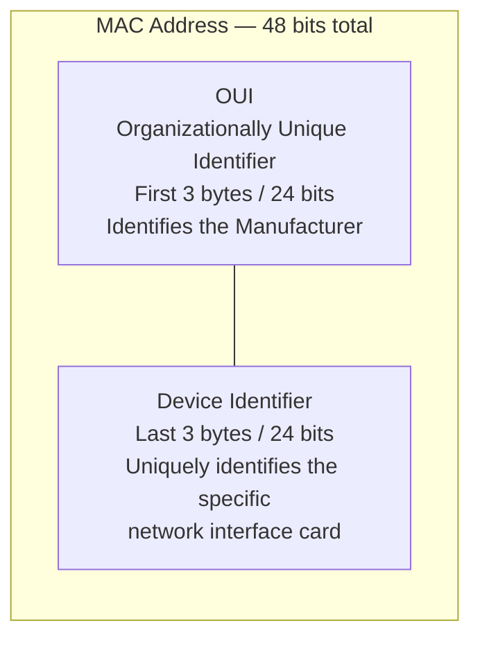

# MAC Address — Structure & Basics

> Part of the Networking Fundamentals series — follows: IP Structure → Subnet Mask → Default Gateway → Router as Default Gateway → **MAC Address**

## 1. Overview

This video covers **what a MAC address is** and **its structure**. A future video will explore *why* we need a MAC address even though we already have an IP address (i.e., the difference between IP addressing and MAC addressing).

## 2. What Is a Network Interface?

A **network interface** is the connecting piece that lets a device (laptop, router, mobile) communicate over a network, wired or wireless.

| Type | Description |
|---|---|
| **NIC** (Network Interface Card) | A physical circuit board / integrated circuit with an antenna to send & receive signals |
| **Ethernet** | Wired interface, deals with electrical signals |
| **Bluetooth** | Short-range wireless interface — fails beyond a limited range |

All of these are **physical things** — and physical things need a form of addressing that identifies them uniquely and permanently.

## 3. Why Not Just Use IP for This?

- IP addresses can be **static or dynamic** — they can change.
- Example: A laptop connects to a router and gets `192.168.1.4`. If the router restarts or the laptop reconnects later (e.g., from a different location), it may be assigned a **different IP** — even though it's the same physical device.
- This makes IP **unreliable** as a way to permanently identify a specific physical device/interface.
- So we need an addressing scheme that is **permanent and unique to the physical hardware** — this is the **MAC address**.

## 4. What Is a MAC Address?

**MAC = Media Access Control** address.

- It is **engraved/permanent** on the physical network interface card — printed on the hardware itself.
- Unlike IP (which tells you *virtually* where a device is on a network), MAC tells you the actual **physical identity** of the interface/device.
- Both A1→A3 (same network) and A1→B3 (cross network) communications ultimately require MAC addresses of the physical devices involved — data literally cannot be delivered to a device without its MAC address.

## 5. Structure of a MAC Address

- Represented as a set of **hexadecimal numbers**, separated by **colons** or **hyphens**.
  - Colon-separated → typically macOS / Linux (e.g., `FA:34:F3:AF:09:00`)
  - Hyphen-separated → typically Windows (e.g., `FA-34-F3-AF-09-00`)
- **Hexadecimal digits**: `0–9` and `A–F` (16 possible values per digit — since two-digit combos like "10" aren't used, letters represent 10–15).

### Size Breakdown

| Unit | Value |
|---|---|
| 1 group (e.g., `FA`) | 1 byte = 8 bits |
| Total groups | 6 |
| Total size | 6 bytes = **48 bits** |

This 48-bit size is **constant** everywhere — every MAC address, regardless of manufacturer or device, is exactly 6 bytes / 48 bits.

## 6. Two Parts of a MAC Address

A MAC address splits into **two halves**, each 3 bytes (24 bits):

| Part | Bytes | Bits | Purpose |
|---|---|---|---|
| **OUI** (Organizationally Unique Identifier) | First 3 bytes | 24 bits | Identifies the **manufacturer** (e.g., Intel, Cisco, Apple) — assigned by an authority to that organization |
| **Device/Host Identifier** | Last 3 bytes | 24 bits | Uniquely identifies **that specific NIC**, even among devices from the same manufacturer |

**Key insight:** Every manufacturer must assign a MAC address to each device it produces. All devices made by a given manufacturer (e.g., Intel) will share the **same first 3 bytes (OUI)**. The **last 3 bytes** differ per device to ensure global uniqueness — conceptually similar to how IP addresses split into a network portion and a host portion.

## 7. MAC vs. IP — Quick Comparison

| Aspect | MAC Address | IP Address |
|---|---|---|
| Nature | Physical, hardware-level | Virtual, logical |
| Persistence | Permanent, engraved on hardware | Can be static or dynamic (changeable) |
| Size | 48 bits (6 bytes) | 32 bits (IPv4) |
| Format | Hexadecimal, colon/hyphen-separated | Decimal, dot-separated (IPv4) |
| Identifies | The physical device/interface | Where the device is on a (virtual) network |
| Assigned by | Manufacturer (via OUI) | Network/router (e.g., via DHCP) or manually |

## 8. Practical Relevance

- As a developer, you'll rarely deal with MAC addresses manually — but understanding the concept matters for grasping the **OSI model** and **routing** later.
- MAC addresses are required whenever data actually moves between two hosts — whether on the same network (A1 → A3) or across networks via a gateway (A1 → B3).

## 9. What's Next

- **Address Resolution Protocol (ARP)** — how IP addresses get resolved to MAC addresses
- Possibly a video on: *"Why do we need IP if we already have MAC?"*

## 10. Interview Q&A

**Q1: What is a MAC address and why is it needed?**
A: MAC (Media Access Control) address is a permanent, hardware-engraved address unique to a network interface. It's needed because IP addresses can change (dynamic assignment), making them unreliable for uniquely and permanently identifying a physical device — data delivery to a device fundamentally requires its MAC address.

**Q2: What is the size of a MAC address?**
A: 48 bits, or 6 bytes, represented as 6 groups of hexadecimal digits separated by colons or hyphens.

**Q3: What are the two parts of a MAC address?**
A: The first 3 bytes (24 bits) form the OUI (Organizationally Unique Identifier), identifying the manufacturer. The last 3 bytes (24 bits) uniquely identify the specific device/interface from that manufacturer.

**Q4: How is a MAC address represented, and does the format differ across OS?**
A: It's represented in hexadecimal (0–9, A–F). macOS/Linux typically use colon-separated format (e.g., `FA:34:F3`), while Windows typically uses hyphen-separated format (e.g., `FA-34-F3`).

**Q5: How does MAC address structure resemble IP address structure?**
A: Both split into two logical parts — IP splits into network bits and host bits (via subnet mask); MAC splits into an organization-identifying portion (OUI) and a device-identifying portion.

**Q6: Why can't IP addresses alone identify a physical device reliably?**
A: Because IP addresses (especially dynamic ones) can change each time a device reconnects to a network, whereas the MAC address remains constant and physically tied to the hardware.

## 11. Quick Revision Checklist

- [ ] Understand what a network interface is (NIC, Ethernet, Bluetooth)
- [ ] Know why IP alone is insufficient for identifying physical devices (dynamic IP issue)
- [ ] MAC address = 48 bits = 6 bytes = 6 hex groups, colon or hyphen separated
- [ ] Understand hexadecimal digits: 0–9 and A–F
- [ ] Know the two parts: OUI (first 3 bytes → manufacturer) and Device ID (last 3 bytes → unique device)
- [ ] Understand MAC is physical/permanent vs. IP being virtual/changeable
- [ ] Recognize MAC addresses are required for actual data delivery between devices (same or different network)
- [ ] Preview: ARP will explain how IP maps to MAC in practice

---
*Source: CampusX Networking Fundamentals playlist — video on MAC Address structure and basics (builds on IP structure, subnet mask, and default gateway videos).*
